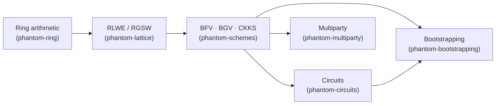

<div align="center">


### Fully homomorphic encryption, natively in Rust.

BFV, BGV, and CKKS, homomorphic circuits, bootstrapping, and multiparty/threshold protocols — an original Rust implementation, not a binding.

[](https://github.com/ultravioletrs/phantom-fhe/actions/workflows/ci.yml)
[](LICENSE)
[](Cargo.toml)
[](https://github.com/ultravioletrs/phantom-fhe/releases)

[Quickstart](#quickstart) · [Why Phantom-FHE](#why-phantom-fhe) · [How It Works](#how-it-works) · [Workspace](#workspace) · [Documentation](#documentation) · [Security](#security) · [Contributing](#contributing)

</div>

## Introduction

Phantom-FHE lets you compute on encrypted data without ever decrypting it: `Enc(a) ⊕ Enc(b) → Enc(a + b)`, `Enc(a) ⊗ Enc(b) → Enc(a * b)`, and further — homomorphic circuits, CKKS bootstrapping, and multiparty/threshold protocols — all built from first principles in Rust, on the RLWE-based family of schemes (BFV, BGV, CKKS) that underlies most practical FHE today.

Phantom-FHE is a research-stage implementation under active development (TRL 2–3). The full architecture is implemented and tested end-to-end — every scheme, every circuit, CKKS bootstrapping, and all six multiparty protocols run on real, non-transparent ciphertexts today. Cryptographic hardening toward production-grade security is in progress under a tracked, public roadmap — see [Security](#security) for exactly what that means before you rely on it.

## Why Phantom-FHE?

- **A real implementation, not a wrapper.** Every ring operation, scheme, circuit, and protocol here is original Rust — no bindings to an existing C++/Go FHE library.
- **Honest about what's real.** [`SECURITY.md`](SECURITY.md) and [`docs/technical-manual.md`](docs/technical-manual.md) state precisely what's production-shaped versus still a transparent scaffold, operation by operation — no glossing over gaps.
- **A tracked, public hardening roadmap.** Alpha and Beta hardening are both complete ([`CHANGELOG.md`](CHANGELOG.md)); [`docs/internal/implementation-plan.md`](docs/internal/implementation-plan.md) tracks every remaining item toward Stable.
- **Batteries included.** RNS ring arithmetic, RLWE/RGSW, three schemes, homomorphic circuits, CKKS bootstrapping, and multiparty threshold protocols — one workspace, one dependency graph, no missing middle layer.
- **Built for both people and agents.** A facade crate with one coherent API, runnable examples for every workflow, and Criterion benchmarks for the hot paths that matter.

## How It Works



Each layer is its own crate with its own tests, benchmarks, and API stability tier — `phantom-ring`'s NTT and RNS arithmetic underlies `phantom-lattice`'s RLWE/RGSW primitives, which the three schemes build on directly. Circuits, bootstrapping, and multiparty protocols sit on top of the schemes, not the ring, so they never need to know how a ciphertext's arithmetic is actually implemented. See [`docs/architecture.md`](docs/architecture.md) for the full crate dependency graph and construction pattern.

## Features

| Area | Capabilities |
| --- | --- |
| Ring arithmetic | RNS polynomial rings, an O(N log N) NTT, Barrett/Montgomery reduction, RNS basis extension and rescaling |
| RLWE / RGSW | Real (non-transparent) encryption, RNS hybrid key-switching, relinearization, Galois automorphisms, noise bounds |
| Schemes | BFV, BGV, and CKKS, each with both a transparent scaffold path (for fast iteration) and a real, noise-bearing encryption path |
| Circuits | Linear transforms (diagonal/BSGS), polynomial evaluation, comparison, inverse, mod1, and DFT |
| Bootstrapping | CKKS bootstrapping end to end on real ciphertexts: modulus raise, CoeffsToSlots, EvalMod, SlotsToCoeffs |
| Multiparty | Six threshold protocols across BGV/BFV/CKKS — collective keygen, Galois/relinearization keygen, collaborative re-encryption, partial decryption, interactive bootstrap — plus Pedersen VSS |
| Serialization | Versioned binary wire formats for every public type, golden-byte/version-mismatch/fuzz-tested; secret-bearing types are never serializable |
| Developer tooling | A facade crate, 16 runnable examples, Criterion benchmarks with toy/small parameter tiers, and a full local `make ci` matching CI exactly |

## Quickstart

Phantom-FHE is not yet published to crates.io. Depend on it directly from git:

```toml
[dependencies]
phantom-fhe = { git = "https://github.com/ultravioletrs/phantom-fhe" }
```

```rust
use phantom_fhe::ring::{Degree, Modulus, Ring};
use phantom_fhe::schemes::bfv::{BfvContext, BfvParams};
use rand_chacha::ChaCha20Rng;
use rand_core::SeedableRng;

fn main() -> Result<(), Box<dyn std::error::Error>> {
    // Development parameters, chosen for fast iteration - see docs/user-guide.md#choosing-parameters.
    let ring = Ring::new(Degree::new(8)?, vec![Modulus::new(257)?])?;
    let ctx = BfvContext::new(BfvParams::new(ring, 17)?);
    let mut rng = ChaCha20Rng::from_seed([7; 32]);

    let keys = ctx.keygen()?.generate_keypair(&mut rng)?;
    let encoder = ctx.encoder();
    let plaintext = encoder.encode_i64(&[-2, 3, 5, -6])?;
    let ciphertext = ctx.encryptor(keys.public)?.encrypt(&plaintext, &mut rng)?;
    let decrypted = ctx.decryptor(keys.secret)?.decrypt(&ciphertext)?;

    assert_eq!(&encoder.decode_i64(&decrypted)?[..4], &[-2, 3, 5, -6]);
    Ok(())
}
```

More workflows (BGV, CKKS, bootstrapping, multiparty) are runnable from [`crates/phantom-examples/examples`](crates/phantom-examples/examples) — see [Development](#development). For a walked-through first program and every scheme's usage, start with [`docs/getting-started.md`](docs/getting-started.md).

## Workspace

| Crate | Description |
| --- | --- |
| [`phantom-fhe`](crates/phantom-fhe) | Top-level facade; re-exports the crates below as `ring`, `lattice`, `schemes`, `circuits`, `bootstrapping`, `multiparty`, and `utils` |
| [`phantom-utils`](crates/phantom-utils) | Minimal cross-cutting support utilities |
| [`phantom-ring`](crates/phantom-ring) | RNS polynomial ring arithmetic |
| [`phantom-lattice`](crates/phantom-lattice) | Scheme-agnostic RLWE and RGSW primitives |
| [`phantom-schemes`](crates/phantom-schemes) | Concrete BGV, BFV, and CKKS scheme APIs |
| [`phantom-circuits`](crates/phantom-circuits) | Shared circuit planning plus scheme-specific circuit implementations |
| [`phantom-bootstrapping`](crates/phantom-bootstrapping) | CKKS bootstrapping pipeline plus reserved BGV/BFV module locations |
| [`phantom-multiparty`](crates/phantom-multiparty) | Threshold protocol implementations (mpBGV, mpBFV, mpCKKS) |
| [`phantom-examples`](crates/phantom-examples) | Runnable example workflows and binaries (workspace-only) |
| [`phantom-benches`](crates/phantom-benches) | Criterion benchmarks for current hot paths (workspace-only) |

`phantom-examples` and `phantom-benches` are workspace-only (`publish = false`): they exercise the individual `phantom-*` crates directly, and the facade crate has its own smoke test ([`crates/phantom-fhe/tests/facade.rs`](crates/phantom-fhe/tests/facade.rs)) confirming its re-exports resolve to working APIs.

## Status

All 18 roadmap phases are implemented — every crate above compiles, is tested, and its examples run end-to-end. Alpha and Beta hardening are both complete: real (non-transparent) encryption paths, RNS hybrid key-switching, CKKS bootstrapping, all six multiparty protocols, a versioned serialization format, Criterion benchmarks, and a production-shaped parameter preset validated against the homomorphicencryption.org 128-bit standard. Remaining work targets the Stable tier — an API/serialization-domain freeze, general production parameter guidance, performance baselines, and an independent security review. See [SECURITY.md](SECURITY.md) for current cryptographic status.

The full phase-by-phase and workstream-by-workstream detail lives in [`docs/internal/implementation-plan.md`](docs/internal/implementation-plan.md); the release tiers themselves are tracked in [`docs/internal/release-checklist.md`](docs/internal/release-checklist.md). See [CHANGELOG.md](CHANGELOG.md) for what shipped in each release.

## Documentation

The full documentation set lives under [`docs/`](docs) — see [`docs/README.md`](docs/README.md) for the index. Highlights:

- [`docs/getting-started.md`](docs/getting-started.md) — clone, build, run the examples, your first program
- [`docs/user-guide.md`](docs/user-guide.md) — using every scheme, circuits, bootstrapping, and multiparty protocols, with runnable code
- [`docs/concepts.md`](docs/concepts.md) — the cryptography and math behind the library
- [`docs/architecture.md`](docs/architecture.md) — crate layout, dependency hierarchy, design conventions
- [`docs/developer-guide.md`](docs/developer-guide.md) — coding/testing conventions, adding a new scheme
- [`docs/technical-manual.md`](docs/technical-manual.md) — the precise, code-level reference: exactly what's real vs. scaffolded, wire formats, error taxonomy, performance
- [`docs/internal/`](docs/internal) — maintainer-facing: PRD, technical spec, implementation plan, dependency policy, release checklist

Rustdoc for every crate is generated with `make doc` (see below).

## Development

```bash
make help    # list all targets
make check   # fmt-check + clippy + test + doc, same as CI
make test    # cargo test --workspace --all-targets
make examples  # run every phantom-examples binary
make bench   # run the phantom-benches Criterion benchmarks
make ci      # check + bench, the full local command matrix
```

See [`Makefile`](Makefile) for the underlying `cargo` invocations, and [CONTRIBUTING.md](CONTRIBUTING.md) for testing conventions and PR scope.

## Security

Phantom-FHE is under active cryptographic hardening. See [SECURITY.md](SECURITY.md) for current per-crate status, the hardening roadmap, and vulnerability reporting guidance.

## Contributing

See [CONTRIBUTING.md](CONTRIBUTING.md) and [`docs/developer-guide.md`](docs/developer-guide.md) for local checks, coding/testing conventions, and authorship rules, and [`docs/internal/dependency-policy.md`](docs/internal/dependency-policy.md) before adding a dependency.

This repository should contain original Rust source authored for Phantom-FHE. Public papers and mature open-source FHE libraries may be used for understanding algorithms, terminology, parameters, and validation behavior, but source code, tests, examples, documentation, and serialization formats here must be authored for this repository — do not copy or mechanically translate third-party implementation code.

## License

Licensed under the [Apache License, Version 2.0](LICENSE).
