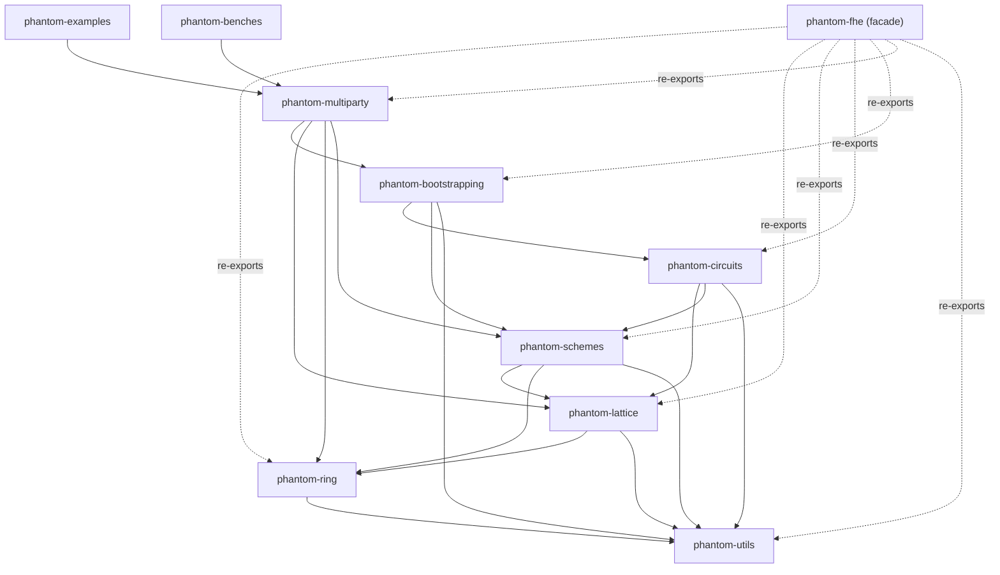
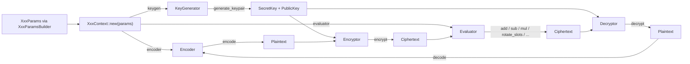
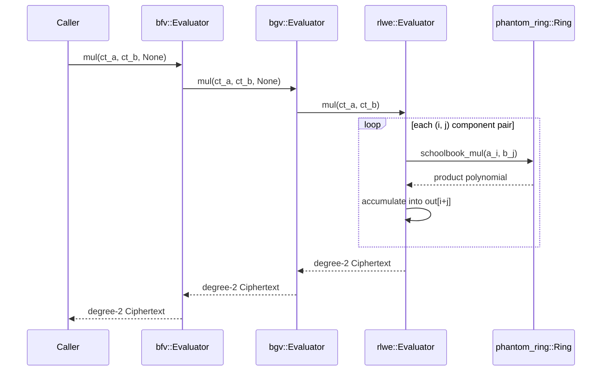

# Architecture

This document describes how Phantom-FHE is put together: the crate hierarchy, why it's shaped that way, and how data flows from raw ring arithmetic up to multiparty protocols. For the mathematics behind each layer, see [`concepts.md`](concepts.md). For current cryptographic status, see [SECURITY.md](../SECURITY.md).

## Design goals

Phantom-FHE follows a few consistent rules across every crate:

- **Strict, acyclic layering.** Each crate depends only on crates below it. Nothing in `phantom-ring` knows about RLWE; nothing in `phantom-lattice` knows about BFV/BGV/CKKS. This keeps the dependency graph easy to reason about and lets each layer be hardened independently (see the workstream breakdown in [`internal/implementation-plan.md`](internal/implementation-plan.md)).
- **Strong domain types over raw primitives.** Ring degree, RNS moduli, scheme parameters, scale, precision, session/participant identifiers — all of these are wrapped in validated types (`Degree`, `Modulus`, `Scale`, `ParticipantId`, ...) rather than passed around as bare `usize`/`u64`/`f64`. Construction validates; once you have the type, it's valid.
- **Builder-based parameter construction.** Every scheme's parameters (`BgvParams`, `BfvParams`, `CkksParams`, `BootstrapParams`, ...) are built through a `Builder` type with a `build()` that validates the whole parameter set at once, in addition to a direct `new()` constructor for the already-validated case.
- **One error enum per crate**, built with `thiserror`, wrapping lower-layer errors via `#[from]`/`#[error(transparent)]`. A `Result<T>` alias is exported from each crate's root so call sites read `phantom_ring::Result<T>`, `phantom_lattice::Result<T>`, etc.
- **Canonical, versioned binary serialization**, hand-rolled per crate rather than via `serde` (see [Serialization](#serialization) below and the full format reference in [`technical-manual.md`](technical-manual.md#serialization-format)).
- **Redacted `Debug` and zero-on-`Drop` for secret material.** `phantom_lattice::rlwe::SecretKey` is the current example: its `Debug` impl prints `<redacted>` and its `Drop` impl zeroes the underlying coefficients.

## Crate dependency graph

```text
phantom-utils   (no crypto-crate dependencies)
     |
     v
phantom-ring    (RNS polynomial arithmetic, NTT, sampling)
     |
     v
phantom-lattice (RLWE + RGSW primitives; scheme-agnostic)
     |
     v
phantom-schemes (BGV, BFV, CKKS)
     |
     v
phantom-circuits (linear transforms, polynomial evaluation, CKKS-specific circuits)
     |
     v
phantom-bootstrapping (CKKS bootstrapping; reserved BGV/BFV modules)
     |
     v
phantom-multiparty (mpbgv, mpbfv, mpckks threshold protocols)

phantom-fhe        -- facade crate, re-exports the stack above
phantom-examples    -- workspace-only, depends on everything
phantom-benches      -- workspace-only, depends on everything
```

Rendered as a graph (arrow = "depends on"):



`phantom-utils` sits outside the crypto hierarchy: every layer may depend on it, but it must never depend on any of them. Concretely, the workspace's `Cargo.toml` path dependencies are:

| Crate | Depends on |
| --- | --- |
| `phantom-utils` | *(external crates only)* |
| `phantom-ring` | `phantom-utils` |
| `phantom-lattice` | `phantom-ring`, `phantom-utils` |
| `phantom-schemes` | `phantom-lattice`, `phantom-ring`, `phantom-utils` |
| `phantom-circuits` | `phantom-lattice`, `phantom-schemes`, `phantom-utils` (dev: `phantom-ring`) |
| `phantom-bootstrapping` | `phantom-circuits`, `phantom-schemes`, `phantom-utils` (dev: `phantom-ring`) |
| `phantom-multiparty` | `phantom-bootstrapping`, `phantom-lattice`, `phantom-ring`, `phantom-schemes` |
| `phantom-fhe` | all of the above |

## Crate responsibilities

### `phantom-utils`

The only crate with no cryptographic knowledge. It provides:

- `sampling` — thin wrappers over `rand_core::{RngCore, CryptoRng}` for filling byte buffers from a secure RNG (`fill_bytes`, `random_bytes`, and, behind the `std` feature, `random_bytes_from_os` via `rand_core::OsRng`).
- `buffer` — `BufferReader<R>` / `BufferWriter<W>` wrapping `std::io::{Read, Write}` with deterministic little-endian primitive encoding (`u8`/`u16`/`u32`/`u64`, fixed-size arrays, length-prefixed byte vectors).
- `serialization` — `DomainTag` (an 8-byte ASCII tag identifying an encoded type), `Version` (a `u16`), and `SerializationHeader` combining the two, with `write_to`/`read_expected` that rejects wrong-domain or wrong-version payloads.
- `test` (under `test-utils` feature or `cfg(test)`) — `deterministic_rng(seed)` / `zero_seed_rng()` built on `ChaCha20Rng`, used throughout the workspace's tests and examples for reproducibility.

Every other crate's `UtilsError` case wraps `phantom_utils::UtilsError` via `#[from]`.

### `phantom-ring`

The lowest cryptographic layer: polynomial arithmetic over `R_q = Z_q[X] / (X^N + 1)` in RNS (Residue Number System) representation. Its public surface (re-exported at the crate root):

- `Modulus` — a validated odd `u64` modulus; `supports_ntt(n)` checks `(q - 1) % 2n == 0`, the condition for a negacyclic NTT of degree `n`.
- `Degree` — a validated non-zero power-of-two ring degree.
- `Ring` — holds a `Degree` and a `Vec<Modulus>`; owns `add`/`sub`/`neg`/`scalar_mul`/`coeffwise_mul`/`schoolbook_mul` and their `_assign` in-place variants.
- `Poly` — RNS-form polynomial storage: `coeffs: Vec<Vec<u64>>` indexed `[modulus_index][coefficient_index]`.
- `ntt` — `NttBackend` trait (`forward`/`inverse`) with one implementation, `CpuNttBackend`, plus `NttTable` (root-of-unity table per modulus/degree).
- `reduce` — `add_mod`/`sub_mod`/`neg_mod`/`mul_mod`/`pow_mod`/`inv_mod` free functions, plus `BarrettReducer`/`MontgomeryReducer`/`reduce_once` types.
- `rns` — `RnsBasis`, CRT reconstruction (`reconstruct_residue`/`reconstruct_poly`), basis extension (`extend_basis`), and modulus dropping (`drop_last_modulus`).
- `sampling` — `sample_uniform`, `sample_ternary`, `sample_discrete_gaussian`, all generic over `R: RngCore + CryptoRng`.

See [`concepts.md`](concepts.md#ring-arithmetic) for the math and [`technical-manual.md`](technical-manual.md#ring-internals) for exactly how far each of these is from a production implementation (the NTT and reducers in particular).

### `phantom-lattice`

Scheme-agnostic RLWE and RGSW primitives — the crate every scheme is built on. Two modules:

- `rlwe` — `RlweParams`, `Plaintext`, `Ciphertext` (a `Vec<Poly>` of arbitrary degree), `SecretKey`/`PublicKey`, `EvaluationKey`/`RelinearizationKey`/`GaloisKey`, `KeyGenerator` (including `generate_hybrid_relinearization_key`/`generate_hybrid_galois_key`, the real key-generation counterparts), `Encryptor` (secret-key or public-key variant), `Decryptor`, `Evaluator` (add/sub/neg/add_plain/mul/relinearize/apply_galois_automorphism/rotate_coefficients/repack), plus `keyswitch::{key_switch, key_switch_identity}` and `repacking::repack`.
- `rgsw` — `RgswParams` (gadget base/levels), `RgswKey`, `RgswCiphertext`, `GadgetDecomposition`/`GadgetDecompositionParams` (base-`2^base_log` coefficient decomposition and recomposition), and `external_product`.

`phantom-lattice::serialization` encodes `PublicKey` and `EvaluationKey` under domain tags `RLWEPK01`/`RLWEEK01`.

### `phantom-schemes`

Concrete BGV, BFV, and CKKS APIs, each as its own module (`bgv`, `bfv`, `ckks`) with a parallel shape: `Params`/`ParamsBuilder`, `Context` (the entry point — creates encoders/keygen/encryptor/decryptor/evaluator), `Plaintext`, `Ciphertext`, `Encoder`, `Encryptor`, `Decryptor`, `Evaluator`, `KeyGenerator`.

The one structural wrinkle worth knowing: **`bfv` is built as a thin wrapper around `bgv`**, not an independent implementation. `BfvParams` wraps a `bgv::BgvParams`; `bfv::Encryptor`, `Decryptor`, `Evaluator` all delegate to the corresponding `bgv::*` type; `bfv::BatchEncoder` adds signed (`encode_i64`/`decode_i64`) encoding on top of `bgv::BatchEncoder`'s unsigned path. CKKS is independent of both — see [`concepts.md`](concepts.md#ckks--approximate-realcomplex-arithmetic) for why its ciphertext representation (transparent complex slots plus scale/level/precision metadata) looks nothing like BGV/BFV's.

### `phantom-circuits`

Circuit planning and evaluation on top of `phantom-schemes`. `common` is scheme-independent: `LinearTransform<T>`/`DiagonalMatrix<T>`/`BabyStepGiantStepPlan` for the diagonal method, and `PolynomialEvalPlan`/`PowerBasisPlan`/`PatersonStockmeyerPlan` for polynomial evaluation strategy selection. `bgv` and `bfv` each provide a `LinearTransformEvaluator` and `PolynomialEvaluator` over exact coefficient slots. `ckks` provides the same plus CKKS-specific circuits: `DftEvaluator`, `ComparisonEvaluator` (sign/step/max), `InverseEvaluator` (reciprocal), `Mod1Evaluator` (centered fractional part), and `MinimaxEvaluator` (composite polynomial evaluation) — the building blocks CKKS bootstrapping is assembled from.

### `phantom-bootstrapping`

A separate crate because bootstrapping is large, optional, and scheme-specialized. `ckks` is the implemented pipeline: `CoeffsToSlots`/`SlotsToCoeffs` (built on `phantom_circuits::ckks::DftEvaluator`), `EvalMod`, `Packer`/`Unpacker` for sparse packing, `BootstrapKeyGenerator`/`BootstrapKey`, and `Bootstrapper` tying the stages together (plus `SecretKeyBootstrapper` for tests/examples that don't need separate key material). `bgv` and `bfv` are reserved module locations — see [`concepts.md`](concepts.md#bootstrapping) for what's actually implemented behind that pipeline shape today.

### `phantom-multiparty`

Threshold/distributed protocols. `common` is protocol-independent: `ParticipantId`/`ParticipantSet`, `SessionId`/`ProtocolKind`/`SessionState` (with a threshold and a round counter), `Share`/`ShareKind`/`ShareAggregator`, and `Transcript`/`TranscriptMessage` with deterministic encoding and a 256-bit transcript hash. `mpbgv`, `mpbfv`, and `mpckks` each implement the same six protocols over their scheme: `CollectiveKeyGen` (ckg), `RelinearizationKeyGen` (rkg), `GaloisKeyGen` (gkg), `PartialDecryptor`, `ReEncryptor`, and `InteractiveBootstrap`. `mpckks::InteractiveBootstrap` is the one that actually calls into `phantom_bootstrapping::ckks::Bootstrapper`; `mpbgv`/`mpbfv` interactive bootstrap is self-contained within the multiparty crate.

### `phantom-fhe`

The public facade. It re-exports each crate above as a module of the same shorthand name:

```rust
pub use phantom_bootstrapping as bootstrapping;
pub use phantom_circuits as circuits;
pub use phantom_lattice as lattice;
pub use phantom_multiparty as multiparty;
pub use phantom_ring as ring;
pub use phantom_schemes as schemes;
pub use phantom_utils as utils;
```

`utils` is included even though it isn't part of the cryptographic hierarchy, because `phantom_utils::UtilsError` leaks into the public error enums of `phantom-lattice` and `phantom-schemes` (via `#[from]`) — a consumer catching those errors needs the type in scope. The facade carries no logic of its own beyond these re-exports; ownership of every implementation stays in its focused crate. `phantom-examples` and `phantom-benches` deliberately depend on the individual `phantom-*` crates directly rather than the facade (see the README's [Workspace](../README.md#workspace) section for why).

## Construction pattern

Every scheme in `phantom-schemes` (and `BootstrapParams`/`Bootstrapper` in `phantom-bootstrapping`) is built from the same object graph: validated `Params` produce a `Context`, and the `Context` is the one place that hands out every other collaborator. Nothing outside a `Context` constructs an `Encoder`/`Encryptor`/`Decryptor`/`Evaluator` directly — this is deliberate, so a context is always the single source of truth for "which parameters is this operation running under."



The same shape repeats at every layer: `phantom_lattice::rlwe::KeyGenerator`/`Encryptor`/`Decryptor`/`Evaluator` underneath each scheme's own types (see [`concepts.md#rlwe-the-shared-foundation`](concepts.md#rlwe-the-shared-foundation)), and `phantom_bootstrapping::ckks::{BootstrapKeyGenerator, Bootstrapper}` following the same `Params → key material → operation` flow one level up. Learning this once pattern is largely enough to navigate any scheme's public API — see every code sample in [`user-guide.md`](user-guide.md).

## Data flow example: encrypting and evaluating

To make the layering concrete, here's what happens underneath a BFV `encrypt` → `mul` → `decrypt` call, top to bottom:

1. **`phantom-schemes::bfv`** — `Encryptor::encrypt` delegates to `bgv::Encryptor::encrypt`, which constructs a `phantom_lattice::rlwe::Ciphertext`.
2. **`phantom-lattice::rlwe`** — the ciphertext is a `Vec<Poly>`; `Evaluator::mul` multiplies component-wise via `Ring::schoolbook_mul` and accumulates into a higher-degree ciphertext.
3. **`phantom-ring`** — `schoolbook_mul` runs O(N²) negacyclic polynomial multiplication per RNS component using `reduce::{mul_mod, add_mod, sub_mod}`.
4. Back up through `phantom-lattice` → `phantom-schemes::bgv` → `phantom-schemes::bfv`, each layer wrapping the lower layer's type in its own newtype (`bgv::Ciphertext(rlwe::Ciphertext)`, `bfv::Ciphertext(bgv::Ciphertext)`... — actually `bfv::Ciphertext` wraps `rlwe::Ciphertext` directly, delegating through `bgv::Evaluator`).

The point of walking this: every operation you call on a scheme type ultimately bottoms out in `phantom-ring`'s modular polynomial arithmetic. Nothing above `phantom-ring` implements its own arithmetic from scratch. As a sequence diagram, one `mul` call:



## Serialization

Every crate that defines a public wire format (`phantom-lattice`, `phantom-schemes`, `phantom-bootstrapping`) puts it in a `serialization` module with the same shape:

1. A `const VERSION: Version = Version::new(N)` and one `const XXX_DOMAIN: DomainTag = DomainTag::from_array(*b"XXXXXXXX")` per encoded type (exactly 8 ASCII bytes).
2. `encode_xxx(&Type) -> Result<Vec<u8>>` writes the header (`SerializationHeader::write_to`) followed by the type's fields via `BufferWriter`.
3. `decode_xxx(&[u8]) -> Result<Type>` reads and validates the header (`SerializationHeader::read_expected`, which rejects a wrong domain tag or wrong version) before reading fields back via `BufferReader`.

This means a payload for the wrong type, or an old-format payload, fails fast with a typed error instead of silently misparsing. The full domain-tag catalog and byte layout are in [`technical-manual.md`](technical-manual.md#serialization-format).

## Design decisions

Short rationale for the choices that most shape the codebase, for anyone wondering "why not just...":

**Why a separate `phantom-bootstrapping` crate instead of a module inside `phantom-schemes`?**
Bootstrapping is optional (most workloads never call it), scheme-specialized (a CKKS bootstrap pipeline shares almost nothing with a hypothetical BGV one), and pulls in `phantom-circuits` as a dependency (for the DFT/eval-mod building blocks) — which `phantom-schemes` itself must not depend on, or the layering in [Crate dependency graph](#crate-dependency-graph) would grow a cycle (`schemes → circuits → schemes`). A separate crate one layer up avoids that while keeping bootstrapping's cost (compile time, API surface) opt-in for consumers who don't need it.

**Why does `bfv` wrap `bgv` instead of being independent?**
BFV and BGV differ mainly in *when* plaintext/ciphertext scaling happens, not in the batched-integer-arithmetic shape of their public API (see [`concepts.md#bgv-and-bfv--exact-integer-arithmetic`](concepts.md#bgv-and-bfv--exact-integer-arithmetic)). Given that, and given the current scaffold's transparent ciphertext semantics (see [`technical-manual.md#bgv--bfv`](technical-manual.md#bgv--bfv)) make that difference not yet observable, implementing BFV as BGV's mechanics plus a signed-encoding layer avoids duplicating the same evaluator/keygen/context logic twice. This is a call that Alpha Hardening Workstream 5 (production BFV/BGV/CKKS) may revisit once real scaling semantics make the schemes' behavior genuinely diverge.

**Why hand-rolled serialization instead of `serde`?**
Two reasons tracked in [`internal/dependency-policy.md`](internal/dependency-policy.md): keeping the trusted core crates' dependency surface minimal, and wanting an explicit, auditable wire format (domain tag + version header, checked on every decode) rather than a format whose exact byte layout is a `serde`-backend implementation detail. `serde` support is planned as an optional, off-by-default feature — see the dependency policy for the constraint that secret-bearing types must never gain a `Serialize`/`Deserialize` impl even then.

**Why one error enum per crate instead of a single workspace-wide error type?**
So each crate's public API surface is self-contained and its `Result<T>` alias documents exactly what can go wrong at that layer, while `#[from]` wrapping still lets errors propagate upward without manual conversion at every call site. The tradeoff — a caller matching on, say, `SchemesError` needs to know its `Ring`/`Lattice`/`Utils` variants nest a lower-layer error — is documented explicitly in [`technical-manual.md#error-reference`](technical-manual.md#error-reference).

**Why does the facade only re-export, instead of defining a simplified top-level API?**
Two reasons: it keeps exactly one implementation of every type (no facade-level wrapper types to keep in sync with the crates underneath), and it keeps `phantom-examples`/`phantom-benches` free to depend on individual crates directly for finer-grained dependency graphs in the workspace's own dev-tooling, without that choice constraining what the *published* facade looks like. See the facade's own doc comment (`crates/phantom-fhe/src/lib.rs`) and the README's [Workspace](../README.md#workspace) section.

**Why strong domain types (`Degree`, `Modulus`, `Scale`, ...) instead of validating at the top of every function?**
Validate-once-at-construction means every function past the constructor can assume its inputs are already valid — no redundant bounds/parity checks scattered through the arithmetic hot paths, and no way to accidentally construct, say, a `Ring` with a non-power-of-two degree and have that surface as a confusing failure three calls later instead of at the point of construction.

## API stability

Every public item in this workspace falls into one of three tiers. None of this is enforced by the compiler today (there's no `#[unstable]`-style attribute or feature gate yet — see the note at the end of this section) — it's a documented classification to set expectations correctly while the crates are still evolving through the Alpha Hardening workstreams.

- **Stable shape** — the type or function's *signature* is expected to hold as the underlying implementation is hardened. This covers the construction pattern described [above](#construction-pattern) (`Params`/`ParamsBuilder`, `Context`, `Encoder`, `Encryptor`, `Decryptor`, `Evaluator`, `KeyGenerator`) across every scheme and crate, plus foundational types with settled math (`phantom_ring::{Ring, Poly, Modulus, Degree}`, `phantom_lattice::rlwe::{Ciphertext, Plaintext, SecretKey, PublicKey}`, the `common` circuit-planning types in `phantom_circuits`). Hardening a workstream is expected to change what these types *do* under the hood, not their public API.
- **Experimental / placeholder** — the item's own doc comment already says so, using one of a small consistent vocabulary: "placeholder," "reserved," "scaffold," "identity," "toy," "correctness scaffold." These are real integration points (removing or hiding them would misrepresent the architecture in [Crate responsibilities](#crate-responsibilities) above), but their *behavior* is what a workstream in [`internal/implementation-plan.md`](internal/implementation-plan.md) is meant to replace, not just refine. `phantom_lattice::rlwe::keyswitch::key_switch_identity`, `phantom_lattice::rlwe::evaluation_key::{RelinearizationKey, GaloisKey}` in their placeholder state (`::placeholder()`/`::new()` - both types can also hold real key material now, see [Crate responsibilities](#crate-responsibilities) above), all of `phantom_bootstrapping::{bgv, bfv}`, and the `mpXXX::{ckg, rkg, gkg}::aggregate_*` functions across `phantom-multiparty` are the concentrated examples — [`technical-manual.md`](technical-manual.md) is the authoritative per-operation account of exactly what each one does today.
- **Internal / not part of the advertised surface** — reachable via a full path (Rust's `pub` visibility doesn't distinguish this from the tiers above) but not re-exported through any crate's `lib.rs`/`mod.rs`, and not something calling code outside this workspace should build against. Most of `phantom_ring::reduce` and `phantom_ring::ntt`'s concrete backend types fall here — the trait (`NttBackend`) and free functions (`reduce::{add_mod, ...}`) are the intended extension points; the concrete `CpuNttBackend`/`BarrettReducer`/`MontgomeryReducer` are current implementations of them, not a committed API.

Two things this audit deliberately did *not* do: relitigate the public fields on plain data-transfer types (`BgvKeyPair`/`BfvKeyPair`/`CkksKeyPair { pub secret, pub public }`, `EvaluationKeys { pub relinearization, pub galois }`, `Complex64 { pub re, pub im }`, `BootstrapParamsLiteral`'s four fields) — these are idiomatic public fields on plain structs, not encapsulation gaps; and mechanically move today's ~150 public items to `pub(crate)` one by one — several later workstreams (4 through 7) are expected to substantially rewrite the types most likely to need tightening, so locking down visibility now would mean redoing that audit again once the real implementations land. A `toy`/`experimental` Cargo feature flag to make the middle tier compiler-enforced (Workstream 2's original item 3) remains open and is worth revisiting once the stable tier is large enough that gating the rest behind a flag is more signal than noise.

## Where to go next

- The math behind every layer above: [`concepts.md`](concepts.md)
- Using the library as a consumer: [`user-guide.md`](user-guide.md)
- Contributing code, testing conventions, adding a new scheme: [`developer-guide.md`](developer-guide.md)
- Exact algorithm/format reference and honest "what's real" status: [`technical-manual.md`](technical-manual.md)
