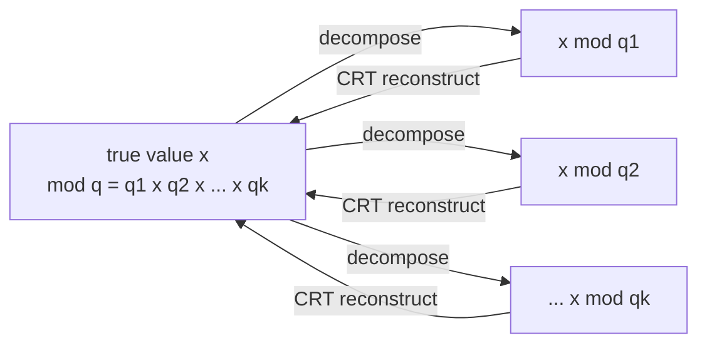
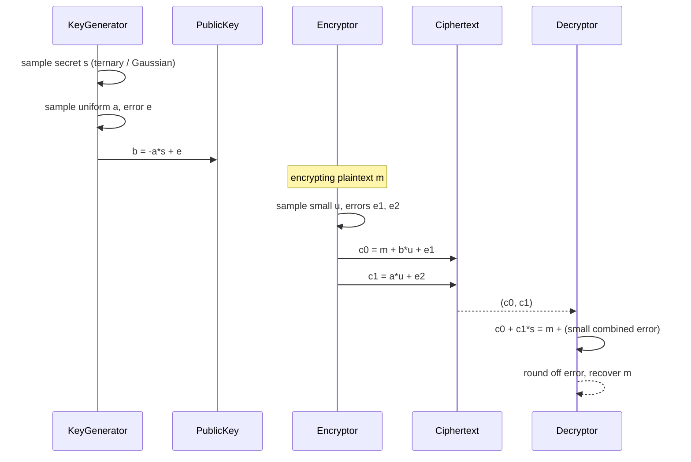
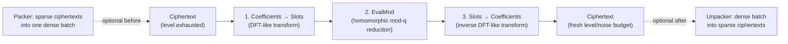
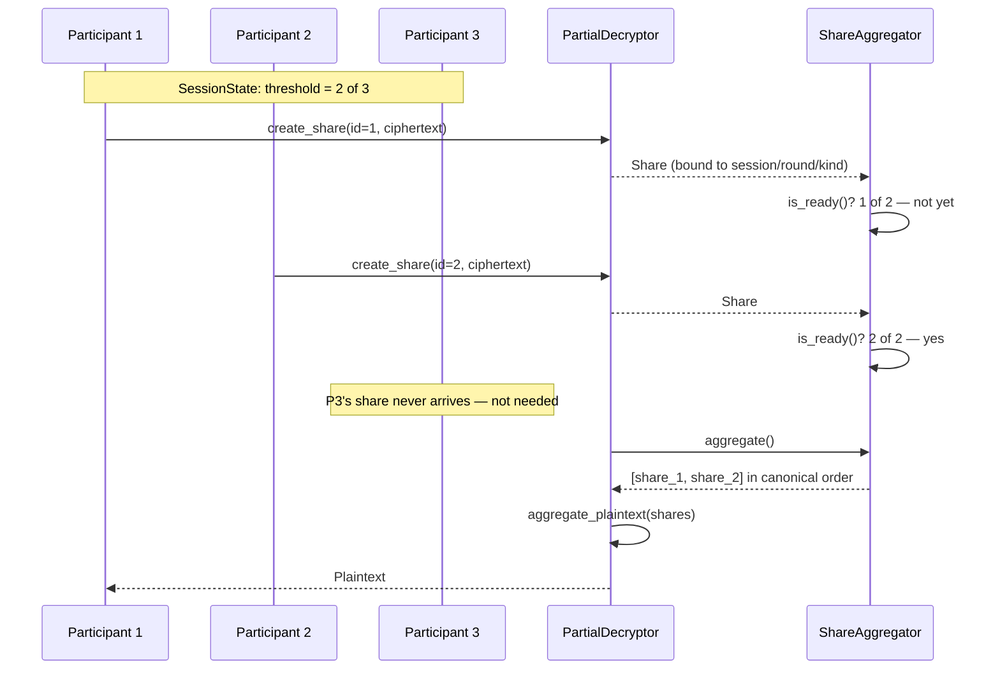

# Concepts

This is a from-first-principles tour of the cryptography Phantom-FHE implements: the math each layer is built on, and the terminology used throughout the rest of the docs. It assumes general programming background but not prior FHE experience. For where each concept lives in the code, see [`architecture.md`](architecture.md); for exactly how far the current implementation is from the textbook version described here, see [`technical-manual.md`](technical-manual.md) and [SECURITY.md](../SECURITY.md).

## Why FHE

Fully homomorphic encryption lets you compute on encrypted data without decrypting it: given `Enc(a)` and `Enc(b)`, you can produce `Enc(a + b)` or `Enc(a * b)` without ever seeing `a` or `b`. The party doing the computation never needs the secret key. This is the primitive behind encrypted analytics, privacy-preserving machine learning, and secure data collaboration — the data owner encrypts, a third party computes, and only the data owner (holding the secret key) can decrypt the result.

Phantom-FHE implements the **RLWE-based** family of schemes (BGV, BFV, CKKS), which is the dominant practical approach: security reduces to the Ring Learning With Errors problem, and ciphertexts are pairs (or tuples) of polynomials in a specific ring.

### Security intuition: why noise makes this hard to break

Every scheme below hides a plaintext `m` inside a linear equation plus a small random error `e` — roughly `c ≈ a·s + e`, for public `a`, secret `s`. Without the error, this is an ordinary system of linear equations: an attacker who sees enough `(a, c)` pairs recovers `s` directly with linear algebra (Gaussian elimination). Adding a *small but nonzero* random `e` to every sample destroys that: the system becomes inconsistent under exact linear algebra, and recovering `s` is (conjectured, and in the ring setting, reduction-proven) as hard as solving certain worst-case lattice problems — this is exactly the **Learning With Errors** assumption. Two things fall directly out of this:

- **The error must be genuinely random and correctly distributed** (e.g. discrete Gaussian) — too small, structured, or predictable, and the "hardness" disappears; this is why [`sample_discrete_gaussian`](#sampling) being a placeholder (see [`technical-manual.md`](technical-manual.md#ring-internals)) is a real, not cosmetic, security gap today.
- **The error must stay small relative to `q`** through every homomorphic operation, or decryption's "round off the error" step fails and the ciphertext becomes undecryptable — this is the "noise budget" every scheme below manages, and precisely what [relinearization](#relinearization-and-key-switching) and [bootstrapping](#bootstrapping) exist to control.

This is also why a *transparent* ciphertext (no error at all — see [`technical-manual.md`](technical-manual.md#rlwe--rgsw-internals)) provides no security whatsoever: with `e = 0`, the linear-algebra attack above works trivially. Every "current status" callout throughout this document and [`technical-manual.md`](technical-manual.md) that says "no error term" is describing exactly this failure mode.

### Why a ring, not just LWE

Plain **LWE** (no ring structure) works over vectors: a secret key is a length-`n` vector, and each ciphertext component is its own independent sample, giving `O(n)` or `O(n²)` sized keys/ciphertexts and no fast multiplication. **RLWE** packs an entire vector's worth of structure into *one* ring element (a degree-`N` polynomial) by working over `R_q = Z_q[X]/(X^N+1)` instead of `Z_q^N`: a single polynomial secret key does the job of an `N`-element vector, ciphertexts are one or two ring elements instead of `O(N)` scalars, and — critically — the ring structure is exactly what makes the NTT applicable, turning polynomial multiplication from `O(N²)` into `O(N log N)`. This efficiency gain is *why* every practical FHE scheme today is ring-based rather than plain-LWE-based.

## A brief history

FHE didn't appear all at once — it's worth knowing the lineage, because the vocabulary ("leveled," "bootstrapping," "generation") throughout this document comes directly from it.

| Year | Who | What | Why it mattered |
| --- | --- | --- | --- |
| 2005 | Regev | LWE (*On Lattices, Learning with Errors, ..., and Cryptography*, STOC 2005) | The hardness assumption everything below eventually builds on — no ring structure yet. |
| 2009 | Gentry | The first FHE construction (PhD thesis, Stanford) | Proved FHE was *possible at all*, via ideal lattices and a technique called **bootstrapping** (see [Bootstrapping](#bootstrapping)) — but many orders of magnitude too slow to use. This is "first-generation" FHE. |
| 2010 | Lyubashevsky, Peikert, Regev | RLWE (*On Ideal Lattices and Learning with Errors over Rings*, EUROCRYPT 2010) | Moved the hardness assumption onto the ring structure described [above](#why-a-ring-not-just-lwe), the efficiency unlock every scheme here depends on. |
| 2012 | Brakerski, Gentry, Vaikuntanathan | **BGV** (*(Leveled) Fully Homomorphic Encryption without Bootstrapping*, ITCS 2012) | "Second-generation" FHE: practical, RLWE-based, exact integer arithmetic, usable for a *bounded* ("leveled") circuit depth without needing to bootstrap after every operation. |
| 2012 | Fan, Vercauteren | **BFV** (*Somewhat Practical Fully Homomorphic Encryption*) | A second, closely related second-generation scheme with a different noise-management strategy — see [BGV and BFV](#bgv-and-bfv--exact-integer-arithmetic) for how close the two actually are. |
| 2016–2017 | Chillotti, Gama, Georgieva, Izabachène | **TFHE** | "Third-generation," fast per-gate bootstrapping for Boolean/small-integer circuits — a different design point (bootstrap every gate, cheaply) than the BGV/BFV/CKKS family. Not implemented in Phantom-FHE; mentioned here for context. |
| 2017 | Cheon, Kim, Kim, Song | **CKKS** (*Homomorphic Encryption for Arithmetic of Approximate Numbers*, ASIACRYPT 2017) | Approximate real/complex arithmetic — the scheme that made FHE practical for machine learning and numerical computation. |
| 2018 | Cheon, Han, Kim, Kim, Song | CKKS bootstrapping (*Bootstrapping for Approximate Homomorphic Encryption*, EUROCRYPT 2018) | Established the coefficients→slots→EvalMod→slots→coefficients pipeline that [`phantom-bootstrapping::ckks`](architecture.md#phantom-bootstrapping) mirrors the shape of. |

Mature open-source implementations — Microsoft SEAL, HElib, PALISADE/OpenFHE, Lattigo, and others — turned these papers into production-shaped libraries over the following years, establishing the RNS-based engineering patterns (parameter presets, RNS variants of BFV/BGV, batching conventions) that inform this project's design; see [`internal/technical-spec.md`](internal/technical-spec.md) and the [Authorship](../README.md#contributing) policy for how that influence is scoped. See [Further reading](#further-reading) at the end of this document for the full citation list.

## Ring arithmetic

Every scheme in this family works over the polynomial ring:

```text
R_q = Z_q[X] / (X^N + 1)
```

$$
R_q = \mathbb{Z}_q[X] \,/\, (X^N + 1)
$$

- `N` is the **ring degree**, a power of two (e.g. 8, 4096, 65536). It bounds the polynomial degree — every polynomial in `R_q` has at most `N` coefficients — and, in batched schemes, determines the number of plaintext slots.
- `q` is the **ciphertext modulus**. Coefficients live in `Z_q = {0, 1, ..., q-1}`.
- `X^N + 1` makes this a **negacyclic** ring: multiplication wraps around with a sign flip (`X^N ≡ -1`), rather than the plain cyclic wraparound (`X^N ≡ 1`) you'd get from `X^N - 1`.

`phantom-ring::Ring` (`Degree` + `Vec<Modulus>`) models this, with `phantom-ring::Poly` storing polynomial coefficients.

### RNS: why the modulus is a list of moduli

Production FHE moduli `q` are large (hundreds of bits) — too large for a machine word. **RNS (Residue Number System)** represents `q` as a product of small coprime moduli, each fitting in a `u64`:

$$
q = q_1 \cdot q_2 \cdots q_k, \qquad x \bmod q \;\longleftrightarrow\; (x \bmod q_1,\; x \bmod q_2,\; \ldots,\; x \bmod q_k)
$$

and arithmetic on `x` reduces to independent arithmetic on each residue (by CRT — the Chinese Remainder Theorem). Going back the other way — residues to the true value — is CRT reconstruction:

$$
x \equiv \sum_{i=1}^{k} r_i \cdot \Big(\frac{q}{q_i}\Big) \cdot \Big[\Big(\frac{q}{q_i}\Big)^{-1} \bmod q_i\Big] \pmod{q}
$$

for residues `r_i = x mod q_i` — exactly what `phantom_ring::rns::crt::reconstruct_residue` computes. This is why `phantom_ring::Poly` stores `coeffs: Vec<Vec<u64>>` indexed `[modulus_index][coefficient_index]` rather than one big-integer coefficient vector:



(each `R1`/`R2`/`R3` above is one `component[j]` of a `phantom_ring::Poly`, for one coefficient position; `Poly` stores one such tuple per coefficient index)

#### Worked example: CRT by hand

Take `q = 15 = 3 × 5` (tiny, so `q1 = 3`, `q2 = 5`) and `x = 11`.

**Decompose** (`x mod q1`, `x mod q2`): `11 mod 3 = 2`, `11 mod 5 = 1`. So `x` is stored as the pair `(2, 1)`.

**Reconstruct**, using the CRT formula above: for `q1 = 3`, `q/q1 = 5`, and we need `5⁻¹ mod 3`: since `5 ≡ 2 (mod 3)` and `2 × 2 = 4 ≡ 1 (mod 3)`, that inverse is `2`. For `q2 = 5`, `q/q2 = 3`, and `3⁻¹ mod 5`: `3 × 2 = 6 ≡ 1 (mod 5)`, so that inverse is also `2`. Plugging in:

$$
x \equiv \big(2 \cdot 5 \cdot 2\big) + \big(1 \cdot 3 \cdot 2\big) \pmod{15} \;=\; 20 + 6 \;=\; 26 \equiv 11 \pmod{15}
$$

Reconstructed value: `11` — matches. Every polynomial coefficient in `phantom_ring::Poly` is stored the same way: as several small residues, reconstructed only when something (a test, a debug print, basis extension) actually needs the true value back.

RNS also gives you **modulus switching / rescaling**: dropping the last modulus `q_k` from the basis divides the represented value by (approximately) `q_k`, which is how BGV modulus switching and CKKS rescaling manage noise growth and, for CKKS, the fixed-point scale. `phantom_ring::rns::rescale::drop_last_modulus` is the primitive; `phantom_ring::rns::extension::extend_basis` goes the other way (extending into a larger basis, needed for e.g. RGSW external products and multiplication).

### Modular reduction

Every ring operation needs fast reduction modulo each `q_i`. The standard techniques:

- **Barrett reduction** — precomputes an approximation of `1/q` to replace division with multiplication and shifts.
- **Montgomery reduction** — represents values in a transformed domain where reduction is cheap, at the cost of transforming in and out.
- **Lazy reduction** — defers full reduction across a chain of additions, only reducing once the accumulator risks overflow.

`phantom_ring::reduce` exposes `BarrettReducer`, `MontgomeryReducer`, and `reduce_once` (lazy) implementing these — see [`technical-manual.md`](technical-manual.md#ring-internals) for the current range restriction and why `Ring`'s hot paths don't use them yet.

### NTT: fast polynomial multiplication

Multiplying two degree-`N` polynomials directly (schoolbook) is O(N²). The **Number Theoretic Transform** — the finite-field analogue of the FFT — evaluates both polynomials at `N` roots of unity, multiplies pointwise (O(N)), and interpolates back, for O(N log N) total. This requires `q` to have a primitive `N`-th root of unity; for the *negacyclic* ring here, specifically a primitive `2N`-th root `ψ` with `ψ² = ω` (the `N`-th root), which is exactly what `Modulus::supports_ntt(n)` checks: `(q - 1) % 2n == 0`.

Because the ring is negacyclic (`X^N ≡ -1`, not `X^N ≡ 1`), the transform first *twists* every coefficient by a power of `ψ` before the ordinary DFT-style sum, and untwists on the way back. For a polynomial with coefficients `a_0, ..., a_{N-1}`:

$$
\hat{a}_k = \sum_{j=0}^{N-1} \big(a_j \cdot \psi^{\,j}\big) \cdot \omega^{\,jk} \pmod q
\qquad\text{(forward)}
$$

$$
a_j = N^{-1} \cdot \psi^{-j} \cdot \sum_{k=0}^{N-1} \hat{a}_k \cdot \omega^{-jk} \pmod q
\qquad\text{(inverse)}
$$

Two polynomials' negacyclic product is then `InverseNTT(NTT(a) ⊙ NTT(b))` — elementwise multiplication in the transformed domain, which is where the O(N²) → O(N) saving on the multiplication step comes from (the transform itself, done via an FFT-style butterfly network, is the O(N log N) part).

`phantom_ring::ntt::NttTable` computes `ψ`, `ω`, and their inverses for a given modulus/degree; `NttBackend` (`forward`/`inverse`) is the trait a concrete implementation satisfies, with `CpuNttBackend` implementing it as a real O(N log N) radix-2 butterfly network — see [`technical-manual.md#ring-internals`](technical-manual.md#ring-internals) for the algorithm and how it's verified, and for what's still not wired into it (the multiplication path everywhere above `phantom-ring` still uses `Ring::schoolbook_mul` instead).

### Sampling

Key generation and encryption need randomness from specific distributions:

- **Uniform** — coefficients uniform in `[0, q)`. Used for the "random" half of RLWE public keys and fresh encryption randomness.
- **Ternary** — coefficients in `{-1, 0, 1}`. A common small-secret distribution: keeps secret keys small (which bounds noise growth) while remaining hard to guess.
- **Discrete Gaussian** — coefficients drawn from a narrow, centered distribution. Used for RLWE's error term `e`, whose smallness is what makes decryption work and whose randomness is what makes the scheme secure (the "learning with errors" in RLWE).

`phantom_ring::sampling` provides `sample_uniform`, `sample_ternary`, and `sample_discrete_gaussian`, all generic over `RngCore + CryptoRng`.

## RLWE: the shared foundation

**Ring Learning With Errors** is the hardness assumption every scheme here reduces to. An RLWE secret key is a small polynomial `s` (typically ternary). An RLWE encryption of a plaintext polynomial `m` is a pair `(c_0, c_1)` such that:

$$
c_0 + c_1 \cdot s \;\approx\; m \pmod q
$$

with the "≈" hiding a small error term that decryption's rounding absorbs. Concretely:

- **Secret-key encryption**: sample uniform `a`, error `e`:
  $$c_0 = m - a \cdot s + e, \qquad c_1 = a$$
  Decryption computes `c_0 + c_1·s = m + e`, and rounds `e` away.
- **Public-key encryption**: the public key is a fresh RLWE encryption of zero, `(b, a) = (-a\cdot s + e,\; a)`. To encrypt `m`, sample a small `u` and fresh errors `e_1, e_2`:
  $$c_0 = m + b \cdot u + e_1, \qquad c_1 = a \cdot u + e_2$$



`phantom_lattice::rlwe` models exactly this shape: `SecretKey`, `PublicKey` (`(c0, c1)` = `(b, a)`), `Encryptor::{SecretKey, PublicKey}`, `Decryptor`. `Ciphertext` is a `Vec<Poly>` because **homomorphic multiplication grows the ciphertext degree**: multiplying a degree-1 ciphertext `(c_0, c_1)` by another `(c_0', c_1')` produces a degree-2 ciphertext

$$
(c_0 c_0',\; c_0 c_1' + c_1 c_0',\; c_1 c_1')
$$

satisfying `d_0 + d_1·s + d_2·s² ≈ m·m'` — a third component, needing `s²` at decryption — hence `Decryptor::decrypt` accumulates `sum_i c_i * s^i` over however many components the ciphertext has.

#### Encoding an integer as a ring element

Everything above treats "the plaintext" as already being a ring element `m`. Turning an actual integer into that ring element is a separate step, and different schemes do it differently (CKKS's version, `round(v·Δ)`, is already given [below](#ckks--approximate-realcomplex-arithmetic)). BFV's version — worth seeing once at the RLWE level, since it's what makes noise-tolerant *exact* decryption work at all — embeds an integer message `v ∈ Z_t` with a gap around it:

$$
m = v \cdot \Delta, \qquad \Delta = \left\lfloor \frac{q}{t} \right\rfloor
$$

Decoding reverses this by dividing back down and rounding to the nearest integer, before reducing mod `t`:

$$
v = \left\lfloor \frac{c_0 + c_1 s}{\Delta} \right\rceil \bmod t
$$

The point of the gap: as long as the accumulated error `e` stays smaller than `Δ/2` in magnitude, `round((v·Δ + e)/Δ)` still lands on exactly `v` — the rounding step absorbs the error completely. Once `|e| ≥ Δ/2`, rounding can land on the wrong integer and decryption silently returns garbage. This *is* the "noise budget" from [Security intuition](#security-intuition-why-noise-makes-this-hard-to-break) made concrete: it's exactly the room between `0` and `Δ/2`.

#### Worked example: encrypting and decrypting one integer by hand

Tiny parameters, chosen only so the arithmetic fits on one screen: ring degree `N = 2` (so `R_q = Z_q[X]/(X²+1)`), ciphertext modulus `q = 17`, plaintext modulus `t = 3`, giving `Δ = ⌊17/3⌋ = 5`. Represent a ring element as its coefficient pair `(a₀, a₁)` for `a₀ + a₁X`.

- Secret key: `s = 1 - X`, i.e. `(1, -1)`.
- Message: `v = 2` (so `2 ∈ Z_3`). Encoded: `m = v·Δ = (10, 0)`.
- Fresh randomness for secret-key encryption: `a = 3 + 5X`, i.e. `(3, 5)`, and a *small* error `e = 1`, i.e. `(1, 0)`.

**Encrypt** (`c_0 = m - a·s + e`, `c_1 = a`). First, `a·s` in `R_q` — using `(a₀+a₁X)(b₀+b₁X) = (a₀b₀ - a₁b₁) + (a₀b₁ + a₁b₀)X` since `X² = -1`:

$$
a \cdot s = \big(3 \cdot 1 - 5 \cdot(-1)\big) + \big(3\cdot(-1) + 5\cdot 1\big)X = 8 + 2X
$$

So:

$$
c_0 = (10, 0) - (8, 2) + (1, 0) = (3, -2) \equiv (3, 15) \pmod{17}, \qquad c_1 = a = (3, 5)
$$

**Decrypt** (`c_0 + c_1·s`). Since `c_1 = a` exactly, `c_1·s = a·s = (8, 2)` — already computed above:

$$
c_0 + c_1 s = (3, 15) + (8, 2) = (11, 17) \equiv (11, 0) \pmod{17}
$$

**Decode**: only the constant term carries the message here, so take `11`, divide by `Δ = 5`, round, reduce mod `t = 3`:

$$
\left\lfloor \frac{11}{5} \right\rceil \bmod 3 = \mathrm{round}(2.2) \bmod 3 = 2 \bmod 3 = 2
$$

Recovered `v = 2` — the original message. Sanity check the failure mode too: this only worked because the error `e = 1` is comfortably under `Δ/2 = 2.5`. Had the accumulated error been `e = 3` instead, decryption would compute `⌊13/5⌉ mod 3 = round(2.6) mod 3 = 3 mod 3 = 0` — silently wrong. That threshold, `Δ/2`, *is* the noise budget for this parameter set.

### Noise growth: why depth matters more than count

Every homomorphic operation changes the hidden error term, and not by the same amount:

- **Addition** grows the error *additively*: adding two ciphertexts with errors `e_a` and `e_b` gives a result with error `e_a + e_b`. Continuing the worked example above, homomorphically doubling the ciphertext (`ct + ct`, representing `v + v`) is linear in every component, so the new error is simply `2e = 2`:

  $$
  c_0 + c_1 s \;=\; 2 \cdot (11, 0) \;=\; (22, 0) \equiv (5, 0) \pmod{17}
  $$

  Decoding: `round(5/5) mod 3 = 1 mod 3 = 1` — and indeed `v + v = 2 + 2 = 4 ≡ 1 (mod 3)`. Correct — but notice the error just grew from `1` to `2`, and the safety margin was `Δ/2 = 2.5`. One more doubling would push the error to `4`, past the threshold, and silently break decryption.
- **Multiplication** grows the error *multiplicatively*, roughly proportional to the *plaintext magnitude* of the other operand, not just the noise itself — a ciphertext encrypting a large value, multiplied by a ciphertext with error `e`, produces error roughly `(large value) × e`, not `e + e`. This is why multiplicative depth (the longest chain of sequential multiplications in a circuit) is the number that determines how large `q` needs to be, not the total count of multiplications — two multiplications in *parallel* (on independent ciphertexts, then added) cost far less noise budget than two multiplications *in sequence* on the same growing ciphertext.

This is exactly the quantity [relinearization](#relinearization-and-key-switching) and [bootstrapping](#bootstrapping) exist to control: relinearization keeps ciphertext *size* from growing (which would otherwise also inflate noise on every subsequent operation), and bootstrapping resets the noise term back down to a small value once the budget is nearly exhausted, letting a circuit run deeper than any fixed parameter set could otherwise tolerate.

### Relinearization and key switching

A degree-2 (or higher) ciphertext works but grows with every multiplication, and needs increasing powers of the secret key to decrypt. **Relinearization** brings it back down to degree 1 using a public **relinearization key** (an encryption of `s²` under `s`, decomposed for noise control). **Key switching** is the general version: transform a ciphertext encrypted under one key into an encryption of the same message under a *different* key — relinearization is key switching from `s²` back to `s`; rotations use key switching from `s` under a Galois automorphism back to `s` under the identity.

### RGSW and the external product

**RGSW** (Ring-GSW) is a different ciphertext shape for the *same* RLWE secret key, built for one specific operation: the **external product**, `RGSW ⊠ RLWE → RLWE`, which multiplies an RLWE ciphertext by an RGSW-encrypted bit/value *without* the noise blowup a regular RLWE×RLWE product causes for that use case. This is the workhorse behind bootstrapping's internal `mux`-style operations in many schemes, and behind more advanced circuit gadgets.

The trick that makes RGSW's noise stay small is **gadget decomposition**: instead of one ciphertext, RGSW stores several rows of RLWE encryptions of `m · g_i` for a gadget vector `g = (1, B, B², ..., B^{l-1})` (a base-`B` digit decomposition). Any coefficient `x` decomposes as

$$
x = \sum_{i=0}^{l-1} d_i \cdot B^i, \qquad d_i = \left\lfloor \frac{x}{B^i} \right\rfloor \bmod B
$$

To multiply, the RLWE input is first decomposed into its own base-`B` digits `d_i` this way, then each digit is matched against the corresponding RGSW row and summed — keeping every intermediate value small (`< B`) rather than letting a full-size `x` multiply a full-size ciphertext component directly. `phantom_lattice::rgsw::decomposition::GadgetDecomposition` implements exactly this, with `B = 2^{\text{base\_log}}`: `decompose(poly, params)` splits each coefficient into `levels` digits; `recompose` reconstructs via the same weighted sum.

#### Worked example: gadget decomposition by hand

Base `B = 4` (`base_log = 2`, so each digit is 2 bits), `levels = 3` (covers values up to `B³ - 1 = 63`), and `x = 53`.

Digit `i` is `⌊x / Bⁱ⌋ mod B` — in the code, `(coeff >> (i·base_log)) & (B-1)`, since shifting/masking by a power of two *is* dividing/mod-ing by that power of two:

| `i` | `⌊53 / 4ⁱ⌋` | `mod 4` | digit `d_i` |
| --- | --- | --- | --- |
| 0 | ⌊53/1⌋ = 53 | 53 mod 4 | **1** |
| 1 | ⌊53/4⌋ = 13 | 13 mod 4 | **1** |
| 2 | ⌊53/16⌋ = 3 | 3 mod 4 | **3** |

Reconstruct: `d_0·B⁰ + d_1·B¹ + d_2·B² = 1·1 + 1·4 + 3·16 = 1 + 4 + 48 = 53` — matches. Every digit is `< 4`, so an RGSW row can be sized for values that small regardless of how large `x` itself is; that's the whole trick.

## BGV, BFV, CKKS: the three schemes

All three build on RLWE ciphertexts but differ in what a "plaintext" means and how noise/precision is managed.

### BGV and BFV — exact integer arithmetic

BGV and BFV both encode integers **exactly**: the plaintext lives in `Z_t` for a small **plaintext modulus** `t`, and every homomorphic operation is exact modulo `t` (no approximation, no rounding error in the *result* — only in whether the ciphertext still decrypts correctly, which is a noise-budget question, not a precision one). They differ mainly in *when* scaling by `t/q` happens (BFV scales at multiplication time; BGV carries plaintext and ciphertext moduli separately and uses modulus switching) and in some engineering tradeoffs — for most application code the two are close to interchangeable, which is reflected in this codebase by BFV literally being a wrapper around BGV's mechanics (see [`architecture.md`](architecture.md#phantom-schemes)) with signed integer encoding layered on top.

**Batching**: rather than one integer per ciphertext, both schemes pack a vector of integers into the coefficient/slot positions of a single polynomial, so one homomorphic add/multiply operates on all slots (`slot_count()`) in parallel (SIMD-style). Rotating slots (`rotate_slots`) and summing across slots (`sum_slots`, by rotate-and-add) are standard building blocks for anything beyond pure elementwise arithmetic — reductions, dot products, matrix-style operations.

### CKKS — approximate real/complex arithmetic

CKKS encodes **approximate** real or complex numbers instead of exact integers. A plaintext value `v` (a vector of slot values, in the batched case) is represented as a fixed-point integer:

$$
\text{encode}(v) = \mathrm{round}(v \cdot \Delta), \qquad \Delta = \text{scale (e.g. } 2^{40}\text{)}
$$

Every operation carries the scale `Δ` along, and multiplication *multiplies* two ciphertexts' scales together:

$$
\Delta_{\text{result}} = \Delta_{\text{lhs}} \cdot \Delta_{\text{rhs}}
$$

which is why CKKS needs an explicit **rescale** operation after each multiplication — dividing the scale back down by dropping one RNS modulus `q_k` from the chain (à la BGV modulus switching, [above](#rns-why-the-modulus-is-a-list-of-moduli)):

$$
\Delta_{\text{new}} \approx \frac{\Delta_{\text{old}}}{q_k}, \qquad \text{level} \mathrel{-}= 1
$$

before the scale grows unmanageably. This is CKKS's defining tradeoff: you get real-number arithmetic and machine-learning-friendly operations, at the cost of accumulating floating-point-like approximation error instead of exact results.

Three numbers matter for reasoning about a CKKS ciphertext:

- **Scale (`Δ`)** — the fixed-point scale factor, checked for compatibility (`Scale::compatible`) before binary operations.
- **Level** — how many RNS moduli remain in the ciphertext's modulus chain; `rescale_next` consumes one level. Once level reaches 0, no more multiplications (without bootstrapping) are possible.
- **Precision** — a running *estimate*, in bits, of how much approximation error has accumulated; every operation degrades it by some amount (rotation/add/sub degrade a little; multiply and rescale degrade more).

CKKS also supports a **conjugate-invariant** mode for encoding only real (not complex) values, which doubles the usable slot count for real-only workloads (`slot_count()` returns `N` instead of `N/2`) at the cost of rejecting non-zero imaginary parts.

## Homomorphic circuits

Batching gives you elementwise operations "for free," but most interesting computations need to move data *between* slots — matrix-vector products, convolutions, polynomial approximations of nonlinear functions. `phantom-circuits` provides the scheme-independent planning machinery for this:

### Linear transforms and the diagonal method

A linear transform on slots is a matrix `M` applied to the slot vector. Applying `M` densely costs `slot_count` rotations. The standard optimization (the **diagonal method**) rewrites `M` as a sum of `slot_count` cyclic diagonals (`M[i][(i+offset) % n]` for each `offset`), most of which are zero for structured transforms — you only pay for the *nonzero* diagonals. `LinearTransform::to_diagonal_matrix` / `DiagonalMatrix::from_linear_transform` performs this conversion.

**Baby-step giant-step (BSGS)** further reduces the rotation count for the diagonal method: instead of one rotation key per nonzero diagonal offset, offsets are split into "baby steps" (small, precomputed rotations) and "giant steps" (larger rotations applied to baby-step results). For `D` nonzero diagonals and a baby-step size `b`, every offset `o` decomposes as `o = g·b + r` (giant index `g`, baby remainder `r`), so only the distinct `r` values and `g·b` values need their own rotation — roughly

$$
O\big(\sqrt{D}\big) \text{ distinct rotations, instead of } O(D)
$$

when `b ≈ √D`. `DiagonalMatrix::bsgs_plan` / `BabyStepGiantStepPlan` implements the schedule, and `BabyStepGiantStepPlan::decompose_offset` gives the `(giant_step, baby_step)` pair for any covered offset.

### Polynomial evaluation strategies

Evaluating a polynomial homomorphically means every multiplication consumes a CKKS level (or BGV/BFV noise budget), so the *strategy* for evaluating `c_0 + c_1*x + ... + c_d*x^d` matters:

- **Horner's method** — sequential, minimal code, but *depth* (levels consumed) equal to the degree.
- **Power basis** — precompute all powers `x, x², ..., x^d`, then a single weighted sum; more multiplications but shallower depth.
- **Paterson-Stockmeyer** — the BSGS idea applied to polynomials: split the degree-`d` polynomial into `⌈d/b⌉` blocks of `b` coefficients each (`b ≈ √d`), evaluate each block with the shared "baby" powers `x, x², ..., x^b`, then combine the block results using "giant" powers `x^b, x^{2b}, ...`:
  $$
  p(x) = \sum_{j} \Big(x^{jb} \cdot \big(\text{block}_j \text{ evaluated in baby powers}\big)\Big), \qquad O(\sqrt{d}) \text{ multiplications instead of } O(d)
  $$
  at roughly `O(log d)` multiplicative depth.

`PolynomialEvalPlan::for_degree` picks a strategy automatically (constant → Horner ≤3 → power-basis ≤7 → Paterson-Stockmeyer beyond that); `PolynomialEvalPlan::with_strategy` lets you override it.

### CKKS-specific circuits

Beyond generic linear transforms and polynomial evaluation, `phantom_circuits::ckks` provides the building blocks bootstrapping and approximate computation need:

- **DFT** (`DftEvaluator`) — a discrete Fourier transform over packed slots, used for the coefficients↔slots transforms in bootstrapping.
- **Comparison** (`ComparisonEvaluator`) — smooth approximations of `sign(x)` (via `tanh(αx)`), the unit step function, and `max(a, b)` (via a smoothed absolute value) — CKKS can't branch, so comparisons need continuous approximations.
- **Inverse** (`InverseEvaluator`) — reciprocal approximation.
- **Mod1** (`Mod1Evaluator`) — centered fractional part (`x - round(x)`), a building block for CKKS's `EvalMod` bootstrapping stage.
- **Minimax** (`MinimaxEvaluator`) — evaluates a *composite* of polynomial stages (each stage's output feeds the next), the general mechanism behind minimax-polynomial approximations of arbitrary functions.

## Bootstrapping

Every scheme above has a *noise budget* (BGV/BFV) or *level budget* (CKKS) that's consumed by multiplication and never replenished by normal operations — eventually a ciphertext can't be operated on further without becoming undecryptable. **Bootstrapping** refreshes a ciphertext to restore that budget, homomorphically evaluating the decryption circuit itself (so the result comes out re-encrypted at full budget, without ever exposing the plaintext).

CKKS bootstrapping is the one implemented here, as the standard four-stage pipeline:



1. **Coefficients → slots** — move the ciphertext's coefficient representation into its slot (evaluation) representation via a DFT-like transform, so slot-wise operations can act on it.
2. **EvalMod** — homomorphically evaluate the modular reduction that decryption implicitly performs, which is the step that actually "refreshes" the noise/level budget. This is the hardest step in real CKKS bootstrapping (it needs a good polynomial approximation of a periodic function) and is where this implementation is currently a stand-in — see [`technical-manual.md#bootstrapping-internals`](technical-manual.md#bootstrapping-internals) for the annotated version of this same diagram showing exactly which stage that is.
3. **Slots → coefficients** — the inverse DFT-like transform, back to coefficient representation.
4. **Sparse packing/unpacking** (`Packer`/`Unpacker`) — bootstrapping is often cheaper on a smaller sparsely-packed ring; packing concatenates several sparse ciphertexts into one dense batch before/after the pipeline (`bootstrap_batch`).

BGV and BFV bootstrapping are architecturally reserved (`phantom_bootstrapping::{bgv, bfv}` module locations exist) but not implemented — see [SECURITY.md](../SECURITY.md). Interactive (threshold, multi-party) bootstrapping — a different, protocol-based way to refresh a ciphertext using cooperating parties instead of the centralized pipeline above — lives in `phantom-multiparty` instead, described next.

## Multiparty / threshold protocols

Everything above assumes one secret-key holder. Multiparty protocols distribute the secret key across `n` participants such that any `threshold` of them can cooperate to decrypt or perform key-dependent operations, but no smaller coalition can. `phantom-multiparty` implements this shape for BGV, BFV, and CKKS uniformly:

- **Participants and sessions** — `ParticipantId`/`ParticipantSet` identify who's involved; `SessionState` binds a `ProtocolKind`, a `ParticipantSet`, a `threshold`, and a `round` counter, so shares can't be replayed into the wrong session, protocol, or round.
- **Shares** — `Share` is a signed-and-typed payload (`ShareKind` + session/round/participant binding) that one participant contributes; `ShareAggregator` collects shares for one session/kind and reports `is_ready()` once `threshold` shares have arrived, then `aggregate()` returns them in canonical order.
- **Transcripts** — `Transcript`/`TranscriptMessage` give a deterministic, appendable, hashable log of a protocol run (useful for auditing and for protocols needing a public transcript, e.g. Fiat-Shamir-style constructions).

On top of this, each of `mpbgv`/`mpbfv`/`mpckks` implements six protocols with the same names:

- **`CollectiveKeyGen` (ckg)** — participants jointly generate a public key for a secret key that's *shared* (no single party holds it).
- **`RelinearizationKeyGen` (rkg)** / **`GaloisKeyGen` (gkg)** — the threshold analogues of relinearization/rotation key generation.
- **`PartialDecryptor`** — each participant contributes a partial decryption share of a ciphertext (their share alone reveals nothing); aggregating `threshold` shares yields the plaintext.
- **`ReEncryptor`** — re-encrypts a ciphertext under a different collective key using threshold shares, without full decryption.
- **`InteractiveBootstrap`** — refreshes a ciphertext via cooperating participants rather than (or, for CKKS, in addition to) a centralized bootstrapping pipeline; `mpckks::InteractiveBootstrap` is the one that hands off to `phantom_bootstrapping::ckks::Bootstrapper` after aggregating shares.

Every one of the six protocols above follows the identical session → share → aggregate shape, illustrated here with `PartialDecryptor` and a 2-of-3 threshold (matching the runnable code in [`user-guide.md#multiparty--threshold-protocols`](user-guide.md#multiparty--threshold-protocols)):



## Serialization

Every public wire type (keys, parameters, plaintexts, ciphertexts, bootstrap parameters) is encoded with a fixed **domain tag** (an 8-byte ASCII identifier for the type) and a `u16` **version**, so decoding a payload against the wrong type or an old/new format fails immediately with a typed error rather than misparsing silently. See [`architecture.md#serialization`](architecture.md#serialization) for the pattern and [`technical-manual.md#serialization-format`](technical-manual.md#serialization-format) for the full byte-level reference.

## Glossary

| Term | Meaning |
| --- | --- |
| **LWE / RLWE** | Learning With Errors / its ring-structured variant — the hardness assumption behind every scheme here. See [Security intuition](#security-intuition-why-noise-makes-this-hard-to-break). |
| **Ring degree (`N`)** | The power-of-two bound on polynomial size in `R_q = Z_q[X]/(X^N+1)`; also the batching capacity. |
| **RNS** | Residue Number System — representing a large modulus `q` as several small coprime moduli for machine-word arithmetic. See [Ring arithmetic](#ring-arithmetic). |
| **CRT** | Chinese Remainder Theorem — the math behind reconstructing a value from its RNS residues. |
| **NTT** | Number Theoretic Transform — the finite-field FFT analogue used for fast polynomial multiplication. |
| **Negacyclic** | A ring where `X^N ≡ -1` (as opposed to cyclic, `X^N ≡ 1`) — the wraparound behavior of `R_q`. |
| **Secret / public key** | The RLWE key pair; the secret key never leaves the party that generated it (except, deliberately, in multiparty threshold protocols). |
| **Relinearization** | Bringing a degree-2+ ciphertext (from multiplication) back down to degree 1. |
| **Key switching** | Re-encrypting a ciphertext under a different key without decrypting; relinearization and rotation are both special cases. |
| **Galois key / rotation key** | Key material enabling a specific slot rotation (Galois automorphism) via key switching. |
| **RGSW** | Ring-GSW — a ciphertext form built for the external product, used inside bootstrapping and advanced circuits. |
| **Gadget decomposition** | Splitting a value into small base-`B` digits so RGSW's external product stays noise-efficient. |
| **Batching / slots** | Packing multiple plaintext values into one ciphertext's coefficient/evaluation positions for SIMD-style parallel operations. |
| **Plaintext modulus (`t`)** | BGV/BFV's exact-arithmetic modulus for encoded integers (distinct from the ciphertext modulus `q`). |
| **Scale (`Δ`)**, **level**, **precision** | CKKS's fixed-point scale factor, remaining modulus-chain budget, and running approximation-error estimate. |
| **Rescale** | CKKS's operation to divide the scale back down after multiplication, consuming one level. |
| **Noise budget** | How much accumulated error a BGV/BFV ciphertext can tolerate before decryption fails; the exact-arithmetic analogue of CKKS's level. |
| **Bootstrapping** | Homomorphically refreshing a ciphertext's noise/level budget by evaluating decryption itself, without exposing the plaintext. |
| **Diagonal method / BSGS** | Techniques for evaluating a linear transform on packed slots using far fewer rotations than a dense matrix would need. |
| **Paterson-Stockmeyer** | The BSGS idea applied to polynomial evaluation: `O(√d)` multiplications instead of `O(d)` for a degree-`d` polynomial. |
| **Threshold / participant / share** | Multiparty protocol vocabulary: a secret distributed so any `threshold`-sized subset of `n` participants can cooperate via their shares. |
| **Domain tag** | The 8-byte type identifier every serialized Phantom-FHE value starts with, rejecting cross-type decoding. |
| **IND-CPA / semantic security** | The standard security notion these schemes target: ciphertexts of chosen plaintexts are computationally indistinguishable from each other. |

## Further reading

The primary literature behind every concept above, in roughly the order you'd want to read them:

- Regev, O. *On Lattices, Learning with Errors, Random Linear Codes, and Cryptography.* STOC 2005. — the original LWE hardness assumption.
- Lyubashevsky, V., Peikert, C., Regev, O. *On Ideal Lattices and Learning with Errors over Rings.* EUROCRYPT 2010. — RLWE, the assumption every scheme here reduces to.
- Gentry, C. *A Fully Homomorphic Encryption Scheme.* PhD thesis, Stanford University, 2009. — the first FHE construction; introduces bootstrapping.
- Brakerski, Z., Gentry, C., Vaikuntanathan, V. *(Leveled) Fully Homomorphic Encryption without Bootstrapping.* ITCS 2012. — BGV.
- Fan, J., Vercauteren, F. *Somewhat Practical Fully Homomorphic Encryption.* IACR ePrint 2012/144. — BFV/FV.
- Halevi, S., Polyakov, Y., Shoup, V. *An Improved RNS Variant of the BFV Homomorphic Encryption Scheme.* CT-RSA 2019. — the RNS-friendly variant of BFV that `phantom-ring`'s RNS design is oriented toward.
- Cheon, J.H., Kim, A., Kim, M., Song, Y. *Homomorphic Encryption for Arithmetic of Approximate Numbers.* ASIACRYPT 2017. — CKKS.
- Cheon, J.H., Han, K., Kim, A., Kim, M., Song, Y. *Bootstrapping for Approximate Homomorphic Encryption.* EUROCRYPT 2018. — the coefficients→slots→EvalMod→slots→coefficients pipeline `phantom-bootstrapping::ckks` mirrors the shape of.
- Chillotti, I., Gama, N., Georgieva, M., Izabachène, M. *TFHE: Fast Fully Homomorphic Encryption over the Torus.* Journal of Cryptology, 2020. — fast per-gate bootstrapping; a different design point than BGV/BFV/CKKS, not implemented here, but useful context for the field as a whole.

For engineering patterns and reference implementations (not copied from — see the [Contributing](../README.md#contributing) authorship policy — but useful for cross-checking understanding): Microsoft SEAL, HElib, OpenFHE (formerly PALISADE), and Lattigo are the widely-used open-source FHE libraries a further-reading path would naturally lead to next.

## Where this stands today

Everything described above is the *target* shape of the API and the math it's meant to implement — and the API shapes, types, and planning logic (circuits, BSGS, RNS structure, protocol session/share handling) are real. What's **not** yet real, in the current alpha, is a lot of the actual cryptographic content behind those shapes: encryption is transparent in several places, some "keys" are placeholders, and bootstrapping's `EvalMod` stage is an identity function. None of this is hidden — [SECURITY.md](../SECURITY.md) lists the current gaps per crate, and [`technical-manual.md`](technical-manual.md) documents precisely what each operation does today versus what it's meant to do. Read both before building anything that assumes real security.
