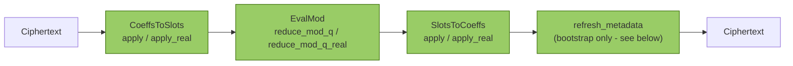
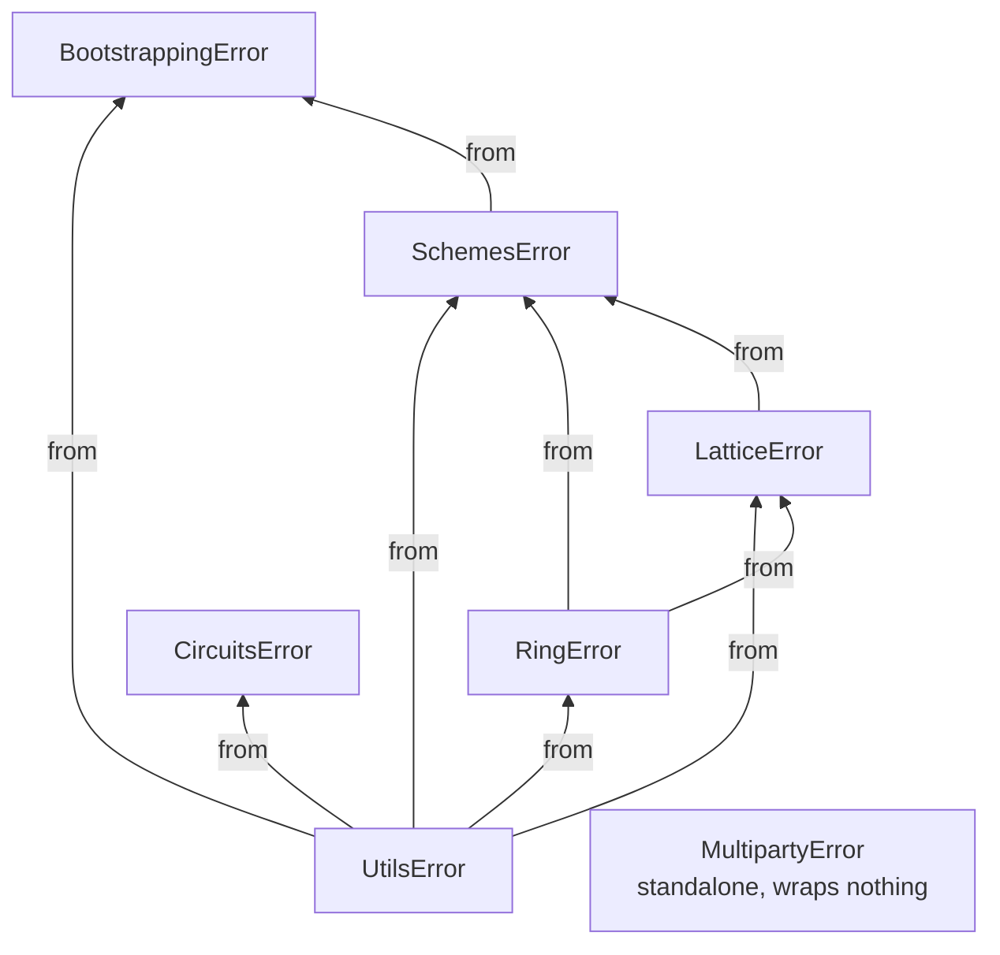

# Technical Manual

This is the precise, code-level reference for Phantom-FHE: exactly what each operation does today, the wire formats, the error taxonomy, and current performance characteristics. Where the current behavior is an early implementation rather than the final cryptographic operation, that's called out explicitly and unambiguously — this document exists so nobody has to read the source to find out. For the conceptual/mathematical background this assumes, see [`concepts.md`](concepts.md); for crate layout, see [`architecture.md`](architecture.md).

Every "Current status" callout below reflects the research-stage status described in [SECURITY.md](../SECURITY.md) — the intended state of an in-progress hardening roadmap, not a defect report. Any operation marked transparent, placeholder, or identity does not yet provide cryptographic protection.

## Ring internals

### Modular reduction

`phantom_ring::reduce` exposes three reducer shapes plus free functions (`add_mod`, `sub_mod`, `neg_mod`, `mul_mod`, `pow_mod`, `inv_mod`, all operating via widened `u128` arithmetic and correct for any odd modulus).

**Current status:** `BarrettReducer` and `MontgomeryReducer` are real implementations of their named algorithms. `BarrettReducer::reduce` now supports the **full 64-bit modulus range** (`modulus >= 2`): `mu = ⌊2¹²⁸/modulus⌋` is computed exactly via an internal `BigUint`'s long division (`crates/phantom-ring/src/bignum.rs`), and reduction estimates the quotient as `⌊value·mu / 2¹²⁸⌋` via a stack-only 128×128→256-bit wide multiply (`mul_wide_128` in `reduce/barrett.rs`: four 64×64→128-bit partial products with explicit carry propagation, no heap allocation on the hot path), corrected with up to two conditional subtractions. `reduce`'s precondition is `value < modulus · 2⁶⁴` (proven, not just `value < modulus²`, though every call site in this crate only ever needs the tighter bound). `MontgomeryReducer` implements REDC (Montgomery 1985) with a real 2-adic modular inverse computed via Newton-Raphson iteration, plus `to_montgomery`/`from_montgomery`/`mul_montgomery` for staying in Montgomery form across a chain of operations (`mul` is the convenience that round-trips plain inputs through Montgomery form on every call — correct, but not the efficient use of the primitive; see the module docs in `reduce/montgomery.rs`). Montgomery's range is capped at `phantom_ring::reduce::MONTGOMERY_MAX_MODULUS` (`2⁶³`, derived from exactly how much headroom `redc`'s `u128` accumulator has, not chosen arbitrarily) — going further needs a genuinely wider (192+ bit) accumulator, real follow-up work not implemented here. Both are validated by exhaustive tests (all moduli 3–199, every value in range) plus thousands of randomized cases across their full respective ranges, plus a dedicated test against four ~61-bit NTT-friendly primes and cross-checks of the wide multiply against an independent bignum implementation and a Python-verified reference product — see `crates/phantom-ring/tests/phase2.rs` and `reduce/barrett.rs`'s own unit tests. `reduce_once` (lazy reduction: subtract `modulus` once if `value >= modulus`) remains a real (if trivial) lazy-reduction primitive. `Ring` precomputes a `BarrettReducer` per modulus at construction — now `Some` for every valid `Modulus`, since Barrett has no upper limit — and routes `coeffwise_mul`/`schoolbook_mul`/`scalar_mul_assign` through it via a `mul_residue` helper, which checks both operands are already `< modulus` before taking the fast path, since `Poly`'s type doesn't enforce that invariant and `BarrettReducer::reduce`'s precondition is narrower than `mul_mod`'s unconditional correctness; anything out of range falls back to the widened `u128` path, so correctness never depends on coefficients happening to be reduced. `add_assign`/`sub_assign`/`neg_assign` still use `add_mod`/`sub_mod`/`neg_mod` directly — addition doesn't benefit from Barrett/Montgomery the way multiplication does. `MontgomeryReducer` (`to_montgomery`/`from_montgomery`/`mul_montgomery`) isn't wired into `Ring` yet — its natural fit is a future NTT butterfly hot path that stays in Montgomery domain across the whole transform, not a single-multiplication swap.

### NTT

`phantom_ring::ntt::CpuNttBackend` computes a negacyclic transform: twist by powers of `ψ` (the `2N`-th root), apply the transform, and for the inverse, untwist by powers of `ψ⁻¹` and scale by `N⁻¹`.

**Current status:** the transform core is now a **real O(N log N) radix-2 Cooley-Tukey butterfly network** (`radix2_ntt_inplace` in `ntt/cpu.rs`) — bit-reverse permutation followed by the standard iterative in-place butterfly stages, run once with `ω` for the forward transform and once with `ω⁻¹` (then scaled by `N⁻¹`) for the inverse, by the standard NTT/DFT duality. The twist/untwist steps around it use `NttTable`'s precomputed `psi_powers`/`inv_psi_powers` (an `O(n)` running-product table built once per table) rather than an independent `pow_mod(psi, j, q)` call per coefficient (`O(n log n)` total, previously recomputed on every multiplication), and every multiplication in both the twist step and the butterfly network routes through `NttTable`'s precomputed `BarrettReducer` (with the same `< modulus` defensive guard `Ring::mul_residue` uses) instead of division-based `mul_mod`. Correctness rests on: a hand-derived reference case (`N=4`, `q=5`) checked by hand before the implementation was written; an independent direct-DFT comparison across four `(degree, modulus)` pairs (`radix2_ntt_matches_direct_dft_for_random_cases`); round-trip and NTT-vs-`schoolbook_mul` comparisons across six degrees from 4 to 128 with ten random polynomials each (`ntt_round_trip_and_multiplication_hold_across_degrees_and_moduli` in `tests/phase2.rs`) — `schoolbook_mul` is a structurally independent implementation of the same negacyclic multiplication, not just the same code checked against itself; and two dedicated tests cross-checking the precomputed power tables against independent `pow_mod` calls. Measured: a forward+inverse round trip at `N=1024` (the NTT-friendly prime `12289`) takes ~110-130µs for 100 iterations combined (`crates/phantom-benches/benches/ring_ntt.rs`) — down from ~414µs before the precomputed-table/Barrett wiring, roughly a 3.5-4x speedup on top of the two-orders-of-magnitude win the O(N log N) transform itself already gave over direct evaluation.

`Ring::mul` is the actual multiplication entry point now: it uses the NTT (via a per-modulus `NttTable` precomputed once at `Ring::new`, not rebuilt per call) for any component whose modulus supports it at the ring's degree, falling back to `schoolbook_mul`'s O(N²) approach per-component otherwise — `schoolbook_mul` itself is unchanged and still always O(N²), kept as the correctness reference `mul`'s NTT path is tested against. Every real call site in `phantom-lattice::rlwe` (`Encryptor`, `Decryptor`, `KeyGenerator::generate_public_key`, `Evaluator::mul`) and `phantom-lattice::rgsw::external_product` switched from `schoolbook_mul` to `mul`, so the speedup reaches actual ciphertext operations, not just a standalone benchmark — verified by the full workspace test suite passing unchanged (same results, since `mul` and `schoolbook_mul` compute the same math) plus dedicated tests comparing the two directly, including the fallback path for a modulus that doesn't support NTT at its degree. `Ring::mul`'s NTT branch also allocates exactly one scratch buffer per call now (reused across every RNS component) instead of the four-plus-one an allocation audit found (`docs/internal/implementation-plan.md` Workstream 3 items 7/8) - the input's forward transform and the final product both write directly into the pre-allocated output buffer, via new `forward_transform_in_place`/`inverse_transform_in_place`/`forward_component_into` primitives in `ntt::cpu`. A before/after smoke-bench comparison found no wall-clock difference distinguishable from noise at this scale - the allocation-count reduction is real and code-verifiable, but proving its performance effect needs a statistically rigorous benchmark this crate doesn't have yet (see [Performance](#performance)).

**Not yet done:** no hand-unrolled hot loops, no lazy/deferred *correction* reduction between butterfly stages (values are still fully reduced to `[0, modulus)` after every operation via `BarrettReducer`/`add_mod`/`sub_mod`, rather than kept in a wider `[0, 2·modulus)`-or-so range across stages the way e.g. Harvey-style butterflies do to elide most of the correction work itself), and no Montgomery-form precomputed root table — all real further-optimization opportunities, not correctness gaps.

**Fixed a real scalability cliff in `NttTable`'s own root-finding** (found while building a production-scale parameter preset, Workstream 2 item 2): `ntt::table::primitive_root_of_order` used to search for a primitive `2·degree`-th root by testing candidates `2, 3, 4, ...` directly against `modulus` — fine when `modulus` stays close in size to `2·degree` (every existing preset in this codebase), since a large fraction of small candidates work, but for a `modulus` far larger than `2·degree` (a realistic multi-prime RNS ciphertext modulus at a fixed, much smaller degree), the order-`2·degree` subgroup shrinks to a vanishingly small, effectively randomly-scattered fraction of `[2, modulus)` — the direct search needed on the order of `modulus / (2·degree)` iterations, billions for a real ~55-bit prime, and never actually returned in any observed run rather than merely being slow. Fixed by computing a candidate directly via the already-known cofactor `k = (modulus - 1) / order` (guaranteed integral by `Modulus::supports_ntt`'s own precondition): `h = g^k` automatically lands in the correct order-dividing subgroup by Fermat's little theorem for any small `g`, so only the existing "has order exactly `order`, not a smaller power-of-two divisor" check (`h^(order/2) != 1`) is still needed, no longer a search over the subgroup's own scattered elements. Verified by the full existing NTT/`Ring::mul` test suite passing unchanged (same roots satisfy the same properties, just found differently) plus a dedicated regression test constructing a table for the exact 55-bit prime this was found with at a small degree (`ntt_table_construction_is_fast_for_a_modulus_far_larger_than_the_degree` in `tests/phase2.rs`), completing near-instantly where the old code would not complete at all.

### RNS basis extension

`phantom_ring::rns::extension::extend_basis` reconstructs each polynomial coefficient's true integer value via CRT and re-decomposes it into the target basis.

**Current status:** the reconstruction is now exact for any basis size, computed over a minimal internal `BigUint` type (`rns/bignum.rs`: base-`2^64` limbs, `add`/`sub`/`mul_u64`/`divmod_u64`/`cmp` — no general bignum/bignum division) rather than a `u128`, which silently overflows once the source moduli's product exceeds `2^128` (e.g. eight or more ~60-bit moduli, a realistic RNS-CKKS/BGV basis size). The CRT sum `T = Σᵢ (rᵢ·yᵢ mod qᵢ)·Mᵢ` is bounded at `< k·Q` (`k` = number of source moduli, `Q` = their product, `Mᵢ = Q/qᵢ`), so reducing it back under `Q` only needs a bounded loop of at most `k−1` subtractions — never a division. This is deliberately an *exact*-arithmetic algorithm, not one of the RNS-native approximate algorithms production implementations typically use (e.g. Bajard-Eynard-Hasan-Zucca or Halevi-Polyakov-Shoup style, which trade a small, carefully-bounded floating-point approximation error for avoiding bignums and the per-coefficient `O(k)` bignum operations this implementation does). Switching to one of those remains a valid future performance upgrade once profiling shows this path is hot; correctness is not in question either way. Verified against: the crate's own exhaustive/randomized `BigUint` primitive tests, the pre-existing small-basis test (unchanged), and a dedicated large-basis regression test using an 8-prime ~489-bit basis checked against values independently computed in Python — exactly the scenario that would have silently overflowed the old `u128` implementation (`extend_basis_is_exact_for_a_realistic_multi_prime_basis_that_overflows_u128` in `tests/phase2.rs`). `rns::rescale::drop_last_modulus` (simple truncation of the last RNS component) remains the one other RNS operation that's already close to its production shape.

### Sampling

`sample_uniform` and `sample_ternary` are the real target algorithms (rejection-sampled uniform bytes, ternary via `sample_bounded(rng, 3)`). `sample_discrete_gaussian` now draws from a real discrete Gaussian, not a uniform-range stand-in: it builds a cumulative distribution table (CDT) over a support truncated to `±6·sigma` (the true Gaussian's tail beyond that integrates to about `2e-9`, negligible against any practical sample count), draws one uniform `u64` per coefficient, and walks the table to find which cumulative-probability bucket it falls into. It takes `sigma` (the actual standard deviation) directly, not a uniform-range bound — the API changed accordingly (`SecretDistribution::Gaussian { sigma: f64 }` in `phantom-lattice::rlwe::keygen`). Verified by: the table's cumulative sum landing at exactly `1.0` (forced past floating-point rounding, so sampling always terminates) across several `sigma` values, samples staying within the truncated support, and an independent statistical check (200,000 samples, empirical mean/stddev within a sample-count-derived tolerance of `0`/`sigma`) — `crates/phantom-ring/src/sampling/gaussian.rs`'s own tests.

**Fixed a real cross-modulus consistency bug** (found while designing Workstream 4 item 3's key-switching, which is the first thing in this codebase to genuinely need more than one RNS modulus at once): `sample_ternary` and `sample_discrete_gaussian` used to draw an independent random choice per `(RNS component, coefficient)` pair, rather than one true small value per coefficient reduced identically into every component. `sample_uniform`'s per-component independence is *correct* (CRT is a bijection, so independent uniform draws per modulus are exactly how you sample a value uniform over the full product range) - but for `sample_ternary`/`sample_discrete_gaussian`, which are meant to produce a coherent small polynomial whose *true* coefficient values are what matters (secret keys, error terms), independent-per-component sampling produces components that don't CRT-reconstruct to any single coherent value at all. Invisible on every single-modulus ring this crate's tests happened to use so far (nothing to be inconsistent with); a real correctness break the moment a ring has more than one modulus, which is the entire premise of RNS. Both now sample the true value once per coefficient and reduce it into every component identically. Verified by a dedicated regression test (`ternary_and_gaussian_samples_are_crt_coherent_across_rns_components` in `tests/phase2.rs`, on a real two-modulus ring) that fails against the old code and passes against the new - confirmed by literally reverting the fix and re-running it. Every existing single-modulus test's fixed-seed output is byte-for-byte unchanged (same RNG call count and order, only which write happens when), so nothing needed updating elsewhere.

**Not yet done:** the table walk short-circuits at the matching bucket, so it is **not constant-time** — a side-channel-hardened sampler needs every entry touched unconditionally, or a Knuth-Yao/Ziggurat construction, which remains future work. See [`concepts.md#sampling`](concepts.md#sampling) for why the *shape* of the noise distribution matters for security, and [Key generation](#key-generation)/[Encryption](#encryption) below for how this sampler is actually wired into every real (non-transparent) scheme's key-generation and encryption error today.

## RLWE / RGSW internals

### Key generation

`KeyGenerator::generate_secret_key` is real (ternary or discrete Gaussian, per `SecretDistribution` - `phantom_lattice::security::recommended_secret_distribution` names ternary as the grounded default). `generate_public_key` computes `(b, a) = (-(a*s + e), a)` via `schoolbook_mul` and a real sampled error term `e` (`phantom_ring::sampling::sample_discrete_gaussian` at `phantom_lattice::security::STANDARD_ERROR_STD_DEV`, σ≈3.2) — a genuine noisy RLWE-of-zero (`b + a*s = -e`, small but nonzero), not the noiseless scaffold this was before Workstream 4 item 1.

### Encryption

`Encryptor::encrypt` (secret-key and public-key variants) samples real error terms into both paths: `c_0 = pt - a*s + e` (secret-key, one error term) or `c_0 = pt + b*u + e_1`, `c_1 = a*u + e_2` (public-key, three error-like terms - the public key's own baked-in error `e_pk`, plus `e_1`/`e_2` freshly sampled here). `phantom_lattice::noise::{fresh_secret_key_noise_bound, fresh_public_key_noise_bound}` give sound (worst-case, not tight) bounds on the resulting decryption noise - see that module's own doc comment for the derivation and why it's deliberately loose rather than a precise probabilistic estimate. `Decryptor::decrypt` was never given a rounding/mod-t step (there is no scaling here, unlike BFV's Δ-scaling or BGV's mod-t reduction), so at this raw layer decryption recovers "plaintext plus small noise" honestly, not the plaintext exactly - callers that need exact recovery (a future production BGV/BFV/CKKS on top of this layer) are responsible for their own noise-tolerant decode, the same way real RLWE-based schemes always are. `phantom-lattice`'s own tests (`tests/phase3_rlwe.rs`, `tests/phase4_rgsw.rs`) check decrypted output against the noise bound above (via a centered-residue comparison), not exact equality, and use a realistically-sized modulus (not the old degree=4/modulus=17 toy ring, which had no room for real noise at all).

### Evaluator operations

`add`/`sub`/`neg`/`add_plain`/`mul` are real polynomial arithmetic (the multiplication grows ciphertext degree correctly, as described in [`concepts.md`](concepts.md#rlwe-the-shared-foundation)); noise grows correspondingly (linearly for add/sub, roughly multiplicatively for `mul` - see `phantom_lattice::noise::mul_noise_bound`). `relinearize` now does **real degree reduction** when given a real key: `RelinearizationKey::from_key_switch_key` (produced by `KeyGenerator::generate_hybrid_relinearization_key`, an RNS hybrid key-switching key from `s²` to `s`) makes `relinearize` treat a degree-2 ciphertext's third component `c2` as the `c1` half of a throwaway `(0, c2)` ciphertext, key-switch that from `s²` to `s`, and fold the result into the first two components - `c0 + c1*s + c2*s² = (c0 + switched_c0) + (c1 + switched_c1)*s`, genuinely degree 1 afterward (`relinearized.degree() == 1`), not just decryptable by accident of the decryptor tolerating any degree. With the still-default `RelinearizationKey::placeholder()` (what every scheme crate above this layer still constructs - see below), `relinearize` remains the identity no-op it always was, so nothing downstream changed behavior. Verified end to end (`tests/phase3_rlwe.rs::real_relinearization_reduces_degree_and_preserves_the_product`): multiply two fresh ciphertexts, relinearize with a real key, decrypt, and check the result matches the true product within a noise bound - confirming in Rust the same "no centering needed for `s²`" algebraic claim `generate_hybrid_relinearization_key`'s own doc comment proves (`P·(Q/q_j)·T ≡ P·(Q/q_j)·s² mod QP` for *any* representative `T` of `s²` congruent mod `Q`, since `P·(Q/q_j)·Q` is itself an exact multiple of `QP`) and was numerically verified in Python (100 randomized trials with non-ternary values) before trusting it.

`apply_galois_automorphism` now does **real Galois-automorphism-based rotation** when given a real key, built on the same `key_switch` primitive: `GaloisKey::from_key_switch_key` (produced by `KeyGenerator::generate_hybrid_galois_key(element, sk, p_moduli, rng)`, an RNS hybrid key-switching key from `σ_element(s)` to `s`) makes `apply_galois_automorphism` apply `σ_element: X -> X^element` (`phantom_ring::Ring::apply_automorphism`) to both of `ct`'s components - any ring automorphism preserves the encryption relation, turning `c0 + c1*s = mu + e` into `σ(c0) + σ(c1)*σ(s) = σ(mu) + σ(e)` - then key-switches that back from `σ(s)` to the original `s`, yielding a genuine ciphertext encrypting `σ(mu)` under `s`. With the still-default `GaloisKey::new` placeholder (what every scheme crate above this layer still constructs - see below), `apply_galois_automorphism` remains an identity no-op, matching `relinearize`'s own placeholder behavior. Verified end to end (`tests/phase3_rlwe.rs::real_galois_automorphism_matches_plaintext_sigma_and_preserves_decryptability`): encrypt, apply a real Galois key, decrypt, and check the result matches `σ_element` applied directly to the plaintext within a noise bound. `σ_element(s)`'s coefficients are just `s`'s own ternary values permuted and sign-flipped by the automorphism (proven in `apply_automorphism`'s own doc comment), so unlike relinearization's `s²` it needs no CRT lift - it reuses `rebase_ternary_secret` directly. `rotate_coefficients` is unchanged: it performs a literal `Vec::rotate_left` on each RNS component - a real coefficient permutation, but not the slot rotation a batched scheme needs (it has no key parameter at all, and `phantom-schemes::bgv::Evaluator` still calls it directly rather than `apply_galois_automorphism`).

`Evaluator::repack` now does **real coefficient repacking**: given several ciphertexts each encrypting a scalar message at coefficient 0 under the same secret key, `repack` multiplies each `ct_i` by the public monomial `X^i` (linear, so it stays valid under the same secret with no key-switching needed) and sums the results, landing `ct_i`'s message at coefficient `i` of one output ciphertext - `c0 + c1*s = m + e` becomes `X^i*c0 + X^i*c1*s = X^i*m + X^i*e` for each input, and summing gives the coefficient-packed message plus accumulated noise. Rejects an empty input and rejects more inputs than the ring's degree (packing that many would silently alias positions via the ring's negacyclic wraparound, `X^N = -1`, rather than erroring). Verified numerically (Python, negacyclic schoolbook multiplication) before implementing, then end to end in Rust (`tests/phase3_rlwe.rs::repack_combines_scalar_ciphertexts_into_one_coefficient_packed_ciphertext`): encrypt several scalar messages independently, repack, decrypt, and check the result matches the coefficient-packed plaintext within a noise bound.

`keyswitch::key_switch_identity` is exactly what its name says: an identity function returning a clone of the input - unlike `repacking::repack_identity` (deleted alongside the real `repack` above), it's kept as a callable no-op key-switch, alongside the real one (`keyswitch::key_switch`, backing both the real `relinearize` and `apply_galois_automorphism` paths above) - but every scheme crate above `phantom-lattice` still only ever constructs the placeholder `RelinearizationKey`/`GaloisKey` (none of them yet supply the auxiliary `P` moduli a real key needs, which don't exist as a concept in their own params today - a Workstream 5 concern, not reopened here), so `relinearize`/`apply_galois_automorphism` still behave as an identity no-op for BGV/BFV/CKKS/multiparty in practice, and repeated evaluation there still accumulates noise unchecked.

`keyswitch::{generate_key_switch_key, key_switch}` are the real primitive those placeholders will eventually build on: RNS **hybrid key-switching** (the modern RNS-CKKS-era technique the plan specifically called for, not a textbook simplification). Given a ciphertext `(c0, c1)` encrypting `mu` under `s_old` over a working basis `Q = q_1···q_L`, and a key-switching key generated for `(s_old, s_new)` over an *extended* basis `QP = Q ∪ P` (`P` a set of auxiliary moduli): gadget-decompose `c1` *per RNS modulus* (`L` digits, not the many more a classical power-of-base decomposition would need), lift each digit into `QP` (via `phantom_ring::rns::extension::extend_basis`, from the single-modulus source basis `{q_j}`), dot-product against the key-switching key's rows, then "mod down" (`phantom_ring::rns::rescale::mod_down`, an exact-floor RNS division by `P`) back to `Q` - the growing-then-shrinking through the bigger `QP` modulus is what keeps the key-switching key's own noise from swamping the result, since its digits are each comparable in size to a whole RNS modulus rather than a small classical gadget digit. Each key-switching-key row encrypts `P · (Q/q_j) · s_old` (not just `Q/q_j · s_old` - the extra factor of `P` is what lets `mod_down` cancel out the CRT-reconstruction's own `k·Q` remainder term correctly; getting this factor wrong was an actual bug caught by hand-deriving and numerically verifying the algorithm in Python *before* writing any Rust, documented in `keyswitch.rs`'s own module doc comment and the commit that introduced it). `generate_key_switch_key` currently requires `s_new` to be ternary (rebased into `QP` by directly re-expressing each coefficient's known `{-1,0,1}` value, not a CRT lift) and requires the caller to have already lifted `s_old` into `QP` themselves (`rebase_ternary_secret` does this for a ternary `s_old`, e.g. switching between two different ternary secrets; relinearization's non-ternary `s^2` will need a different, genuine CRT-based centered lift, deliberately left out of this general primitive). Verified by 5+ independent randomized trials (`tests/key_switch.rs`) decrypting within a generous (not yet formally derived) noise bound of the original plaintext, on a real multi-modulus `Q` (3 moduli) with a comparably-sized 2-modulus `P` - a single-modulus `Q` would never exercise what makes this "RNS" key-switching rather than a textbook one.

**Finding this also surfaced a real, separate bug**, since key-switching was the first thing in this codebase to genuinely need more than one RNS modulus at once: `phantom_ring::sampling::sample_ternary`/`sample_discrete_gaussian` used to sample independently per RNS component rather than once per coefficient - see [Sampling](#sampling) above for the fix.

### RGSW

`RgswCiphertext` is now a **real encrypted gadget matrix** — the standard GSW/RGSW construction (e.g. Gama-Izabachène-Nguyen-Xiao; the ring variant used in FHEW/TFHE-style bootstrapping), not the earlier plaintext-backed scaffold. `RgswCiphertext::encrypt` builds two blocks of `levels` real RLWE ciphertexts each: `rows()[0][i] = RLWE_s(B^i * message)` and `rows()[1][i] = RLWE_s(B^i * message * s)` for `B = 2^base_log`, `i = 0..levels` — each row a fresh RLWE-of-zero (via `Encryptor::with_secret_key`, so it carries real sampled noise) with `B^i * message` (or `B^i * message * s`) added into its `c0` component. `external_product(RGSW(m), ct)` gadget-decomposes `ct`'s own `c0`/`c1` (via the existing `GadgetDecomposition::decompose`) and computes `sum_i c0_i * rows()[0][i] + sum_i c1_i * rows()[1][i]`; hand-derived in `external_product.rs`'s own doc comment, this recovers `RLWE_s(m * mu)` with noise `m*e_ct + (sum of gadget-digit-times-row-noise terms)`, bounded by `phantom_lattice::noise::external_product_noise_bound`. Verified against an independent expected value (`schoolbook_mul(pt, multiplier)`) checked via the same centered-residue noise-bound comparison the RLWE tests use, at the same realistically-sized ring `tests/phase3_rlwe.rs` established (the old degree=4/modulus=97 ring has no room for real noise, so it's kept only for the noise-free structural tests: parameter validation, gadget decompose/recompose). No bootstrapping construction consumes RGSW ciphertexts yet, so this remains an unused (if now real) primitive until one does.

`GadgetDecomposition::decompose`/`recompose` were later found (via a BGV cross-operation test, see BGV's own paragraph below) to be unsound on any ring with more than one RNS modulus - bit-slicing each RNS component's own residue independently rather than embedding a CRT-coherent digit, a gap RGSW's own tests never caught since they only ever used single-modulus rings. Fixed with an RNS-level redesign: each modulus is its own gadget "level," base-`B` sub-split within it, each block scaled by the new `phantom_ring::rns::extension::crt_lift_constant` so digits reconstruct via the standard CRT identity `sum_j G_j*(x mod q_j) ≡ x (mod Q)` instead of independent per-component bit-slicing - `RgswCiphertext::encrypt` now generates `moduli.len() * levels` rows (not just `levels`), each row `(j, i)` encrypting `B^i * G_j * message` (or `* message * s`). For a single-modulus ring `G_0 == 1` always, so this is exactly the previous construction - every existing single-modulus RGSW test still passes unchanged, plus new `tests/rgsw_multi_modulus.rs` coverage for the case that was actually broken.

## Scheme internals

### BGV / BFV

`bgv::Encryptor` now has **two coexisting modes**, chosen by which constructor built it — see the module's own doc comment for the full derivation. `with_secret_key`/`with_public_key` are unchanged: **fully transparent**, ignoring `rng` and the key entirely and returning `Ciphertext::new(vec![plaintext.value().clone()])` — kept exactly as before so every existing caller (`phantom-circuits`, `phantom-bootstrapping`, `phantom-multiparty`, `phantom-examples`, and `bfv::Encryptor`'s own transparent path, which still delegates to this same one) keeps compiling and behaving identically. New `with_secret_key_real`/`with_public_key_real` do **real BGV encryption**: noise scaled by the plaintext modulus `t` (`c0 = m + t*e - a*s`, `c1 = a` for secret-key; `c0 = m + b*u + t*e0`, `c1 = a*u + t*e1` for public-key), so it vanishes under `decode_u64`'s existing centered-mod-`t` reduction — no change needed there, or in `Decryptor::decrypt` (already scheme-agnostic, generalizes to any ciphertext degree via `sum_i c_i * s^i`). The public-key path needs its own real key, `BgvKeyGenerator::generate_keypair_real` — a plain `generate_keypair`'s raw-noise public key isn't compatible (its noise isn't a multiple of `t`, so it would survive the final `mod t` reduction and corrupt the result; secret-key encryption has no such requirement, since it never touches a public key's noise). Hand-derived and verified numerically (Python) before implementing, then end to end in Rust (`tests/phase5_bgv.rs`): secret-key and public-key round trips, homomorphic add/sub/neg/add_plain/mul_plain, and raw (pre-relinearization) multiplication all recover exact values `mod t`. `Evaluator::add`/`sub`/`neg`/`add_plain`/`mul`/`mul_plain` needed no changes at all for the real path — they're pure ring arithmetic that provably preserves the "noise is a multiple of `t`" invariant regardless of which mode produced the ciphertext (verified both algebraically and numerically). Relinearization stays the existing no-op (`BgvKeyGenerator::generate_evaluation_keys` still only produces the placeholder `RelinearizationKey`, since BGV has no way to supply the auxiliary `P` moduli real key-switching needs yet — real relinearization would also need the key-switching key's own noise scaled by `t`, or it would corrupt the mod-`t` invariant after relinearizing, which the raw ciphertext-ciphertext product doesn't have this problem with since it's the input ciphertexts' own already-`t`-scaled noise being combined, not a fresh key-switching contribution).

`bfv::Encryptor` has the same two-mode shape, but real BFV's math is genuinely different from BGV's, not just a relabeling — confirmed while investigating this: the pre-existing "BFV" scheme was actually just BGV's own exact coefficient-mod-`t` scheme reused directly (identical encode/decode/multiply, no Δ-scaling anywhere), not a real BFV variant at all. Real BFV (`with_secret_key_real`/`with_public_key_real`) scales the **message** by `Delta = floor(Q/t)` (`Q` = the full ciphertext modulus product) instead of scaling noise, and adds *raw*, unscaled noise: `c0 = Delta*m + e - a*s`, `c1 = a` for secret-key; `c0 = Delta*m + b*u + e0`, `c1 = a*u + e1` for public-key. Unlike BGV, a standard generic RLWE public key works unchanged here — `BfvKeyGenerator::generate_keypair` is reused as-is for both transparent and real encryption, no new keygen method needed. `Delta` doesn't fit in a `u64` for a multi-modulus ring, so applying it needed a new generic RNS primitive, `phantom_ring::rns::extension::floor_divide_residues(basis, divisor)` — computes `floor(product(basis.moduli())/divisor) mod q_j` per modulus, a genuine floor division (unlike the existing `crt_basis_constant`'s `M_i`, which is always exact by construction) - verified against Python-computed values (`tests/floor_divide.rs`). Decoding needs a matching real path too: `BatchEncoder::decode_u64_real`/`decode_i64_real`/`decode_batched_real` do BFV's standard round-and-rescale-by-`t/Q` step via `phantom_ring::rns::decode_scaled_value` (reconstruct the raw decrypted coefficient's true value across *every* one of `Q`'s own moduli via CRT, center, compute `round(|centered| * t / Q)`, reapply the sign, reduce mod `t`) — `Decryptor::decrypt` itself needed no change, same reasoning as BGV. Hand-derived and verified numerically (Python) before implementing, then end to end in Rust (`tests/phase6_bfv.rs`): secret-key round trip, public-key round trip, and ciphertext-ciphertext add/sub/neg, each across 50 randomized trials.

**Fixed a real decode bug for multi-modulus `Q`** (found while building a production-scale parameter preset, Workstream 2 item 2, which was also the first thing in this codebase to ever decode a real BFV ciphertext at `Q` with more than one modulus): the original `decode_u64_real`/`decode_batched_real` read only `ring().moduli()[0]`, treating it as the *whole* `Q`. That's correct for a single-modulus `Q` (every prior real-BFV test), where "the first modulus" and "the whole `Q`" are the same number, but silently wrong the moment `Q` has more than one - `Delta*m + noise` is comparable in magnitude to the *entire* `Q` by construction (unlike BGV's small `m + t*e`, which is genuinely smaller than any single modulus and so *can* be read from one component directly), so reading one modulus's own residue recovers an essentially arbitrary fragment of the true value, not the value itself. Every decoded value came out wrong - not imprecise, structurally uncorrelated with the true message - exactly the signature that led to root-causing this rather than a subtler numeric issue. Fixed with a new shared primitive, `phantom_ring::rns::decode_scaled_value` (`crates/phantom-ring/src/rns/rescale.rs`, alongside `rescale_and_round`, reusing the same CRT-reconstruction/centering/`BigUint`-rounding machinery, minus the auxiliary-basis extension `rescale_and_round`'s own tensor-product use case needs): reconstructs the coefficient's true value across every modulus in the basis before centering and rounding. Verified against independently-computed (`i128`-arithmetic) expected values across 200 randomized multi-modulus cases, including the exact shape that exposed the bug (`tests/decode_scaled_value.rs`), plus the full existing `tests/phase6_bfv.rs`/`cross_operations.rs` suite passing unchanged at the original single-modulus scale.

`Evaluator::mul_real` now does **real BFV multiplication**: a raw tensor product's true coefficient magnitude can reach roughly `degree * (Q/2)^2` (far beyond what `Q` alone can hold without wraparound - `Ring::mul`'s ordinary mod-`Q` output loses exactly the information the rescale step needs), so `mul_real` extends both ciphertexts into an auxiliary `Q ∪ P` basis (`p_moduli`, sized comparably to `Q` itself, passed by the caller) via `extend_basis`, computes the raw tensor product there (no wraparound), then calls new `phantom_ring::rns::rescale::rescale_and_round(poly, q_basis, p_basis, t)` on each component: reconstructs its true value via CRT, centers it into `(-QP/2, QP/2]`, computes `round(|centered| * t / Q)`, and reduces the signed result back into `Q`'s own moduli. That rescale needed genuine bignum/bignum division with correct rounding (`Q` doesn't fit in a `u64` for a multi-modulus ring) - new `phantom_ring::bignum::BigUint::divmod` (binary long division; simple correctness over a faster algorithm, since this isn't hot-path-critical), the first general bignum/bignum division this crate has needed. Verified numerically in three independent passes before implementing (true unbounded-integer arithmetic, an RNS-mechanized simulation using actual CRT reconstruction, both cross-checked against real BFV encrypt/multiply/decrypt round trips), then `rescale_and_round` itself (`tests/rescale_and_round.rs`: an independently-computed fixed case plus a 200-trial randomized property check) and `BigUint::divmod` (`bignum.rs`'s own tests: a multi-limb Python-computed case, a 200-trial `quotient*divisor+remainder == self` property check, a cross-check against `divmod_u64`) before wiring up `mul_real` itself, verified end to end against a `schoolbook_mul` oracle across 30 randomized trials (`tests/phase6_bfv.rs`).

New `Evaluator::add_plain_real` does **real BFV plaintext addition**: adding a real ciphertext's own raw plaintext operand directly (what `add_plain` does) is wrong for a real-mode ciphertext, since `c0` already holds `Delta*m1 + noise`, not `m1` - `add_plain_real` scales the plaintext operand by `Delta` first (the same scaling `Encryptor`'s real path applies at encryption time), so `c0 + Delta*m2` correctly combines to `Delta*(m1+m2) + noise`. `mul_plain` turned out to need **no** such counterpart, contrary to an earlier assumption here - multiplying by a small, unscaled plaintext doesn't have addition's problem: `(c0+c1*s)*m2 = Delta*m1*m2 + noise*m2` is already exactly the form a real ciphertext needs, verified numerically alongside `add_plain_real` and confirmed end to end in Rust (`tests/phase6_bfv.rs::real_add_plain_and_mul_plain_are_exact`, 30 randomized trials). New `Evaluator::relinearize_real` (BFV) now relinearizes `mul_real`'s degree-2 output back to degree 1: since a real BFV ciphertext is structurally a plain RLWE ciphertext (no `Delta`-specific shape), this is a direct, unmodified pass-through to `phantom_lattice::rlwe::Evaluator::relinearize`, using a key from new `BfvKeyGenerator::generate_hybrid_relinearization_key` (itself a pass-through to `bgv::BgvKeyGenerator::generate_raw_hybrid_relinearization_key`, which reaches the underlying `phantom_lattice::rlwe::KeyGenerator`). Verified end to end (`tests/phase6_bfv.rs::real_relinearization_reduces_degree_and_preserves_the_product`, 30 randomized trials).

**BGV's own relinearization is now real too** (`Evaluator::relinearize_real`, `BgvKeyGenerator::generate_relinearization_key_real`), but it can't reuse BFV's key-switching machinery: BGV's mod-`t` decode invariant needs every noise contribution folded into a ciphertext to be a multiple of `t`, and while t-scaling the RNS hybrid technique's key-switching noise seemed like the obvious fix, it turned out not to work - verified numerically before implementing anything further. The RNS hybrid technique's `mod_down` step computes `floor(X/P)` on an accumulator that only becomes congruent to the wanted value mod `t` *after* combining with the secret `s_new` via multiplication, which the evaluator performing key-switching never has access to (that's the whole point of key-switching); `floor` doesn't distribute over that sum, so its rounding error is small but not generally a multiple of `t` - confirmed by simulating the full pipeline and finding a residual like `[21, 12, -21, -23]` after relinearizing, not a multiple of 17 in 3 of 4 coordinates. New `BgvRelinearizationKey` (`phantom-schemes::bgv::relinearization`) sidesteps this with **classical (power-of-base) gadget decomposition** instead - reusing `phantom_lattice::rgsw::{GadgetDecomposition, GadgetDecompositionParams}` (built for RGSW's external product) - which needs no auxiliary modulus or division/rounding step at all, so `t`-scaled fresh noise in the key-switching key's rows stays an exact multiple of `t` through the whole computation. The tradeoff: more gadget levels than RNS hybrid needs (`~log_B(Q)` rather than one per RNS modulus), and the base `B` must stay small - a `B = 2^20` first attempt failed outright (not just imprecisely) before switching to `B = 16`/`B = 4`, since a large digit multiplied against even a tiny noise difference can itself overflow `Q` under ring convolution. Verified end to end in Rust (`tests/phase5_bgv.rs::real_relinearization_reduces_degree_and_preserves_the_product_exactly`, 30 randomized trials, checking **exact** equality with the true product, not just within a noise bound).

That verification, like RGSW's own, only ever used a single-modulus ring - chaining this relinearization with real modulus switching on a multi-modulus ring produced incorrect results, root-caused to `GadgetDecomposition`'s multi-modulus soundness gap (see RGSW's own paragraph above for the fix) rather than anything specific to BGV. Fixed there, verified end to end with a new `cross_operations.rs::bgv_real_pipeline_encrypt_add_multiply_relinearize_switch_and_serialize` reproducing the exact previously-broken chain.

Wiring circuits/bootstrapping/multiparty/examples to either real path (updating their toy `[257, 769]`-modulus parameters, which have no headroom for real noise) is deliberately not done here — a separate, larger follow-up, since some of those consumers may do enough repeated multiplication without relinearization to need their own noise-growth analysis first.

`ModulusSwitcher::switch_next` (BGV) stays the existing scaffold that "preserves the ciphertext unchanged" — it validates the ciphertext against the ring and returns a clone, kept for existing callers not yet migrated to the real path below. New `ModulusSwitcher::switch_next_real` does an actual RNS modulus-drop-and-rescale: `phantom_ring::rns::rescale::modulus_switch_down` drops the ring's last modulus, producing a value congruent to the original mod the plaintext modulus `t` (so the decrypted message is unchanged) and as close as possible to `value / q_L` (so noise shrinks proportionally to the dropped modulus, the entire point of modulus switching). Since the result has one fewer RNS component, `ModulusSwitcher::next_params`/`switch_secret_key` (also exposed via `Evaluator::next_modulus_switch_params`/`switch_secret_key`) produce the matching smaller-ring parameters and secret key needed to decrypt it — a plain `drop_last_modulus` suffices for the secret key (it isn't rescaled, only the ciphertext is), but the ciphertext itself needs the full congruence-preserving rescale. Hand-derived and verified numerically (Python, 200 trials) before implementing; verified end to end in Rust (`tests/phase5_bgv.rs::real_modulus_switch_reduces_ring_and_preserves_plaintext`) across 30 randomized trials at a 2-modulus real-noise ring.

`Evaluator::add`/`sub`/`neg`/`add_plain`/`mul`/`mul_plain`/`rotate_slots`/`sum_slots` operate correctly on the transparent representation — because the "ciphertext" is the plaintext, these are just the corresponding plaintext-space operations (mod `t`, or mod the ring's `q` before the encoder's mod-`t` decode), which is why they produce mathematically correct results end-to-end despite the underlying encryption doing nothing.

Neither BGV's nor BFV's real `Ciphertext` carries any noise metadata (unlike CKKS's `Precision`, which lives on the ciphertext itself), so noise/error estimation is instead a set of standalone functions taking the relevant parameters directly: new `bgv::noise`/`bfv::noise` modules, each tracking the *unscaled* noise term `e` in their own decryption relation (`m + t*e` for BGV, `Delta*m + e` for BFV) — `fresh_secret_key_noise_bound`/`fresh_public_key_noise_bound` are thin re-exports of `phantom_lattice::noise`'s own generic RLWE bounds in both, since fresh noise sampling is identical to plain RLWE. `bgv::noise::mul_noise_bound` and `relinearize_noise_bound` are new BGV-specific derivations (the former genuinely different in shape from `phantom_lattice::noise::mul_noise_bound`, due to an extra factor of `t` from BGV's own noise scaling; the latter adapting `external_product_noise_bound`'s reasoning to BGV's classical-gadget relinearization). `bfv::noise::mul_noise_bound` needed its own closed form (`degree*(t+noise_bound)^2 + 1`) rather than reusing the generic formula directly — the natural-looking shortcut (`Delta*t/Q ≈ 1` cancels `Delta` out) is unsound, since `Delta = floor(Q/t)`'s own rounding gap introduces an additional noise contribution proportional to the *message* magnitude that the generic formula doesn't capture, caught by numerically verifying against a real `rescale_and_round` simulation before implementing. Both modules' `noise_budget_bits` converts an absolute noise bound into bits of margin against decryption's actual correctness threshold via a new shared `phantom_lattice::noise::noise_budget_bits(threshold_bits, noise_bits)`, worked entirely in `log2` space so a realistic multi-modulus ring's modulus product never needs to be materialized as a literal number. `BgvContext`/`BfvContext` expose `noise_budget_bits`/`fresh_secret_key_noise_budget_bits`/`fresh_public_key_noise_budget_bits` convenience wrappers pulling `degree`/`t`/moduli from the context's own params. Not modeled: BFV's (and CKKS's) relinearization/key-switching noise contribution, the same `phantom_lattice::rlwe` hybrid-key-switching gap `SECURITY.md` already documents.

### CKKS

CKKS's default (transparent) `ckks::Ciphertext` still stores `slots: Vec<Complex64>` **directly**, plus `scale`/`level`/`precision`/`degree` metadata, and `Encryptor::encrypt`/`Decryptor::decrypt` are still identity functions over that representation (beyond `encrypt`'s own precision degrade - see below) — the transparent `Evaluator` operations built on this scaffold (`add`, `sub`, `mul`, `add_plain`, `mul_plain`, `rescale_next`, `rotate_slots`, `conjugate`, `align_levels`) are still real floating-point arithmetic over `Vec<Complex64>`, unchanged and remaining every existing caller's default.

Their scale/level bookkeeping is unchanged too, but `Precision` tracking is no longer illustrative: `ckks::noise` derives every operation's bit-loss from real noise analysis (the same triangle-inequality style `phantom_lattice::noise` already uses for BGV/BFV/RGSW, adapted to CKKS's canonical-embedding setting - see that module's own doc comment for the full derivation and per-operation formulas), replacing the flat constants (`degrade(0.25)`, `degrade(1.0)`) every operation used before. `Encryptor::encrypt` also now degrades precision at encryption time (previously it passed the plaintext's own encode-only precision straight through, implying zero RLWE noise even after "encrypting" - the internal inconsistency that surfaced while verifying the other formulas end to end, described in `ckks::noise::fresh_precision_bits`'s own doc comment).

Alongside that, CKKS now also has a full real path, mirroring the dual-mode design BGV/BFV use: `Ciphertext`/`Plaintext` each gained an `Option`-typed real field (`Plaintext::poly: Option<Poly>`, `Ciphertext::poly: Option<phantom_lattice::rlwe::Ciphertext>`) that's `None` on the long-standing transparent constructors and `Some` on the new real ones, so both representations coexist without disturbing any existing caller. Unlike `Plaintext::slots()` (always meaningful, since a plaintext isn't secret), a real `Ciphertext::slots()` is deliberately empty - carrying the cleartext message in an encrypted ciphertext object would defeat the point.

**Encoding** (`Encoder::encode_complex_real`/`decode_complex_real`) implements CKKS's actual canonical embedding: `N/2` complex slots are embedded into an `N`-coefficient polynomial by evaluating the closed-form inverse of the canonical embedding matrix at `N` of the primitive `2N`-th root of unity's own powers, scaling by `Delta`, and rounding into the ring's RNS residues; decoding CRT-reconstructs each coefficient's true signed value (`phantom_ring::rns::extension::reconstruct_centered_values`) and evaluates back at the same embedding points. Slot `j` is assigned exponent `5^j mod 2N`, not the simpler sequential `2j+1` an earlier version used - the latter cannot support real ciphertext rotation via a single Galois automorphism at all (confirmed by brute-force search, not just cited as a known fact: under sequential indexing, only the identity and one order-2 whole-vector-reversing automorphism keep every slot's exponent out of the conjugated half), while `5`-power indexing makes `X -> X^(5^shift mod 2N)` a clean per-slot rotation for any `shift`, since `(Z/2N)*` factors as `<5> x {+-1}` for `N` a power of two `>= 8`. See `ckks/encoder.rs`'s module doc comment for the full derivation.

**Encryption/decryption** (`Encryptor::encrypt_real`/`Decryptor::decrypt_real`) is structurally BFV's own real path minus the `Delta`-scaling step (already baked into the plaintext by the encoder): `c0 = m + e - a*s`, `c1 = a` for secret-key, with the public-key variant needing no special key scaling either. `decrypt_real` and `Evaluator`'s own real-path methods derive their working ring from the ciphertext's *own* level (`CkksParams::at_level`) rather than the context's full-level ring, since rescaling can drop RNS components; a full-level secret key passed in is truncated to match automatically.

**Arithmetic**: `Evaluator::{add,sub,neg,add_plain}_real` and `mul_real` (raw tensor product, no relinearization) are direct, unmodified pass-throughs to `phantom_lattice::rlwe::Evaluator` - real CKKS multiplication needs no BFV-style extended-basis tensor-and-rescale procedure, since its mod-`Q` tensor product is already exactly the value the next, separate rescale step needs (unlike BFV, where rescaling is fused into multiplication itself). `relinearize_real` reuses the same real hybrid key-switching machinery BFV's relinearization does (`CkksKeyGenerator::generate_hybrid_relinearization_key`). `rotate_real`/`conjugate_real` apply a real Galois automorphism (`phantom_lattice::rlwe::Evaluator::apply_galois_automorphism`, via a `GaloisKey` from `CkksKeyGenerator::generate_hybrid_galois_key`) for the element `CkksParams::rotation_element(shift)`/`conjugation_element()` computes - correct specifically because of the encoder's `5`-power slot indexing described above; only defined for degree-1 ciphertexts. `rescale_next_real` drops the ciphertext's last RNS component via `phantom_ring::rns::rescale::mod_down` and divides the tracked `Scale` by that modulus's own value to match - CKKS has no plaintext-modulus invariant to protect the way BGV's `modulus_switch_down` does, so a plain floor division suffices.

Not yet done: wiring the real path into `phantom-circuits`/`phantom-bootstrapping`/`phantom-multiparty`/`phantom-examples` (same not-yet-migrated situation as BGV/BFV's own real paths), conjugate-invariant real packing, an NTT/FFT fast path for encode/decode (still `O(N^2)`), and rescale-chaining/level-alignment helpers beyond one rescale at a time.

Still transparent (cleartext slots, float arithmetic) by default, and tracked as further CKKS work: `Ciphertext`, `Encryptor`, `Decryptor`, and every `Evaluator` operation, alongside their now-complete real-path counterparts described above. Real encoding was a prerequisite for the real ciphertext/encryption/arithmetic path (a real ciphertext needs a real plaintext underneath it) but doesn't itself change how the transparent scaffold represents or evaluates a ciphertext - only its `Precision` estimate, described above, does.

### Serialization

`phantom-schemes::serialization` encodes params/plaintexts/ciphertexts for all three schemes — real, working, and format-stable, independent of the encryption gaps above (encoding a transparent CKKS ciphertext still round-trips its `Complex64` slots correctly). CKKS's real `Plaintext`/`Ciphertext` (a `poly`/`Poly` a real one carries instead of - or, for `Ciphertext`, in addition to an intentionally empty - `slots`, see items 3/4's own notes) need their own encode/decode pair rather than reusing the transparent one: `encode_ckks_plaintext`/`encode_ckks_ciphertext` only ever write `slots`, so reusing them on a real value would silently discard its actual content instead of erroring - a gap found by `phantom-schemes/tests/cross_operations.rs`'s own cross-operation pipeline test, fixed with new `encode_ckks_plaintext_real`/`decode_ckks_plaintext_real`/`encode_ckks_ciphertext_real`/`decode_ckks_ciphertext_real` under their own domain tags (the existing transparent wire format is unchanged).

## Circuit internals

`phantom-circuits::common` (linear-transform diagonalization, BSGS planning, polynomial evaluation strategy selection) is real, general-purpose planning logic with no dependency on scheme encryption status — it operates on plain matrices/coefficient vectors, and its output (a `DiagonalMatrix`, a `BabyStepGiantStepPlan`, a `PolynomialEvalPlan`) is meaningful regardless of what's underneath.

`bgv`/`bfv` circuit evaluators (`LinearTransformEvaluator::apply`, `PolynomialEvaluator::evaluate`) require **degree-zero ciphertexts** (checked explicitly, erroring otherwise) and operate directly on the transparent coefficient representation described above — real matrix-vector and polynomial arithmetic mod `t`, on plaintext-equivalent data.

`ckks` circuit evaluators (`DftEvaluator`, `ComparisonEvaluator`, `InverseEvaluator`, `Mod1Evaluator`, `MinimaxEvaluator`, `LinearTransformEvaluator`) are real floating-point implementations of their named operations (DFT is literal O(n²) evaluation, not FFT-accelerated; comparison/inverse/mod1 are the real closed-form approximations described in [`concepts.md`](concepts.md#ckks-specific-circuits)) — operating on CKKS's transparent `Complex64` slots. Every one of these evaluators also degrades the output's `Precision` estimate by an amount reflecting what the real homomorphic operation would cost, even though no actual noise was introduced. `phantom-circuits/tests/ckks_approximation_targets.rs` checks each of these against its exact closed-form target with a derived error bound (`sign`/`step` against `tanh`'s own known distance from `sign`, `max` against its smooth-abs formula's known worst case at `lhs == rhs`, `reciprocal`/`centered_fractional_part` against bit-exact agreement outside their clamp/rounding edges) — plus `MinimaxEvaluator`/`CompositePolynomial` against a genuine composite-polynomial sign approximation (six iterations of `f(x) = 1.5x - 0.5x^3`, the standard CKKS bootstrapping technique, converging to `sign(x)` for `x` bounded away from zero), rather than only exercising the evaluation machinery on arbitrary coefficients.

BGV's and BFV's circuit evaluators are both now real (Workstream 6 item 2, done). Scoping this surfaced a real asymmetry between the schemes: BGV/BFV's evaluators treat each raw coefficient as an independent SIMD slot, which only matches the transparent scaffold - real BGV/BFV ciphertext multiplication is negacyclic *ring* convolution across every coefficient jointly, not elementwise, so genuine per-slot circuits needed CRT-based plaintext batching and real rotation first. BFV tracked BGV closely throughout, since it shares the same plaintext ring `Z_t[X]/(X^N+1)` - most of its own work is thin pass-throughs to BGV's, called out below where it isn't.

**Batching**: `bgv::BatchEncoder::encode_batched`/`decode_batched` implement it exactly (no rounding, unlike CKKS's own approximate canonical embedding) via public `phantom_ring::ntt::{negacyclic_forward,negacyclic_inverse}` wrappers around the crate's existing NTT machinery — `R_t = Z_t[X]/(X^N+1) ≅ Z_t^N` when `t` is prime and `t ≡ 1 (mod 2N)`, giving `N` genuinely independent slots laid out as 2 rows of `N/2` (the standard structure, matching e.g. SEAL's own `BatchEncoder`), using the same `5`-power slot indexing `ckks::Encoder` derives for the identical reason: it makes `X -> X^(5^shift mod 2N)` rotate both rows together and `X -> X^(-1)` swap them. Verified against a real encrypted multiplication (encode two batches, encrypt, multiply, decrypt, decode — the result is the elementwise product mod `t`, not the raw convolution the per-coefficient model would wrongly predict).

**Rotation**: `bgv::Evaluator::rotate_real` needed the same fix real relinearization already had - the generic `phantom_lattice::rlwe` hybrid key-switching samples raw (non-`t`-scaled) noise, which would corrupt BGV's exact mod-`t` invariant. Reuses `BgvRelinearizationKey`'s classical-gadget-decomposition machinery directly (neither it nor its `key_switch` is actually specific to `s_old == s^2` - both are generic key-switching from whatever secret to `s_new`): new `BgvKeyGenerator::generate_rotation_key_real` computes `s_old = σ_element(s)` and calls the existing `generate()` unmodified. `BgvParams::rotation_element`/`row_swap_element` compute the matching automorphism elements. Verified exact (not just noise-bounded, same reason relinearization is exact) for every row-rotation shift and the row swap. **BFV's own rotation turned out simpler**: real BFV relinearization already reuses `phantom_lattice::rlwe`'s generic hybrid key-switching unmodified (no `t`-scaled-noise invariant of its own to protect), so `bfv::Evaluator::rotate_real` does too - a direct pass-through to `apply_galois_automorphism`, backed by new `bgv::BgvKeyGenerator::generate_raw_hybrid_galois_key` (a raw, unscaled sibling to the relinearization key's own raw pass-through, living on BGV's key generator since that's where the underlying `phantom_lattice::rlwe::KeyGenerator` lives).

**Evaluators**: `bgv::PolynomialEvaluator::evaluate_real` is Horner's method, genuinely simpler than CKKS's own `evaluate_encrypted` since BGV's mod-`t` arithmetic has no scale or level to track - one relinearization key reused at every step; `bfv::PolynomialEvaluator::evaluate_real` mirrors it exactly, using BFV's own `mul_real`/`add_plain_real` (needing `p_moduli` for the extended-basis tensor procedure) in place of BGV's `mul`/`add_plain`. `bgv::LinearTransformEvaluator::apply_real` needed its own design work: the scheme-independent `DiagonalMatrix` type assumes one flat `n`-slot cyclic group (true for CKKS's `rotate_real`, confirmed *not* true for BGV's two-independent-rows structure - naively applying it would silently read from the wrong row for any offset crossing the row boundary), so this instead computes diagonals directly against the row structure and is scoped to **row-local** (block-diagonal in the two rows) transforms only, rejecting anything else rather than computing it wrong; `bfv::LinearTransformEvaluator::apply_real` reuses BGV's own `row_local_diagonals` helper directly (`pub(crate)`), since the row structure is identical. The full general case (row-swap-then-rotate for the two cross-row blocks) is deferred for both schemes.

CKKS's ring arithmetic, by contrast, genuinely does correspond to elementwise slot arithmetic (the canonical embedding's whole point), so a real CKKS circuit evaluator was buildable — and now exists: `ckks::PolynomialEvaluator::evaluate_encrypted` (named that way, not `evaluate_real`, to avoid colliding with the existing transparent-scaffold `evaluate_real`'s own unrelated meaning — real-*valued* coefficients, not a real *ciphertext*) evaluates a polynomial against an actual encrypted CKKS ciphertext via Horner's method, using `mul_plain_real`/`mul_real`/`relinearize_real`/`rescale_next_real`/`drop_level_real`/`add_plain_real` in sequence. Getting there took three real-path additions, each found while building (not just scoping) the evaluator: `ckks::Evaluator::drop_level_real` drops a real ciphertext's level without touching its scale, unlike `rescale_next_real` (which always changes both) — needed to keep the original input in sync with an accumulator that drops a level every step; `Scale::compatible` now compares `log2(scale)` against an absolute-bits tolerance rather than a relative tolerance on the raw value (a dropped modulus is only ever close to, never exactly, a power of two, so scale drifts by a small amount on every rescale) and `mul_real`/`mul_plain_real` no longer require matching operand scales at all (real CKKS multiplication never needed that — the result's scale is just the product of the inputs); and `ckks::Evaluator::mul_plain_real` (new — ciphertext × plaintext, no relinearization needed, implemented the same way BGV/BFV's own real `mul_plain` are, by wrapping the plaintext as a degree-`0` ciphertext and reusing `phantom_lattice::rlwe::Evaluator::mul`'s generic degree handling) fills a gap the real path never had a plaintext-multiply counterpart for. A fourth, non-obvious fix was needed at the key-generation layer: a relinearization key from `CkksKeyGenerator::generate_hybrid_relinearization_key` only works at the exact level it was generated for (`phantom_lattice::rlwe::key_switch` rejects any other level — the key-switching key's row count is pinned to the ring it was built against), invisible until a circuit needed to relinearize at *every* level of a multi-step chain rather than just once at the top; new `CkksKeyGenerator::generate_hybrid_relinearization_key_at_level(sk, level, p_moduli, rng)` builds a level-scoped key by truncating the secret key first (the same `drop_last_modulus` technique `Decryptor::decrypt_real` already uses). Verified end to end (`phantom-circuits/tests/ckks_real_polynomial.rs`): a genuine cubic polynomial evaluated on a real encrypted ciphertext, encrypt through decode, matching the true value within `1e-2`.

A second real CKKS evaluator now exists alongside it: `ckks::LinearTransformEvaluator::apply_real` applies an arbitrary dense linear map to a real ciphertext via the standard "diagonal method" - `Enc(M @ z) = sum_k pt(d_k) * rotate_real(Enc(z), k)`, where `d_k[j] = M[j][(j+k) mod n]` is the transform's `k`-th cyclic diagonal, using `rotate_real` for the rotation and `mul_plain_real`/`add_real` to weight and accumulate each term. It reuses `DiagonalMatrix` (already existed for the transparent scaffold's `apply_diagonal`, itself never actually rotation-driven - it just reconstructs a dense matrix and sums directly) to decompose the matrix, but executes with real rotations for the first time. Direct `O(n)`-rotation evaluation, not the `O(sqrt n)` baby-step-giant-step schedule `DiagonalMatrix::bsgs_plan` can already produce - correctness first, matching this crate's convention elsewhere. Verified end to end (`phantom-circuits/tests/ckks_real_linear_transform.rs`, 4 tests): a dense random matrix product exercising every rotation offset, a pure permutation checked against `rotate_real` directly, and rejection of a missing Galois key and a mismatched slot count.

## Bootstrapping internals

The pipeline shape (see [`concepts.md#bootstrapping`](concepts.md#bootstrapping)) is faithfully implemented, both as a transparent scaffold (`Bootstrapper::bootstrap`) and, now, as a real pipeline over an actual encrypted ciphertext (`Bootstrapper::bootstrap_real`):



The transparent path (`Bootstrapper::bootstrap`) runs coefficients→slots (`CoeffsToSlots::apply`, via `DftEvaluator::transform(..., Forward)`) then eval-mod (`EvalMod::reduce_mod_q`) then slots→coefficients (`SlotsToCoeffs::apply`, via `DftEvaluator::transform(..., Inverse)`) on cleartext `Complex64` slots directly. `reduce_mod_q` removes an unknown multiple of `BootstrapParams::raise_modulus` (`q`) from every slot, real and imaginary parts independently: `q * centered_fractional_part(x / q)`, the scaled version of the same centered mod-one operation the standard sin/cos-based polynomial approximation targets. (`EvalMod::centered_fractional_part` itself stays *unscaled* — `x - round(x)`, correct only for inputs already bounded by one — and is still exposed standalone for direct callers with that shape of input, but `bootstrap()` calls `reduce_mod_q`, not it.) After the pipeline, `refresh_metadata` resets scale to the CKKS context's default, level to `BootstrapParams::target_level`, and precision to `BootstrapParams::target_precision_bits` — i.e. the metadata genuinely gets "refreshed" to look like a fresh ciphertext, which is the observable effect a real bootstrap should have, even though no actual noise reduction occurred (because there's no noise to reduce in a transparent ciphertext).

The real path (`Bootstrapper::bootstrap_real`/`bootstrap_real_wide`) composes `CoeffsToSlots::apply_real`, `EvalMod::reduce_mod_q_real`/`reduce_mod_q_real_wide` (twice, once per half), and `SlotsToCoeffs::apply_real` on an actual encrypted ciphertext. `CoeffsToSlots::apply_real`/`SlotsToCoeffs::apply_real` implement real CKKS bootstrapping's own CoeffToSlot/SlotToCoeff construction (Cheon-Han-Kim-Kim-Song, EUROCRYPT 2018, Section 5.1) rather than a generic DFT (an earlier version's own mistake, since corrected): given the ciphertext's own canonical-embedding slot vector `z'` and `U` the embedding Vandermonde matrix split into its left/right halves `U_0, U_1`, `CoeffsToSlots::apply_real` computes `z'_k = (1/N)(conj(U_k)^T . z' + U_k^T . conj(z'))` for `k=0,1` - **two** new ciphertexts holding the ciphertext's own `N` raw ring coefficients directly (`N/2` per ciphertext), via two `LinearTransformEvaluator::apply_real` calls (one against the ciphertext, one against its `conjugate_real`) plus an `add_real`, for each half; `SlotsToCoeffs::apply_real` is the inverse `z' = U_0.z0 + U_1.z1`, no conjugation needed. `EvalMod::reduce_mod_q_real` replaces `round()` with a degree-17 odd polynomial approximating `sin(2*pi*y)`, fit by Chebyshev-Gauss-Lobatto interpolation, evaluated via `ckks::PolynomialEvaluator::evaluate_encrypted` after pre-scaling the input by `1/q` (in two steps, each by `1/sqrt(q)` - encoding `1/q` directly silently rounds to zero at the working scale once `q` is large enough, found the hard way) so the Horner loop's repeatedly-multiplied operand stays near `O(1)`. `reduce_mod_q_real_wide` widens the domain via angle-doubling (a companion `cos` fit plus `r` applications of the exact double-angle identity); `reduce_mod_q_real_complex_wide` further generalizes to a genuinely complex wraparound. Each real stage needs key material generated at its own level, so `bootstrap_real`/`bootstrap_real_wide` take the relevant key sets — `c2s_galois_keys`, `c2s_conjugation_key`, `eval_mod_relin_keys`, `s2c_galois_keys` — as explicit parameters. Verified end to end against engineered wraparounds, and `CoeffsToSlots`/`SlotsToCoeffs` specifically verified against a real, genuinely encrypted round trip (not just transparently).

`bootstrap_real`/`bootstrap_real_wide` are the digit-extraction half of bootstrapping, not the whole circuit: real bootstrapping's own modulus-raise step is a standalone, tested primitive (`ckks::Evaluator::raise_level_real`, `phantom-schemes`) the caller runs first, then feeds the raised ciphertext into `bootstrap_real_wide`. This is verified genuinely end to end, not just in the two pieces separately: `phantom-bootstrapping/tests/phase12_ckks_bootstrapping.rs`'s `bootstrap_real_wide_recovers_a_message_through_a_genuine_raise_level_real` encrypts a real message at level zero, raises it via a real `raise_level_real` call (a genuine per-ring-coefficient wraparound, not an engineered slot-domain one), and bootstraps it through the public `Bootstrapper::bootstrap_real_wide`, recovering the message to well within tolerance across several independent seeds.

Two things the caller must get right for this to work, both now stated precisely in `Evaluator::raise_level_real`'s and `EvalMod::reduce_mod_q_real_wide`'s own doc comments (an earlier session's attempt at this same end-to-end test got both wrong, which looked like unresolved precision/architectural bugs but wasn't):

- `BootstrapParams::raise_modulus` must be `q0/Delta` — the raised ciphertext's own lowest modulus divided by its tracked scale — not the raw modulus `q0` itself. `EvalMod`'s arithmetic operates on already-scale-divided (decoded) values, so the wraparound it needs to remove is `(q0/Delta)*I`, not `q0*I`; passing the raw `q0` (`~2^32` for a realistic ciphertext) feeds the sin/cos polynomial's own small, fixed absolute fit error through a scale-back factor far larger than intended, producing wrong output that looks like a precision failure but isn't one. Relatedly, `q0` itself should sit several bits above `Delta` (not `q0 ~ Delta`) so `raise_modulus` leaves room for a non-negligible message under `EvalMod`'s own `|m| < 0.03*raise_modulus` bound.
- `eval_mod_doublings` only needs to cover the *un*-amplified wraparound bound `(h+2)/2` (`h` = the secret's Hamming weight) — not a ring-degree-amplified `N*(h+2)/2`. That amplified bound applied to the old, generic-DFT-based `CoeffsToSlots::apply_real`; the redesigned one puts raw ring coefficients directly into its two output ciphertexts' own slots (confirmed by decoding them mid-pipeline: imaginary parts sit at encryption-noise scale, `~1e-8`, not a large spurious component), so there's no amplification to account for. Over-provisioning `doublings` past what's actually needed isn't free margin either — the extra multiplicative noise from unneeded doubling steps measurably increases the recovered message's error.

See `docs/internal/implementation-plan.md`'s Workstream 11 (item 8) for the full root-cause trace.

`bgv`/`bfv` bootstrapping (`phantom_bootstrapping::{bgv, bfv}`) are reserved module locations: `BootstrapParams`/`BootstrapKey` are effectively unit structs, and `Evaluator::bootstrap_unimplemented` always returns `Err(BootstrappingError::InvalidParameters("BGV bootstrapping is reserved but not implemented"))`. This is a deliberate decision (Workstream 6 item 6), not an oversight: real BGV/BFV bootstrapping (digit-extraction-style) is a substantially larger undertaking than CKKS's on its own terms - a low-degree "digit extraction" polynomial per prime-power factor of the plaintext modulus, thin/thick-bootstrapping variants, its own noise/parameter analysis - independent of item 2's own status (done for both schemes as of the batching/rotation/evaluator work above). Revisit as its own scheduling decision, not one this item's own prerequisite was blocking.

## Multiparty internals

`phantom-multiparty::common` (participants, sessions, shares, transcripts) is real, working protocol-scaffolding logic — session/round/participant binding checks, threshold gating, deterministic encoding, are all genuinely enforced, independent of scheme cryptographic status.

`stable_hash_256` (in `common/transcript.rs`) is SHA-256 (`sha2`, `default-features = false`) over the transcript's own deterministic byte encoding — a vetted cryptographic hash, not the hand-rolled 4-lane XOR/multiply/rotate mixer an earlier version of this crate used (deterministic and collision-*resistant-looking*, but with no cryptanalysis behind it). `Transcript::hash` is still a convenience summary, not yet wired into a Fiat-Shamir-style protocol built on top of `Transcript` — but `TranscriptHash` is a public type other code may reasonably build one on top of later, so it needed a real primitive underneath it now.

`mpbgv::CollectiveKeyGen` is real, the first genuinely cryptographic protocol in this crate: `create_share(participant, local_secret_share, replay_guard, rng)` takes that participant's own ordinary small RLWE secret (independently generated, kept entirely local - never a Shamir share of anything, see the type's own doc comment for why that distinction is load-bearing) and computes their public share `b_i = t*e_i - a*s_i` (`t` = the plaintext modulus, `a` a common value every participant derives independently and identically via `common::derive_common_ring_element` - seeded from the session id via `Sha256`, no extra communication round). `aggregate_public_key` sums *every* collected share via `ShareAggregator::all_shares` (not `aggregate`, which truncates to `threshold` - correct for genuine Shamir-style protocols, silently wrong for this additive one, since omitting a contributor's `b_i` yields a public key for a different collective secret than the one everyone agreed to; both methods' own doc comments state which construction each is for) into `(sum_i b_i, a)`, matching `bgv::keygen::BgvKeyGenerator::generate_keypair_real`'s own `t`-scaled shape for the collective secret `s = sum_i s_i` - never itself assembled by anyone. `mpbgv::GaloisKeyGen::aggregate_keys` and `mpbgv::RelinearizationKeyGen::aggregate_key` are both real too (see below); so are their `mpbfv`/`mpckks` counterparts, via a different, RNS-hybrid construction (see below).

`mpbgv::GaloisKeyGen` is also real, and structurally different from `CollectiveKeyGen`: real BGV rotation keys aren't the RNS-hybrid `KeySwitchKey` construction BFV/CKKS bootstrapping use for theirs (that construction's `mod_down` rounding doesn't distribute over `t`-scaled noise, corrupting BGV's exact `mod t` decode - see `bgv::relinearization`'s own module doc comment), so `GaloisKeyGen::aggregate_keys` returns a `BgvRelinearizationKey` (classical gadget decomposition, `moduli.len() * levels` rows), not a `GaloisKey`. Each row `(j,i)` follows the identical `t`-scaled additive equation `CollectiveKeyGen` already established, tiled per row - `create_share` computes each participant's own `b_{j,i}^{(p)} = scale_by_base_power_and_lift(sigma_element(s_p), base_log, i, lift_j) + t*e_{j,i}^{(p)} - a_{j,i}*s_p` (one common `a_{j,i}` per row, `derive_common_ring_element` with a row-indexed purpose label), relying on ring automorphisms being linear over addition (`sigma(sum_p(s_p)) = sum_p(sigma(s_p))`). `aggregate_keys` sums every collected share's own `b_{j,i}`, but **not** `a_{j,i}` - a real bug in an earlier version, since `a_{j,i}` is a shared constant every participant derives identically, not a per-participant contribution, and summing it across `n` shares silently produced `n*a` instead of `a`; fixed by keeping one copy and verifying every other share's own copy matches exactly. Scoped to one rotation `element` per session, matching `CollectiveKeyGen`/`ReEncryptor`'s own shape.

`mpbgv::RelinearizationKeyGen` is real too, and structurally different from all three of the above: they're each linear in a participant's own secret `s_p`, so one round suffices, but relinearization needs the collective secret's *square* - `s^2 = (sum_p s_p)^2 = sum_p sum_q s_p*s_q` has cross terms `s_p*s_q` for `p != q` that no single participant can form alone - so this runs a genuine two-round protocol using the collective public key `(cpk_b, cpk_a)` as a tool. Round 1 (`create_share_round1`, per row `i`): each party locally computes `h0_i^(p) = cpk_b*u_i^(p) + t*e0_i^(p) + scale_i(s_p)`, `h1_i^(p) = cpk_a*u_i^(p) + t*e1_i^(p)` (`u_i^(p)` fresh ephemeral ternary); `aggregate_round1` sums every share's rows into a *public* `(H0_i, H1_i)` - a fresh encryption of `scale_i(s)` under the collective key that nobody ever decrypts. Round 2 (`create_share_round2`, fed that public aggregate): each party computes `h0'_i^(p) = s_p*H0_i + cpk_b*v_i^(p) + t*e2_i^(p)`, `h1'_i^(p) = s_p*H1_i + cpk_a*v_i^(p) + t*e3_i^(p)`; `aggregate_key` sums every share's rows into the real relinearization key, decrypting under the collective secret to `scale_i(s^2) + t*(noise)` via the collective public key's own identity `cpk_b + cpk_a*s = t*e_pk`. `RelinearizationKeyGen::new` takes the collective public key as an explicit input (the other three don't need it), and round 2 runs against `round2_session()` (round 1's session, one round advanced) - `common::shares::Share`/`ShareAggregator`/`SessionState` already support this multi-round handshake directly, no new session infrastructure needed. Unlike `GaloisKeyGen`'s per-row `a`, neither round here sums a shared constant, so that bug class doesn't apply, though row-count/shape agreement is still checked the same way.

`mpbgv::ReEncryptor` is real: genuine collaborative key-switching (PCKS), the mechanism a real multiparty deployment uses to deliver a result toward a recipient who never participates in DKG at all. `ReEncryptor::new(params, session, statistical_security_bits)` and `create_share(participant, local_secret_share, ciphertext, ciphertext_noise_bound, recipient_public_key, replay_guard, rng)` compute `h0_i = u_i*b_r + t*e0_i + s_i*c1`, `h1_i = u_i*a_r + t*e1_i` (`u_i` fresh ternary per call - what makes reusing the recipient's own public `a_r` safe, the same role a normal encryption's own ephemeral `u` plays). `aggregate_ciphertext` sums *every* collected share via `ShareAggregator::all_shares` (not `aggregate`, which truncates to `threshold` - wrong here for the identical reason it was wrong for `CollectiveKeyGen`) into `(c0 + sum_i(h0_i), sum_i(h1_i))`, a ciphertext decryptable only under the recipient's own secret - the algebra (`b_r = t*e_r_pk - a_r*s_r` cancels every extra term down to a `t`-scaled residual) is in `mpbgv::reencryption`'s own doc comment, verified numerically (Python, 120 trials across 1-12 participants) before implementing. Like `CollectiveKeyGen`, this is additive n-of-n, not Lagrange/Shamir reconstruction - `phantom_multiparty::vss` composes with it (both draw on the same per-participant local secret) but isn't required for its correctness.

Every real `mpbgv` `create_share`/`create_share_round1`/`create_share_round2` call above also takes a `replay_guard: &mut common::ReplayGuard` - one instance per participant's own process, reused across every real protocol call that participant makes over its lifetime. It refuses (before any crypto work) to produce a second share for the same `(session id, round, protocol, participant)`: since each protocol's own public randomness (`a`, `cpk_b`/`cpk_a`, etc.) is derived deterministically from the session, a second exposure of the same participant's secret against that same public value would leak it via accumulated linear algebra - the standard "insecurity of retries" finding in the threshold-FHE literature, independent of smudging noise magnitude. This is a per-participant, per-process protection (an honest participant guarding against accidentally re-exposing their own key material, e.g. after a crash or network partition) - it does no I/O of its own, so a caller whose process restarts must persist and restore a guard's own state themselves to keep the protection across restarts, and it cannot stop a malicious participant from simply not using one.

`e0_i`/`e1_i` are smudging noise, sized via `phantom_lattice::security::smudging_std_dev(ciphertext_noise_bound, statistical_security_bits) = ciphertext_noise_bound * 2^(statistical_security_bits/2)` - the noise-flooding relationship Mouchet, Troncoso-Pastoriza, Bossuat & Hubaux derive for exactly this purpose (eprint 2020/304, Section IV-E/Appendix A): each `h0_i` is, from the view of anyone who can decrypt an *individual* share (e.g. a combiner colluding with the recipient), a fresh RLWE-style encryption of `s_i*c1` under the recipient's own public key, and the smudging noise is what stops the residual from leaking `s_i` itself once the public `c1` is factored out. `ciphertext_noise_bound` is the caller's own worst-case bound on the specific ciphertext being switched (via `phantom_schemes::bgv::noise`'s composable bound functions - `ReEncryptor` has no way to know a ciphertext's operation history itself), and `statistical_security_bits` (recommended default `phantom_lattice::security::RECOMMENDED_STATISTICAL_SECURITY_BITS = 40`) is set once at construction. At this scale (hundreds of millions to billions), `phantom_ring::sampling::sample_discrete_gaussian`'s own cumulative-distribution-table sampler is unusable (its table is `O(sigma)` wide - a real, confirmed multi-gigabyte allocation failure at smudging scale); `sample_smudging_gaussian` (Box-Muller, no table, `O(1)` per coefficient) exists for exactly this regime.

`mpbgv::PartialDecryptor` is real too, and structurally the simplest of the five: a special case of `ReEncryptor`'s own PCKS construction, "collective key-switching toward the null key" (the same framing Mouchet et al. use for their own analogous protocol: "can be used as a decryption protocol, `s' = 0`"). `create_share(participant, local_secret_share, ciphertext, ciphertext_noise_bound, replay_guard, rng)` computes `d_i = c1*s_i + t*e_i` (`e_i` smudging-sized, the identical formula above - `d_i` is, from anyone's view without the collective secret, an RLWE sample `(c1, c1*s_i + t*e_i)`, hiding `s_i` via RLWE hardness with smudging additionally hiding the exact noise realization). `aggregate_plaintext(aggregator, ciphertext)` sums every collected share into `c0 + sum_i(d_i) = c0 + c1*s + t*(sum_i e_i)` - exactly `bgv::Decryptor::decrypt`'s own single-party algebra plus a `t`-scaled term that vanishes under the caller's own subsequent `mod t` decode - and wraps the result directly as a `Plaintext`, matching `Decryptor::decrypt`'s own convention. No new algebra needed here: it reuses, unchanged, every primitive `ReEncryptor`/`ReplayGuard` already established. Additive n-of-n, the same default as the other four.

`mpbfv::CollectiveKeyGen`/`ReEncryptor`/`PartialDecryptor` are real too, mirroring `mpbgv`'s own three additive constructions with one difference: no `t`-scaling anywhere. BFV's own real path scales the *message* by `Delta = floor(Q/t)` (`phantom_schemes::bfv::encryptor`'s own module doc comment), not the noise - none of these three shares ever carries a plaintext message (`s_i*c1`/`d_i`/`b_i` are all message-free), so `Delta` never appears in any of them. `mpbfv::ckg`'s own `b_i = e_i - a*s_i` (plain `STANDARD_ERROR_STD_DEV` noise, matching BFV's own real public key `(b, a) = (-(a*s+e), a)` - "unlike BGV, BFV's public key needs no special scaling," per `bfv::keygen`'s own doc comment) is otherwise identical to `mpbgv::ckg`'s own construction, and likewise for PCKS's `h0_i = u_i*b_r + e0_i + s_i*c1`/`h1_i = u_i*a_r + e1_i` and `PartialDecryptor`'s `d_i = c1*s_i + e_i` - the smudging-noise formula, `ReplayGuard`, and `ShareAggregator::all_shares` all carry over unchanged. `mpbfv::GaloisKeyGen`/`RelinearizationKeyGen` are real too, via the shared `common::hybrid` construction described below.

`mpckks::CollectiveKeyGen`/`ReEncryptor`/`PartialDecryptor` are real too, the same construction as `mpbfv`'s own (CKKS's real public key is also plain, unscaled noise), with two CKKS-specific additions `mpckks::reencryption`'s own doc comment covers at length. First, level-tracking: a CKKS ciphertext's own ring shrinks as it rescales (`level()`), so PCKS/`PartialDecryptor` derive their working ring via `CkksParams::at_level(ciphertext.level())` and truncate `local_secret_share` (and, for PCKS, the recipient's public key) to match via `phantom_ring::rns::rescale::drop_last_modulus`, the same technique `ckks::Decryptor::decrypt_real` already uses. Second, and more subtly: CKKS has no exact modular reduction stripping smudging noise the way BGV/BFV's decode does - the decoded value is the raw `(c0+c1*s)/Delta`, so smudging noise shows up *directly* in the result, and since `smudging_std_dev` at the recommended 40-bit target comes out to a fixed magnitude independent of scale, the scale must be sized well above that floor for a useful decode (found via a real test failure - a 30-bit scale decoded values off by 1-10 before a 45-bit one fixed it). This also means `ciphertext_noise_bound` (explicit for BGV/BFV) is dropped from CKKS's own `create_share` signatures entirely, derived internally from `ciphertext.precision()` via `ckks::noise::noise_bound_from_precision` instead - CKKS's own `Ciphertext` already tracks a real per-value precision estimate the other two schemes' ciphertexts don't. Constructing a real `ckks::Ciphertext`/`Plaintext` from raw poly data needed `new_real` widened from `pub(crate)` to `pub` (unlike BGV/BFV's own always-`pub` equivalents) - a small, deliberate cross-crate extension, the same kind `BgvRelinearizationKey::from_rows` already was for GKG. `mpckks::GaloisKeyGen`/`RelinearizationKeyGen` are real too, via the same shared `common::hybrid` construction `mpbfv`'s own two use.

`mpbfv`/`mpckks::GaloisKeyGen`/`RelinearizationKeyGen` are both built on `phantom_multiparty::common::hybrid`, a new scheme-agnostic module operating purely on `phantom_lattice::rlwe::{RlweParams, SecretKey, PublicKey}` and `phantom_ring::Modulus` - no `BfvParams`/`CkksParams` anywhere inside it. It exists because BFV and CKKS, unlike BGV, already use the RNS-hybrid `KeySwitchKey` construction unmodified for their own single-party rotation/relinearization keys (`phantom_lattice::rlwe::KeyGenerator::generate_hybrid_galois_key`/`generate_hybrid_relinearization_key`, built on `keyswitch::generate_key_switch_key`/`key_switch`) - the same construction BGV's own `mpbgv::gkg`/`rkg` deliberately avoid, since `mod_down`'s rounding error isn't generally a multiple of `t` and would corrupt BGV's exact `mod t` decode. A single-party hybrid row `j` (one per `Q`-modulus - the construction has no "levels" dimension) is `b_j = P*hat_Q_j*s_old + e_j - a_j*s_new`, computed in the extended `QP` ring (`hat_Q_j = Q/q_j`, `P*hat_Q_j` via `phantom_ring::rns::extension::crt_basis_constant`, `e_j` plain `STANDARD_ERROR_STD_DEV` noise - no `t`-scaling, since neither BFV nor CKKS scales key-generation noise the way BGV does).

For GKG, `s_old = sigma(s) = sum_p(sigma(s_p))` is linear, so `hybrid::gkg_row_contributions` mirrors `mpbgv::gkg`'s own additive pattern directly: each participant contributes `b_j^{(p)} = P*hat_Q_j*sigma(s_p) + e_j^{(p)} - a_j*s_p` per row (`a_j` common via `derive_common_ring_element`, one label per row), and aggregation sums every `b_j` while verifying every share's own `a_j` matches rather than summing it - the identical "shared constant, not a per-participant contribution" check `mpbgv::gkg`'s own bug taught. Each participant's own secret is rebased into `QP` via the already-`pub` `rebase_ternary_secret` (exact for a ternary value), with the automorphism applied before rebasing, matching `generate_hybrid_galois_key`'s own order.

For RKG, `s_old = s^2` is quadratic - cross terms `s_p*s_q` (`p != q`) no single participant can form alone - needing the same two-round trick `mpbgv::rkg` uses, adapted to `QP`, plus one ingredient BGV's own RKG didn't need: a collective public key *over `QP`* (`hybrid::qp_ckg_contribution`/`aggregate_qp_public_key` - structurally identical to ordinary CKG, `b_i = e_i - a*s_i_qp`, just over `QP`; BGV's RKG reuses its already-existing `Q`-ring collective key directly, since it never leaves `Q`). With that key in hand, `hybrid::rkg_round1_row_contributions`/`rkg_round2_row_contributions` mirror `mpbgv::rkg`'s own two rounds exactly, but *per row* `j`, with `crt_basis_constant`'s own `P*hat_Q_j` applied to the *signal* inside round 1 (`scale_j(s_p)`), never to already-aggregated noise - scaling a finished aggregate afterward would scale its own fresh noise by the same huge factor, destroying the key, so each row repeats the full two rounds with its own independently-sized fresh noise rather than reusing one pass. `mpbfv`/`mpckks::RelinearizationKeyGen` accordingly need three rounds (round 0 builds the `QP` collective key, rounds 1/2 mirror `mpbgv::rkg`), one more than `mpbgv::rkg`'s own two.

Each scheme's own `mpbfv`/`mpckks::gkg.rs`/`rkg.rs` is a thin wrapper: it supplies its own `RlweParams` (via `BfvParams`/`CkksParams::rlwe_params()`) and `p_moduli`, handles session/replay/wire concerns, and packages `hybrid`'s row output into a `KeySwitchKey` via a new `phantom_lattice::rlwe::KeySwitchKey::from_rows(qp_params, rows)` constructor (bypassing `generate_key_switch_key`, which needs `s_old` fully known - unusable when the rows are a multiparty protocol's collectively-combined output) before wrapping it as a `GaloisKey`/`RelinearizationKey` via their own already-`pub const fn` `from_key_switch_key` constructors. Both schemes' wrappers compiled clean on the first attempt once `common::hybrid` was proven, confirming the "derive once, wire twice" premise directly rather than assuming it.

`mpbgv`/`mpbfv`/`mpckks::InteractiveBootstrap` are real too - a single-round collective bootstrap, the last of Workstream 7's own real protocols. It fuses two already-real constructions via a per-participant mask that cancels exactly on combination: `PartialDecryptor`'s own decrypt-toward-the-null-key share and `CollectiveKeyGen`'s own fresh-encryption share - the real **ColBootstrap** protocol Mouchet, Troncoso-Pastoriza, Bossuat & Hubaux describe for BFV (eprint 2020/304, Protocol 5), extracted from the paper's own protocol box and verified numerically before implementing. Each participant discloses one share, `h0_i = c1*s_i + t*e0_i - M_i`, `h1_i = t*e1_i - a*s_i + M_i` (BFV drops the `t`-scaling, matching every other real `mpbfv` construction's own difference from `mpbgv`'s) - `M_i` a private per-participant mask, `e0_i` smudging-sized off the caller's own `ciphertext_noise_bound`, `e1_i` ordinary fresh noise, `a` a common value via `derive_common_ring_element`. Combining every share and revealing `c0 + sum(h0_i)` through `BatchEncoder::decode_u64`/`decode_u64_real`'s own exact `mod t`/`Delta` decode discards the input ciphertext's own noise entirely (the same discreteness that makes ordinary decode exact, applied here to a masked value) while hiding the plaintext completely, since `sum(M_i)` is never known to anyone; re-embedding via `encode_u64`/`encode_u64_real` and adding `sum(h1_i)` gives a genuine fresh ciphertext under the same collective secret, with noise reset to just `e1` - independent of how noisy the input was, verified directly against an artificially-elevated-noise ciphertext in `phase14_mpbgv.rs`/`phase15_mpbfv.rs`.

CKKS needed a real adaptation, not a port, found through two false starts rather than assumed. First: CKKS has no discrete decode step to discard noise *through* the way `mod t` does, so a pure-polynomial version of the same algebra leaves the input ciphertext's own noise `e_ct` sitting unremoved in the final result, on top of `e0_i`/`e1_i` - a real difference from BGV/BFV, not a bug, and consistent with this file's own "smudging costs CKKS precision directly" finding for `mpckks::reencryption`: the construction still caps total output noise/precision to a known, `e0_i`-dominated floor rather than eliminating it. Second: sizing the mask the same `smudging_std_dev` way `e0_i`/`e1_i` already are overflowed the Gaussian sampler once the signal being flooded was a `Delta`-scaled message rather than a small noise term (a real overflow panic hit while testing) - fixed by sampling the mask uniformly over the *entire* ciphertext ring instead (`sample_uniform`, the same primitive `derive_common_ring_element`'s own common value already uses), which needs no security-parameter sizing at all since the ring modulus is astronomically larger than any message's own scaled magnitude - strictly better hiding, and simpler.

`phantom-multiparty::vss` is a real, standalone Pedersen verifiable-secret-sharing (VSS) distributed-key-generation (DKG) primitive - a genuine cryptographic building block, not a scaffold, but not itself required by `CollectiveKeyGen`'s or `ReEncryptor`'s own correctness (see each type's own doc comment): both are additive (every participant's own ordinary, independently-generated secret contributes directly), so no Shamir/VSS reconstruction is needed to keep the collective secret un-assembled - simple per-party locality already does that, and this crate's own real deployment target treats additive n-of-n as the *stronger*, default choice, not a stepping stone toward threshold reconstruction. VSS's own real, still-unwired consumer remains a genuinely different, not-yet-attempted future use: giving participants a verifiable, recoverable backup of each other's own secret shares, for whatever fault-tolerance work is wanted later - not required by anything currently wired. Built specifically so that no single party, and no infrastructure aggregating protocol messages between them, ever assembles the collective secret (not even momentarily), and so a dealer sending inconsistent shares to different recipients is cryptographically caught: each dealer samples their own random vector-valued polynomial (constant term = their own small centered-integer secret contribution, embedded directly as a Ristretto255 scalar - RLWE secret coefficients are always small enough, ternary or Gaussian-bounded, that per-ring-coefficient Shamir sharing over the curve's own ~2^252 field works without needing any RLWE modulus to be prime), publishes a compact Pedersen vector commitment (one group element per polynomial degree, covering the whole coefficient vector at once - not one commitment per coordinate), and sends each participant their own evaluation. Recipients verify each share against the public commitment before accepting it, accumulate verified shares from every dealer, and `>= threshold` participants' own combined final shares reconstruct the collective secret via Lagrange interpolation - see `crates/phantom-multiparty/src/vss/mod.rs`'s own module doc comment for the exact scheme and equations, and `docs/internal/implementation-plan.md`'s Workstream 7 items 4a/4b for the full derivation and the composability example.

## Serialization format

### Header

Every encoded payload starts with an 8-byte **domain tag** (ASCII, identifying the encoded type) followed by a little-endian `u16` **version**:

```text
byte offset   0                                7 8    9
              +--------------------------------+------+
              |          domain tag (8B)        | ver  |
              +--------------------------------+------+
```

`SerializationHeader::write_to` writes this; `SerializationHeader::read_expected` reads it back and returns `UtilsError::InvalidDomain` if the tag doesn't match what the caller expected, or `UtilsError::UnsupportedVersion` if the version doesn't match — decoding a payload against the wrong `decode_*` function, or a payload from a future/past format version, fails immediately rather than misparsing.

After the header, each format writes its fields with `BufferWriter`'s deterministic little-endian primitives: fixed-width integers (`write_u8`/`write_u16_le`/`write_u32_le`/`write_u64_le`), raw bytes (`write_all`), and length-prefixed byte vectors (`write_bytes`, a `u64` length followed by the bytes). All current formats are version `1`.

### Domain tag catalog

| Domain tag | Type | Crate | Encode / decode functions |
| --- | --- | --- | --- |
| `RLWEPK01` | `phantom_lattice::rlwe::PublicKey` | `phantom-lattice` | `encode_public_key` / `decode_public_key` |
| `RLWEEK01` | `phantom_lattice::rlwe::EvaluationKey` | `phantom-lattice` | `encode_evaluation_key` / `decode_evaluation_key` |
| `BGVPRM01` | `phantom_schemes::bgv::BgvParams` | `phantom-schemes` | `encode_bgv_params` / `decode_bgv_params` |
| `BFVPRM01` | `phantom_schemes::bfv::BfvParams` | `phantom-schemes` | `encode_bfv_params` / `decode_bfv_params` |
| `CKKSPR01` | `phantom_schemes::ckks::CkksParams` | `phantom-schemes` | `encode_ckks_params` / `decode_ckks_params` |
| `BGVPLT01` | `phantom_schemes::bgv::Plaintext` | `phantom-schemes` | `encode_bgv_plaintext` / `decode_bgv_plaintext` |
| `BFVPLT01` | `phantom_schemes::bfv::Plaintext` | `phantom-schemes` | `encode_bfv_plaintext` / `decode_bfv_plaintext` |
| `CKKSPL01` | `phantom_schemes::ckks::Plaintext` | `phantom-schemes` | `encode_ckks_plaintext` / `decode_ckks_plaintext` |
| `BGVCTXT1` | `phantom_schemes::bgv::Ciphertext` | `phantom-schemes` | `encode_bgv_ciphertext` / `decode_bgv_ciphertext` |
| `BFVCTXT1` | `phantom_schemes::bfv::Ciphertext` | `phantom-schemes` | `encode_bfv_ciphertext` / `decode_bfv_ciphertext` |
| `CKKSCT01` | `phantom_schemes::ckks::Ciphertext` | `phantom-schemes` | `encode_ckks_ciphertext` / `decode_ckks_ciphertext` |
| `CKKPLR01` | `phantom_schemes::ckks::Plaintext` (real) | `phantom-schemes` | `encode_ckks_plaintext_real` / `decode_ckks_plaintext_real` |
| `CKKCTR01` | `phantom_schemes::ckks::Ciphertext` (real) | `phantom-schemes` | `encode_ckks_ciphertext_real` / `decode_ckks_ciphertext_real` |
| `CIRPOLY1` | `phantom_circuits::common::PolynomialEvalPlan` | `phantom-circuits` | `encode_polynomial_eval_plan` / `decode_polynomial_eval_plan` |
| `CIRBSGS1` | `phantom_circuits::common::BabyStepGiantStepPlan` | `phantom-circuits` | `encode_bsgs_plan` / `decode_bsgs_plan` |
| `CKKSBTP1` | `phantom_bootstrapping::ckks::BootstrapParams` | `phantom-bootstrapping` | `encode_ckks_bootstrap_params` / `decode_ckks_bootstrap_params` |

Every crate's test suite includes golden-byte, malformed/truncated, wrong-domain, wrong-version, and `proptest` decode-never-panics coverage for every type pair in this table (Workstream 8 - see the `phaseNN_serialization.rs`/`tests/serialization.rs` files noted in [`developer-guide.md`](developer-guide.md#testing-conventions)). Secret-bearing types (`SecretKey`, RLWE/RGSW key material) intentionally have **no** encode/decode path — see [`internal/serialization-compatibility-policy.md`](internal/serialization-compatibility-policy.md) for the standing policy on this and its one documented exception (`vss::VssShare`).

## Error reference

Every crate exports one `Result<T>` alias and one `#[derive(thiserror::Error)]` enum from its root. Lower-layer errors are wrapped via `#[from]`/`#[error(transparent)]`, so a `SchemesError` can originate from `phantom-ring`, `phantom-lattice`, or `phantom-utils` as well as from the schemes layer itself:



Every edge above is a `#[from]`/`#[error(transparent)]` conversion that preserves the original error as a variant payload — a `?` across a crate boundary never discards the source error. `RingError` does not itself wrap anything (it's the bottom of the stack — `phantom-ring` has no crate dependencies below it that could fail). `MultipartyError` is the one error type that wraps nothing at all: every multiparty failure is a protocol-level condition (duplicate participant, stale share, threshold not met, ...) rather than a propagated lower-layer error.

| Crate | Error type | Variants |
| --- | --- | --- |
| `phantom-utils` | `UtilsError` | `Io`, `InvalidDomainLength { actual }`, `InvalidDomain { expected, found }`, `UnsupportedVersion { expected, found }`, `LengthOverflow { len }` |
| `phantom-ring` | `RingError` | `InvalidDegree(usize)`, `InvalidModulus(u64)`, `InvalidNttModulus { modulus, two_n }`, `DimensionMismatch`, `LevelOutOfBounds { level, moduli }`, `CrtOverflow`, `MissingRoot(u64)` |
| `phantom-lattice` | `LatticeError` | `Ring(RingError)`, `DimensionMismatch`, `InvalidParameters(&str)`, `MissingKey(&str)`, `Utils(UtilsError)` |
| `phantom-schemes` | `SchemesError` | `InvalidParameters(&str)`, `DimensionMismatch`, `InvalidSlotCount`, `Ring(RingError)`, `Lattice(LatticeError)`, `Utils(UtilsError)` |
| `phantom-circuits` | `CircuitsError` | `InvalidParameters(&str)`, `DimensionMismatch`, `EmptyPolynomial`, `SchemeOperation(&str)`, `Utils(UtilsError)` |
| `phantom-bootstrapping` | `BootstrappingError` | `InvalidParameters(&str)`, `DimensionMismatch`, `SchemeOperation(&str)`, `CircuitOperation(&str)`, `Schemes(SchemesError)`, `Utils(UtilsError)` |
| `phantom-multiparty` | `MultipartyError` | `InvalidParameters(&str)`, `DuplicateParticipant`, `MissingShare`, `UnknownParticipant`, `StaleShare`, `MalformedMessage`, `ThresholdNotMet` |

`CircuitsError`/`BootstrappingError` used to collapse `UtilsError`/`SchemesError` into a generic `&'static str` variant (losing the original error); both now wrap them with `#[from]` like every other crate, closing that Alpha Hardening Workstream 2 item. What's still coarse-grained is call-site error mapping rather than the crate-boundary conversions — several circuit/bootstrapping functions (e.g. `phantom_circuits::bgv::polynomial::PolynomialEvaluator::evaluate`, `phantom_bootstrapping::ckks::{CoeffsToSlots, SlotsToCoeffs, EvalMod}`) use `.map_err(|_| SomeVariant("label"))` at a specific call site, which gives a precise, meaningful label (e.g. `"coefficients-to-slots"`) but still discards the specific lower-layer error that triggered it. That's a smaller, lower-priority refinement than the crate-boundary fix above, not yet scheduled as its own workstream item.

## Performance

The current implementation prioritizes small, readable correctness scaffolds over performance — this is deliberate at the current stage, not an oversight, but it means today's numbers are not representative of where the library needs to land.

- `phantom_ring::ntt::CpuNttBackend` is now a real O(N log N) transform with precomputed twiddle-power tables and `BarrettReducer`-based multiplication throughout (see [Ring internals](#ring-internals) above), and `Ring::mul` (the real multiplication entry point, used throughout `phantom-lattice::rlwe`/`rgsw` in place of the always-O(N²) `Ring::schoolbook_mul`) routes through it for any NTT-supporting modulus — measured ~110-160µs for a forward+inverse round trip at `N=1024` (`ring_ntt/small`), and ~340-530µs per `RlweParams`-based encryption at the same size (`rlwe_encrypt/small`, both `crates/phantom-benches/benches/`). Still unoptimized: no lazy *correction* elision between butterfly stages (every operation still fully reduces via `BarrettReducer`/`add_mod`/`sub_mod`, rather than staying in a wider range across stages), no Montgomery-form root table, no unrolling.
- `phantom-benches` uses [Criterion](https://github.com/bheisler/criterion.rs) (`default-features = false`, `features = ["cargo_bench_support"]`, pinned to `0.7` - see `docs/internal/dependency-policy.md`), adopted once Workstream 9 (Performance and Benchmarking) was picked up, replacing the earlier `std::time::Instant`-based smoke timing. `cargo bench -p phantom-benches` (`make bench`, part of `make ci`) runs a CI-tuned configuration (`benches/support.rs::criterion_config` — 500ms warm-up, 1.5s measurement, Criterion's own minimum sample count of 10) so the full suite stays well under a minute; this is real repeated-sample statistics (confidence intervals, outlier detection, a saved baseline it diffs against on the next run), just a faster sweep than Criterion's own defaults. For a deeper local run, override at the command line, e.g. `cargo bench -p phantom-benches -- --sample-size 100 --measurement-time 5`.
- Benchmark targets today: `ring_ntt`, `ring_rns`, `ring_extend_basis`, `rlwe_encrypt`, `rlwe_keyswitch`, `bfv_eval`, `bgv_eval`, `ckks_eval`, `ckks_bootstrapping`, `multiparty` (see `crates/phantom-benches/benches/`). The first five (the ring/RLWE-level primitives) each run at two parameter tiers, `toy` (the documented development preset — see `user-guide.md#choosing-parameters`) and `small` (`N=1024`, matching the smallest degree the homomorphicencryption.org 128-bit-security table covers) — picking a size is just a modulus/degree choice at this layer, no new scheme parameters needed. The last five (`bfv_eval` through `multiparty`) stay single-tier, calling the same `phantom_examples::*` workflow functions as before at their existing, already-reviewed toy preset: constructing a second, larger BGV/BFV/CKKS/bootstrapping/multiparty parameter set is a parameter-preset design decision, not a benchmarking one, and stays gated the same way `user-guide.md#choosing-parameters` already states there is currently no production preset to graduate to — Workstream 9 didn't reopen that decision. `rlwe_keyswitch` measures the real `Evaluator::relinearize` path (a real RNS hybrid key-switching key from `s²` to `s`, applied to a genuine degree-2 ciphertext product); `ring_extend_basis`'s `small` tier (an 8-source/2-target-modulus basis at `N=1024`, matching the `extend_basis` regression test's scale) measures ~370-720µs per call — meaningfully higher than `ring_ntt`'s ~110-160µs at the same degree, consistent with `extend_basis`'s per-coefficient `BigUint` heap allocations being real, uninvestigated cost rather than noise.
- The five single-tier evaluator benches also print a one-shot allocation-count diagnostic (`phantom_benches::alloc::CountingAllocator`, a `#[global_allocator]` wrapping `std::alloc::System` with atomic counters) before their Criterion group runs — e.g. `bfv_eval allocations: 170 calls, 13768 bytes`. This is a labeled diagnostic, not a Criterion-averaged metric (a single representative call, not statistically sampled): Criterion's public API has no per-iteration allocation hook without a custom `Measurement` implementation, and a one-shot count is enough to make "many small heap allocations per operation" visible without that machinery.

Planned performance work (see `implementation-plan.md` Workstream 3 and 9): lazy/deferred reduction in the NTT, allocation-reduction passes over evaluator hot paths (many operations currently clone full ciphertexts rather than mutating in place, now visible via the allocation-count diagnostic above), and larger parameter presets once the correctness/security work above catches up enough that larger sizes are meaningful to benchmark.

## Where this stands relative to the roadmap

Every gap catalogued in this document has a corresponding hardening track in [`internal/implementation-plan.md`](internal/implementation-plan.md)'s Alpha Hardening workstreams (3 through 7 cover ring, RLWE/RGSW, schemes, bootstrapping/circuits, and multiparty respectively). This document will be updated as each track lands — if you're reading this to decide whether a specific operation is safe to rely on, treat "not mentioned as a gap here" as the thing to verify against the current source, not as an implicit guarantee; this document is a snapshot, not a live contract.
