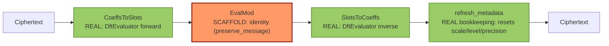
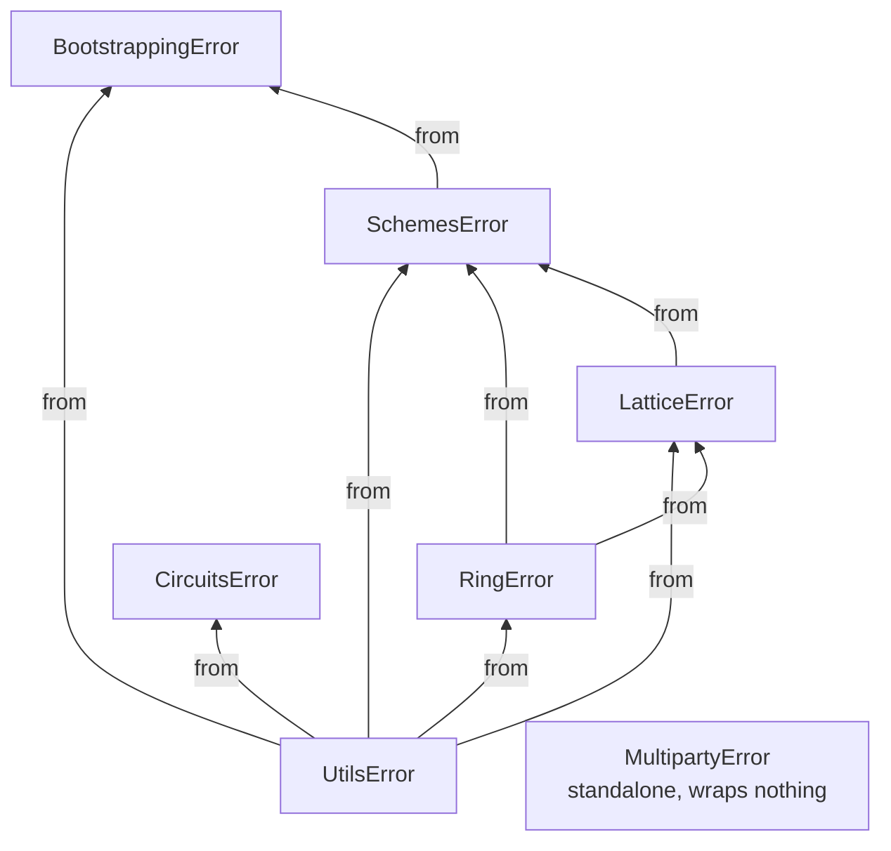

# Technical Manual

This is the precise, code-level reference for Phantom-FHE: exactly what each operation does today, the wire formats, the error taxonomy, and current performance characteristics. Where the current behavior is an early implementation rather than the final cryptographic operation, that's called out explicitly and unambiguously — this document exists so nobody has to read the source to find out. For the conceptual/mathematical background this assumes, see [`concepts.md`](concepts.md); for crate layout, see [`architecture.md`](architecture.md).

Every "Current status" callout below reflects the research-stage status described in [SECURITY.md](../SECURITY.md) — the intended state of an in-progress hardening roadmap, not a defect report. Any operation marked transparent, placeholder, or identity does not yet provide cryptographic protection.

## Ring internals

### Modular reduction

`phantom_ring::reduce` exposes three reducer shapes plus free functions (`add_mod`, `sub_mod`, `neg_mod`, `mul_mod`, `pow_mod`, `inv_mod`, all operating via widened `u128` arithmetic and correct for any odd modulus).

**Current status:** `BarrettReducer` and `MontgomeryReducer` are real implementations of their named algorithms. `BarrettReducer::reduce` now supports the **full 64-bit modulus range** (`modulus >= 2`): `mu = ⌊2¹²⁸/modulus⌋` is computed exactly via an internal `BigUint`'s long division (`crates/phantom-ring/src/bignum.rs`), and reduction estimates the quotient as `⌊value·mu / 2¹²⁸⌋` via a stack-only 128×128→256-bit wide multiply (`mul_wide_128` in `reduce/barrett.rs`: four 64×64→128-bit partial products with explicit carry propagation, no heap allocation on the hot path), corrected with up to two conditional subtractions. `reduce`'s precondition is `value < modulus · 2⁶⁴` (proven, not just `value < modulus²`, though every call site in this crate only ever needs the tighter bound). `MontgomeryReducer` implements REDC (Montgomery 1985) with a real 2-adic modular inverse computed via Newton-Raphson iteration, plus `to_montgomery`/`from_montgomery`/`mul_montgomery` for staying in Montgomery form across a chain of operations (`mul` is the convenience that round-trips plain inputs through Montgomery form on every call — correct, but not the efficient use of the primitive; see the module docs in `reduce/montgomery.rs`). Montgomery's range is capped at `phantom_ring::reduce::MONTGOMERY_MAX_MODULUS` (`2⁶³`, derived from exactly how much headroom `redc`'s `u128` accumulator has, not chosen arbitrarily) — going further needs a genuinely wider (192+ bit) accumulator, real follow-up work not implemented here. Both are validated by exhaustive tests (all moduli 3–199, every value in range) plus thousands of randomized cases across their full respective ranges, plus a dedicated test against four ~61-bit NTT-friendly primes and cross-checks of the wide multiply against an independent bignum implementation and a Python-verified reference product — see `crates/phantom-ring/tests/phase2.rs` and `reduce/barrett.rs`'s own unit tests. `reduce_once` (lazy reduction: subtract `modulus` once if `value >= modulus`) remains a real (if trivial) lazy-reduction primitive. `Ring` precomputes a `BarrettReducer` per modulus at construction — now `Some` for every valid `Modulus`, since Barrett has no upper limit — and routes `coeffwise_mul`/`schoolbook_mul`/`scalar_mul_assign` through it via a `mul_residue` helper, which checks both operands are already `< modulus` before taking the fast path, since `Poly`'s type doesn't enforce that invariant and `BarrettReducer::reduce`'s precondition is narrower than `mul_mod`'s unconditional correctness; anything out of range falls back to the widened `u128` path, so correctness never depends on coefficients happening to be reduced. `add_assign`/`sub_assign`/`neg_assign` still use `add_mod`/`sub_mod`/`neg_mod` directly — addition doesn't benefit from Barrett/Montgomery the way multiplication does. `MontgomeryReducer` (`to_montgomery`/`from_montgomery`/`mul_montgomery`) isn't wired into `Ring` yet — its natural fit is a future NTT butterfly hot path that stays in Montgomery domain across the whole transform, not a single-multiplication swap.

### NTT

`phantom_ring::ntt::CpuNttBackend` computes a negacyclic transform: twist by powers of `ψ` (the `2N`-th root), apply the transform, and for the inverse, untwist by powers of `ψ⁻¹` and scale by `N⁻¹`.

**Current status:** the transform core is now a **real O(N log N) radix-2 Cooley-Tukey butterfly network** (`radix2_ntt_inplace` in `ntt/cpu.rs`) — bit-reverse permutation followed by the standard iterative in-place butterfly stages, run once with `ω` for the forward transform and once with `ω⁻¹` (then scaled by `N⁻¹`) for the inverse, by the standard NTT/DFT duality. The twist/untwist steps around it use `NttTable`'s precomputed `psi_powers`/`inv_psi_powers` (an `O(n)` running-product table built once per table) rather than an independent `pow_mod(psi, j, q)` call per coefficient (`O(n log n)` total, previously recomputed on every multiplication), and every multiplication in both the twist step and the butterfly network routes through `NttTable`'s precomputed `BarrettReducer` (with the same `< modulus` defensive guard `Ring::mul_residue` uses) instead of division-based `mul_mod`. Correctness rests on: a hand-derived reference case (`N=4`, `q=5`) checked by hand before the implementation was written; an independent direct-DFT comparison across four `(degree, modulus)` pairs (`radix2_ntt_matches_direct_dft_for_random_cases`); round-trip and NTT-vs-`schoolbook_mul` comparisons across six degrees from 4 to 128 with ten random polynomials each (`ntt_round_trip_and_multiplication_hold_across_degrees_and_moduli` in `tests/phase2.rs`) — `schoolbook_mul` is a structurally independent implementation of the same negacyclic multiplication, not just the same code checked against itself; and two dedicated tests cross-checking the precomputed power tables against independent `pow_mod` calls. Measured: a forward+inverse round trip at `N=1024` (the NTT-friendly prime `12289`) takes ~110-130µs for 100 iterations combined (`crates/phantom-benches/benches/ring_ntt.rs`) — down from ~414µs before the precomputed-table/Barrett wiring, roughly a 3.5-4x speedup on top of the two-orders-of-magnitude win the O(N log N) transform itself already gave over direct evaluation.

`Ring::mul` is the actual multiplication entry point now: it uses the NTT (via a per-modulus `NttTable` precomputed once at `Ring::new`, not rebuilt per call) for any component whose modulus supports it at the ring's degree, falling back to `schoolbook_mul`'s O(N²) approach per-component otherwise — `schoolbook_mul` itself is unchanged and still always O(N²), kept as the correctness reference `mul`'s NTT path is tested against. Every real call site in `phantom-lattice::rlwe` (`Encryptor`, `Decryptor`, `KeyGenerator::generate_public_key`, `Evaluator::mul`) and `phantom-lattice::rgsw::external_product` switched from `schoolbook_mul` to `mul`, so the speedup reaches actual ciphertext operations, not just a standalone benchmark — verified by the full workspace test suite passing unchanged (same results, since `mul` and `schoolbook_mul` compute the same math) plus dedicated tests comparing the two directly, including the fallback path for a modulus that doesn't support NTT at its degree. `Ring::mul`'s NTT branch also allocates exactly one scratch buffer per call now (reused across every RNS component) instead of the four-plus-one an allocation audit found (`docs/internal/implementation-plan.md` Workstream 3 items 7/8) - the input's forward transform and the final product both write directly into the pre-allocated output buffer, via new `forward_transform_in_place`/`inverse_transform_in_place`/`forward_component_into` primitives in `ntt::cpu`. A before/after smoke-bench comparison found no wall-clock difference distinguishable from noise at this scale - the allocation-count reduction is real and code-verifiable, but proving its performance effect needs a statistically rigorous benchmark this crate doesn't have yet (see [Performance](#performance)).

**Not yet done:** no hand-unrolled hot loops, no lazy/deferred *correction* reduction between butterfly stages (values are still fully reduced to `[0, modulus)` after every operation via `BarrettReducer`/`add_mod`/`sub_mod`, rather than kept in a wider `[0, 2·modulus)`-or-so range across stages the way e.g. Harvey-style butterflies do to elide most of the correction work itself), and no Montgomery-form precomputed root table — all real further-optimization opportunities, not correctness gaps.

### RNS basis extension

`phantom_ring::rns::extension::extend_basis` reconstructs each polynomial coefficient's true integer value via CRT and re-decomposes it into the target basis.

**Current status:** the reconstruction is now exact for any basis size, computed over a minimal internal `BigUint` type (`rns/bignum.rs`: base-`2^64` limbs, `add`/`sub`/`mul_u64`/`divmod_u64`/`cmp` — no general bignum/bignum division) rather than a `u128`, which silently overflows once the source moduli's product exceeds `2^128` (e.g. eight or more ~60-bit moduli, a realistic RNS-CKKS/BGV basis size). The CRT sum `T = Σᵢ (rᵢ·yᵢ mod qᵢ)·Mᵢ` is bounded at `< k·Q` (`k` = number of source moduli, `Q` = their product, `Mᵢ = Q/qᵢ`), so reducing it back under `Q` only needs a bounded loop of at most `k−1` subtractions — never a division. This is deliberately an *exact*-arithmetic algorithm, not one of the RNS-native approximate algorithms production implementations typically use (e.g. Bajard-Eynard-Hasan-Zucca or Halevi-Polyakov-Shoup style, which trade a small, carefully-bounded floating-point approximation error for avoiding bignums and the per-coefficient `O(k)` bignum operations this implementation does). Switching to one of those remains a valid future performance upgrade once profiling shows this path is hot; correctness is not in question either way. Verified against: the crate's own exhaustive/randomized `BigUint` primitive tests, the pre-existing small-basis test (unchanged), and a dedicated large-basis regression test using an 8-prime ~489-bit basis checked against values independently computed in Python — exactly the scenario that would have silently overflowed the old `u128` implementation (`extend_basis_is_exact_for_a_realistic_multi_prime_basis_that_overflows_u128` in `tests/phase2.rs`). `rns::rescale::drop_last_modulus` (simple truncation of the last RNS component) remains the one other RNS operation that's already close to its production shape.

### Sampling

`sample_uniform` and `sample_ternary` are the real target algorithms (rejection-sampled uniform bytes, ternary via `sample_bounded(rng, 3)`). `sample_discrete_gaussian` now draws from a real discrete Gaussian, not a uniform-range stand-in: it builds a cumulative distribution table (CDT) over a support truncated to `±6·sigma` (the true Gaussian's tail beyond that integrates to about `2e-9`, negligible against any practical sample count), draws one uniform `u64` per coefficient, and walks the table to find which cumulative-probability bucket it falls into. It takes `sigma` (the actual standard deviation) directly, not a uniform-range bound — the API changed accordingly (`SecretDistribution::Gaussian { sigma: f64 }` in `phantom-lattice::rlwe::keygen`). Verified by: the table's cumulative sum landing at exactly `1.0` (forced past floating-point rounding, so sampling always terminates) across several `sigma` values, samples staying within the truncated support, and an independent statistical check (200,000 samples, empirical mean/stddev within a sample-count-derived tolerance of `0`/`sigma`) — `crates/phantom-ring/src/sampling/gaussian.rs`'s own tests.

**Fixed a real cross-modulus consistency bug** (found while designing Workstream 4 item 3's key-switching, which is the first thing in this codebase to genuinely need more than one RNS modulus at once): `sample_ternary` and `sample_discrete_gaussian` used to draw an independent random choice per `(RNS component, coefficient)` pair, rather than one true small value per coefficient reduced identically into every component. `sample_uniform`'s per-component independence is *correct* (CRT is a bijection, so independent uniform draws per modulus are exactly how you sample a value uniform over the full product range) - but for `sample_ternary`/`sample_discrete_gaussian`, which are meant to produce a coherent small polynomial whose *true* coefficient values are what matters (secret keys, error terms), independent-per-component sampling produces components that don't CRT-reconstruct to any single coherent value at all. Invisible on every single-modulus ring this crate's tests happened to use so far (nothing to be inconsistent with); a real correctness break the moment a ring has more than one modulus, which is the entire premise of RNS. Both now sample the true value once per coefficient and reduce it into every component identically. Verified by a dedicated regression test (`ternary_and_gaussian_samples_are_crt_coherent_across_rns_components` in `tests/phase2.rs`, on a real two-modulus ring) that fails against the old code and passes against the new - confirmed by literally reverting the fix and re-running it. Every existing single-modulus test's fixed-seed output is byte-for-byte unchanged (same RNG call count and order, only which write happens when), so nothing needed updating elsewhere.

**Not yet done:** the table walk short-circuits at the matching bucket, so it is **not constant-time** — a side-channel-hardened sampler needs every entry touched unconditionally, or a Knuth-Yao/Ziggurat construction, which remains future work. And this sampler still isn't wired into any scheme's actual encryption error — `phantom-lattice::rlwe::Encryptor` samples no error term at all yet (see below); it's only reachable today via `SecretDistribution::Gaussian` as an alternative secret-key distribution. See [`concepts.md#sampling`](concepts.md#sampling) for why the *shape* of the noise distribution matters for security once it is wired in.

## RLWE / RGSW internals

### Key generation

`KeyGenerator::generate_secret_key` is real (ternary or discrete Gaussian, per `SecretDistribution` - `phantom_lattice::security::recommended_secret_distribution` names ternary as the grounded default). `generate_public_key` computes `(b, a) = (-(a*s + e), a)` via `schoolbook_mul` and a real sampled error term `e` (`phantom_ring::sampling::sample_discrete_gaussian` at `phantom_lattice::security::STANDARD_ERROR_STD_DEV`, σ≈3.2) — a genuine noisy RLWE-of-zero (`b + a*s = -e`, small but nonzero), not the noiseless scaffold this was before Workstream 4 item 1.

### Encryption

`Encryptor::encrypt` (secret-key and public-key variants) samples real error terms into both paths: `c_0 = pt - a*s + e` (secret-key, one error term) or `c_0 = pt + b*u + e_1`, `c_1 = a*u + e_2` (public-key, three error-like terms - the public key's own baked-in error `e_pk`, plus `e_1`/`e_2` freshly sampled here). `phantom_lattice::noise::{fresh_secret_key_noise_bound, fresh_public_key_noise_bound}` give sound (worst-case, not tight) bounds on the resulting decryption noise - see that module's own doc comment for the derivation and why it's deliberately loose rather than a precise probabilistic estimate. `Decryptor::decrypt` was never given a rounding/mod-t step (there is no scaling here, unlike BFV's Δ-scaling or BGV's mod-t reduction), so at this raw layer decryption recovers "plaintext plus small noise" honestly, not the plaintext exactly - callers that need exact recovery (a future production BGV/BFV/CKKS on top of this layer) are responsible for their own noise-tolerant decode, the same way real RLWE-based schemes always are. `phantom-lattice`'s own tests (`tests/phase3_rlwe.rs`, `tests/phase4_rgsw.rs`) check decrypted output against the noise bound above (via a centered-residue comparison), not exact equality, and use a realistically-sized modulus (not the old degree=4/modulus=17 toy ring, which had no room for real noise at all).

### Evaluator operations

`add`/`sub`/`neg`/`add_plain`/`mul` are real polynomial arithmetic (the multiplication grows ciphertext degree correctly, as described in [`concepts.md`](concepts.md#rlwe-the-shared-foundation)); noise grows correspondingly (linearly for add/sub, roughly multiplicatively for `mul` - see `phantom_lattice::noise::mul_noise_bound`). `relinearize` now does **real degree reduction** when given a real key: `RelinearizationKey::from_key_switch_key` (produced by `KeyGenerator::generate_hybrid_relinearization_key`, an RNS hybrid key-switching key from `s²` to `s`) makes `relinearize` treat a degree-2 ciphertext's third component `c2` as the `c1` half of a throwaway `(0, c2)` ciphertext, key-switch that from `s²` to `s`, and fold the result into the first two components - `c0 + c1*s + c2*s² = (c0 + switched_c0) + (c1 + switched_c1)*s`, genuinely degree 1 afterward (`relinearized.degree() == 1`), not just decryptable by accident of the decryptor tolerating any degree. With the still-default `RelinearizationKey::placeholder()` (what every scheme crate above this layer still constructs - see below), `relinearize` remains the identity no-op it always was, so nothing downstream changed behavior. Verified end to end (`tests/phase3_rlwe.rs::real_relinearization_reduces_degree_and_preserves_the_product`): multiply two fresh ciphertexts, relinearize with a real key, decrypt, and check the result matches the true product within a noise bound - confirming in Rust the same "no centering needed for `s²`" algebraic claim `generate_hybrid_relinearization_key`'s own doc comment proves (`P·(Q/q_j)·T ≡ P·(Q/q_j)·s² mod QP` for *any* representative `T` of `s²` congruent mod `Q`, since `P·(Q/q_j)·Q` is itself an exact multiple of `QP`) and was numerically verified in Python (100 randomized trials with non-ternary values) before trusting it.

`apply_galois_automorphism` now does **real Galois-automorphism-based rotation** when given a real key, built on the same `key_switch` primitive: `GaloisKey::from_key_switch_key` (produced by `KeyGenerator::generate_hybrid_galois_key(element, sk, p_moduli, rng)`, an RNS hybrid key-switching key from `σ_element(s)` to `s`) makes `apply_galois_automorphism` apply `σ_element: X -> X^element` (`phantom_ring::Ring::apply_automorphism`) to both of `ct`'s components - any ring automorphism preserves the encryption relation, turning `c0 + c1*s = mu + e` into `σ(c0) + σ(c1)*σ(s) = σ(mu) + σ(e)` - then key-switches that back from `σ(s)` to the original `s`, yielding a genuine ciphertext encrypting `σ(mu)` under `s`. With the still-default `GaloisKey::new` placeholder (what every scheme crate above this layer still constructs - see below), `apply_galois_automorphism` remains an identity no-op, matching `relinearize`'s own placeholder behavior. Verified end to end (`tests/phase3_rlwe.rs::real_galois_automorphism_matches_plaintext_sigma_and_preserves_decryptability`): encrypt, apply a real Galois key, decrypt, and check the result matches `σ_element` applied directly to the plaintext within a noise bound. `σ_element(s)`'s coefficients are just `s`'s own ternary values permuted and sign-flipped by the automorphism (proven in `apply_automorphism`'s own doc comment), so unlike relinearization's `s²` it needs no CRT lift - it reuses `rebase_ternary_secret` directly. `rotate_coefficients` is unchanged: it performs a literal `Vec::rotate_left` on each RNS component - a real coefficient permutation, but not the slot rotation a batched scheme needs (it has no key parameter at all, and `phantom-schemes::bgv::Evaluator` still calls it directly rather than `apply_galois_automorphism`).

`Evaluator::repack` now does **real coefficient repacking**: given several ciphertexts each encrypting a scalar message at coefficient 0 under the same secret key, `repack` multiplies each `ct_i` by the public monomial `X^i` (linear, so it stays valid under the same secret with no key-switching needed) and sums the results, landing `ct_i`'s message at coefficient `i` of one output ciphertext - `c0 + c1*s = m + e` becomes `X^i*c0 + X^i*c1*s = X^i*m + X^i*e` for each input, and summing gives the coefficient-packed message plus accumulated noise. Rejects an empty input and rejects more inputs than the ring's degree (packing that many would silently alias positions via the ring's negacyclic wraparound, `X^N = -1`, rather than erroring). Verified numerically (Python, negacyclic schoolbook multiplication) before implementing, then end to end in Rust (`tests/phase3_rlwe.rs::repack_combines_scalar_ciphertexts_into_one_coefficient_packed_ciphertext`): encrypt several scalar messages independently, repack, decrypt, and check the result matches the coefficient-packed plaintext within a noise bound.

`keyswitch::key_switch_identity` is exactly what its name says: an identity function returning a clone of the input - unlike `repacking::repack_identity` (deleted alongside the real `repack` above), it's kept as a callable no-op key-switch, alongside the real one (`keyswitch::key_switch`, backing both the real `relinearize` and `apply_galois_automorphism` paths above) - but every scheme crate above `phantom-lattice` still only ever constructs the placeholder `RelinearizationKey`/`GaloisKey` (none of them yet supply the auxiliary `P` moduli a real key needs, which don't exist as a concept in their own params today - a Workstream 5 concern, not reopened here), so `relinearize`/`apply_galois_automorphism` still behave as an identity no-op for BGV/BFV/CKKS/multiparty in practice, and repeated evaluation there still accumulates noise unchecked.

`keyswitch::{generate_key_switch_key, key_switch}` are the real primitive those placeholders will eventually build on: RNS **hybrid key-switching** (the modern RNS-CKKS-era technique the plan specifically called for, not a textbook simplification). Given a ciphertext `(c0, c1)` encrypting `mu` under `s_old` over a working basis `Q = q_1···q_L`, and a key-switching key generated for `(s_old, s_new)` over an *extended* basis `QP = Q ∪ P` (`P` a set of auxiliary moduli): gadget-decompose `c1` *per RNS modulus* (`L` digits, not the many more a classical power-of-base decomposition would need), lift each digit into `QP` (via `phantom_ring::rns::extension::extend_basis`, from the single-modulus source basis `{q_j}`), dot-product against the key-switching key's rows, then "mod down" (`phantom_ring::rns::rescale::mod_down`, an exact-floor RNS division by `P`) back to `Q` - the growing-then-shrinking through the bigger `QP` modulus is what keeps the key-switching key's own noise from swamping the result, since its digits are each comparable in size to a whole RNS modulus rather than a small classical gadget digit. Each key-switching-key row encrypts `P · (Q/q_j) · s_old` (not just `Q/q_j · s_old` - the extra factor of `P` is what lets `mod_down` cancel out the CRT-reconstruction's own `k·Q` remainder term correctly; getting this factor wrong was an actual bug caught by hand-deriving and numerically verifying the algorithm in Python *before* writing any Rust, documented in `keyswitch.rs`'s own module doc comment and the commit that introduced it). `generate_key_switch_key` currently requires `s_new` to be ternary (rebased into `QP` by directly re-expressing each coefficient's known `{-1,0,1}` value, not a CRT lift) and requires the caller to have already lifted `s_old` into `QP` themselves (`rebase_ternary_secret` does this for a ternary `s_old`, e.g. switching between two different ternary secrets; relinearization's non-ternary `s^2` will need a different, genuine CRT-based centered lift, deliberately left out of this general primitive). Verified by 5+ independent randomized trials (`tests/key_switch.rs`) decrypting within a generous (not yet formally derived) noise bound of the original plaintext, on a real multi-modulus `Q` (3 moduli) with a comparably-sized 2-modulus `P` - a single-modulus `Q` would never exercise what makes this "RNS" key-switching rather than a textbook one.

**Finding this also surfaced a real, separate bug**, since key-switching was the first thing in this codebase to genuinely need more than one RNS modulus at once: `phantom_ring::sampling::sample_ternary`/`sample_discrete_gaussian` used to sample independently per RNS component rather than once per coefficient - see [Sampling](#sampling) above for the fix.

### RGSW

`RgswCiphertext` is now a **real encrypted gadget matrix** — the standard GSW/RGSW construction (e.g. Gama-Izabachène-Nguyen-Xiao; the ring variant used in FHEW/TFHE-style bootstrapping), not the earlier plaintext-backed scaffold. `RgswCiphertext::encrypt` builds two blocks of `levels` real RLWE ciphertexts each: `rows()[0][i] = RLWE_s(B^i * message)` and `rows()[1][i] = RLWE_s(B^i * message * s)` for `B = 2^base_log`, `i = 0..levels` — each row a fresh RLWE-of-zero (via `Encryptor::with_secret_key`, so it carries real sampled noise) with `B^i * message` (or `B^i * message * s`) added into its `c0` component. `external_product(RGSW(m), ct)` gadget-decomposes `ct`'s own `c0`/`c1` (via the existing `GadgetDecomposition::decompose`) and computes `sum_i c0_i * rows()[0][i] + sum_i c1_i * rows()[1][i]`; hand-derived in `external_product.rs`'s own doc comment, this recovers `RLWE_s(m * mu)` with noise `m*e_ct + (sum of gadget-digit-times-row-noise terms)`, bounded by `phantom_lattice::noise::external_product_noise_bound`. `GadgetDecomposition::decompose`/`recompose` are unchanged — they were already the real base-`2^base_log` coefficient decomposition/recomposition algorithm, now actually consumed by a real ciphertext instead of sitting unused. Verified against an independent expected value (`schoolbook_mul(pt, multiplier)`) checked via the same centered-residue noise-bound comparison the RLWE tests use, at the same realistically-sized ring `tests/phase3_rlwe.rs` established (the old degree=4/modulus=97 ring has no room for real noise, so it's kept only for the noise-free structural tests: parameter validation, gadget decompose/recompose). No bootstrapping construction consumes RGSW ciphertexts yet, so this remains an unused (if now real) primitive until one does.

## Scheme internals

### BGV / BFV

`bgv::Encryptor` now has **two coexisting modes**, chosen by which constructor built it — see the module's own doc comment for the full derivation. `with_secret_key`/`with_public_key` are unchanged: **fully transparent**, ignoring `rng` and the key entirely and returning `Ciphertext::new(vec![plaintext.value().clone()])` — kept exactly as before so every existing caller (`phantom-circuits`, `phantom-bootstrapping`, `phantom-multiparty`, `phantom-examples`, and `bfv::Encryptor`'s own transparent path, which still delegates to this same one) keeps compiling and behaving identically. New `with_secret_key_real`/`with_public_key_real` do **real BGV encryption**: noise scaled by the plaintext modulus `t` (`c0 = m + t*e - a*s`, `c1 = a` for secret-key; `c0 = m + b*u + t*e0`, `c1 = a*u + t*e1` for public-key), so it vanishes under `decode_u64`'s existing centered-mod-`t` reduction — no change needed there, or in `Decryptor::decrypt` (already scheme-agnostic, generalizes to any ciphertext degree via `sum_i c_i * s^i`). The public-key path needs its own real key, `BgvKeyGenerator::generate_keypair_real` — a plain `generate_keypair`'s raw-noise public key isn't compatible (its noise isn't a multiple of `t`, so it would survive the final `mod t` reduction and corrupt the result; secret-key encryption has no such requirement, since it never touches a public key's noise). Hand-derived and verified numerically (Python) before implementing, then end to end in Rust (`tests/phase5_bgv.rs`): secret-key and public-key round trips, homomorphic add/sub/neg/add_plain/mul_plain, and raw (pre-relinearization) multiplication all recover exact values `mod t`. `Evaluator::add`/`sub`/`neg`/`add_plain`/`mul`/`mul_plain` needed no changes at all for the real path — they're pure ring arithmetic that provably preserves the "noise is a multiple of `t`" invariant regardless of which mode produced the ciphertext (verified both algebraically and numerically). Relinearization stays the existing no-op (`BgvKeyGenerator::generate_evaluation_keys` still only produces the placeholder `RelinearizationKey`, since BGV has no way to supply the auxiliary `P` moduli real key-switching needs yet — real relinearization would also need the key-switching key's own noise scaled by `t`, or it would corrupt the mod-`t` invariant after relinearizing, which the raw ciphertext-ciphertext product doesn't have this problem with since it's the input ciphertexts' own already-`t`-scaled noise being combined, not a fresh key-switching contribution).

`bfv::Encryptor` has the same two-mode shape, but real BFV's math is genuinely different from BGV's, not just a relabeling — confirmed while investigating this: the pre-existing "BFV" scheme was actually just BGV's own exact coefficient-mod-`t` scheme reused directly (identical encode/decode/multiply, no Δ-scaling anywhere), not a real BFV variant at all. Real BFV (`with_secret_key_real`/`with_public_key_real`) scales the **message** by `Delta = floor(Q/t)` (`Q` = the full ciphertext modulus product) instead of scaling noise, and adds *raw*, unscaled noise: `c0 = Delta*m + e - a*s`, `c1 = a` for secret-key; `c0 = Delta*m + b*u + e0`, `c1 = a*u + e1` for public-key. Unlike BGV, a standard generic RLWE public key works unchanged here — `BfvKeyGenerator::generate_keypair` is reused as-is for both transparent and real encryption, no new keygen method needed. `Delta` doesn't fit in a `u64` for a multi-modulus ring, so applying it needed a new generic RNS primitive, `phantom_ring::rns::extension::floor_divide_residues(basis, divisor)` — computes `floor(product(basis.moduli())/divisor) mod q_j` per modulus, a genuine floor division (unlike the existing `crt_basis_constant`'s `M_i`, which is always exact by construction) - verified against Python-computed values (`tests/floor_divide.rs`). Decoding needs a matching real path too: new `BatchEncoder::decode_u64_real`/`decode_i64_real` do BFV's standard round-and-rescale-by-`t/q` step (`decode_bfv_residue`: center the raw decrypted coefficient, compute `round(|centered| * t / q)`, reapply the sign, reduce mod `t`) — `Decryptor::decrypt` itself needed no change, same reasoning as BGV. Hand-derived and verified numerically (Python) before implementing, then end to end in Rust (`tests/phase6_bfv.rs`): secret-key round trip, public-key round trip, and ciphertext-ciphertext add/sub/neg, each across 50 randomized trials.

`Evaluator::mul_real` now does **real BFV multiplication**: a raw tensor product's true coefficient magnitude can reach roughly `degree * (Q/2)^2` (far beyond what `Q` alone can hold without wraparound - `Ring::mul`'s ordinary mod-`Q` output loses exactly the information the rescale step needs), so `mul_real` extends both ciphertexts into an auxiliary `Q ∪ P` basis (`p_moduli`, sized comparably to `Q` itself, passed by the caller) via `extend_basis`, computes the raw tensor product there (no wraparound), then calls new `phantom_ring::rns::rescale::rescale_and_round(poly, q_basis, p_basis, t)` on each component: reconstructs its true value via CRT, centers it into `(-QP/2, QP/2]`, computes `round(|centered| * t / Q)`, and reduces the signed result back into `Q`'s own moduli. That rescale needed genuine bignum/bignum division with correct rounding (`Q` doesn't fit in a `u64` for a multi-modulus ring) - new `phantom_ring::bignum::BigUint::divmod` (binary long division; simple correctness over a faster algorithm, since this isn't hot-path-critical), the first general bignum/bignum division this crate has needed. Verified numerically in three independent passes before implementing (true unbounded-integer arithmetic, an RNS-mechanized simulation using actual CRT reconstruction, both cross-checked against real BFV encrypt/multiply/decrypt round trips), then `rescale_and_round` itself (`tests/rescale_and_round.rs`: an independently-computed fixed case plus a 200-trial randomized property check) and `BigUint::divmod` (`bignum.rs`'s own tests: a multi-limb Python-computed case, a 200-trial `quotient*divisor+remainder == self` property check, a cross-check against `divmod_u64`) before wiring up `mul_real` itself, verified end to end against a `schoolbook_mul` oracle across 30 randomized trials (`tests/phase6_bfv.rs`).

New `Evaluator::add_plain_real` does **real BFV plaintext addition**: adding a real ciphertext's own raw plaintext operand directly (what `add_plain` does) is wrong for a real-mode ciphertext, since `c0` already holds `Delta*m1 + noise`, not `m1` - `add_plain_real` scales the plaintext operand by `Delta` first (the same scaling `Encryptor`'s real path applies at encryption time), so `c0 + Delta*m2` correctly combines to `Delta*(m1+m2) + noise`. `mul_plain` turned out to need **no** such counterpart, contrary to an earlier assumption here - multiplying by a small, unscaled plaintext doesn't have addition's problem: `(c0+c1*s)*m2 = Delta*m1*m2 + noise*m2` is already exactly the form a real ciphertext needs, verified numerically alongside `add_plain_real` and confirmed end to end in Rust (`tests/phase6_bfv.rs::real_add_plain_and_mul_plain_are_exact`, 30 randomized trials). New `Evaluator::relinearize_real` (BFV) now relinearizes `mul_real`'s degree-2 output back to degree 1: since a real BFV ciphertext is structurally a plain RLWE ciphertext (no `Delta`-specific shape), this is a direct, unmodified pass-through to `phantom_lattice::rlwe::Evaluator::relinearize`, using a key from new `BfvKeyGenerator::generate_hybrid_relinearization_key` (itself a pass-through to `bgv::BgvKeyGenerator::generate_raw_hybrid_relinearization_key`, which reaches the underlying `phantom_lattice::rlwe::KeyGenerator`). Verified end to end (`tests/phase6_bfv.rs::real_relinearization_reduces_degree_and_preserves_the_product`, 30 randomized trials).

**BGV's relinearization is not wired up**, and unlike BFV's, it can't reuse the same key-switching machinery unmodified: BGV's mod-`t` decode invariant needs every noise contribution folded into a ciphertext to be a multiple of `t`, but the generic key-switching key `generate_raw_hybrid_relinearization_key` produces samples its own fresh noise raw (the same way `phantom_lattice::rlwe::generate_key_switch_key` always has) - relinearizing a real BGV ciphertext with it would silently corrupt the mod-`t` invariant, not add a merely-approximate noise. Giving BGV relinearization the `t`-scaled key-switching noise it needs means either changing the shared, scheme-agnostic `phantom_lattice::rlwe` key-switching primitive (which CKKS/Galois rotation also depend on, with no `t` concept of their own) or duplicating its logic in `phantom-schemes::bgv` - out of scope here, tracked as follow-up.

Wiring circuits/bootstrapping/multiparty/examples to either real path (updating their toy `[257, 769]`-modulus parameters, which have no headroom for real noise) is deliberately not done here — a separate, larger follow-up, since some of those consumers may do enough repeated multiplication without relinearization to need their own noise-growth analysis first.

`ModulusSwitcher::switch_next` (BGV) stays the existing scaffold that "preserves the ciphertext unchanged" — it validates the ciphertext against the ring and returns a clone, kept for existing callers not yet migrated to the real path below. New `ModulusSwitcher::switch_next_real` does an actual RNS modulus-drop-and-rescale: `phantom_ring::rns::rescale::modulus_switch_down` drops the ring's last modulus, producing a value congruent to the original mod the plaintext modulus `t` (so the decrypted message is unchanged) and as close as possible to `value / q_L` (so noise shrinks proportionally to the dropped modulus, the entire point of modulus switching). Since the result has one fewer RNS component, `ModulusSwitcher::next_params`/`switch_secret_key` (also exposed via `Evaluator::next_modulus_switch_params`/`switch_secret_key`) produce the matching smaller-ring parameters and secret key needed to decrypt it — a plain `drop_last_modulus` suffices for the secret key (it isn't rescaled, only the ciphertext is), but the ciphertext itself needs the full congruence-preserving rescale. Hand-derived and verified numerically (Python, 200 trials) before implementing; verified end to end in Rust (`tests/phase5_bgv.rs::real_modulus_switch_reduces_ring_and_preserves_plaintext`) across 30 randomized trials at a 2-modulus real-noise ring.

`Evaluator::add`/`sub`/`neg`/`add_plain`/`mul`/`mul_plain`/`rotate_slots`/`sum_slots` operate correctly on the transparent representation — because the "ciphertext" is the plaintext, these are just the corresponding plaintext-space operations (mod `t`, or mod the ring's `q` before the encoder's mod-`t` decode), which is why they produce mathematically correct results end-to-end despite the underlying encryption doing nothing.

### CKKS

CKKS's ciphertext (`ckks::Ciphertext`) stores `slots: Vec<Complex64>` **directly**, plus `scale`/`level`/`precision`/`degree` metadata — it never touches `phantom_ring`/`phantom_lattice` types at all for its actual data. `Encryptor::encrypt` and `Decryptor::decrypt` are both identity functions over this representation (ignoring the RNG, secret key, and public key passed to them beyond validating that RLWE parameters *could* be constructed). Every `Evaluator` operation (`add`, `sub`, `mul`, `rescale_next`, `rotate_slots`, `conjugate`, `align_levels`) is real floating-point arithmetic over `Vec<Complex64>`, with real scale/level/precision bookkeeping (scale multiplies on `mul`, level decrements on `rescale_next`, precision degrades by op-specific amounts — see the `degrade(...)` calls in `ckks/evaluator.rs`). So: the metadata model (scale, level, precision, rescale, level alignment) is a faithful simulation of how a real CKKS ciphertext's noise/precision would evolve, but the "ciphertext" carries the plaintext values in the clear the entire time.

### Serialization

`phantom-schemes::serialization` encodes params/plaintexts/ciphertexts for all three schemes — real, working, and format-stable, independent of the encryption gaps above (encoding a transparent CKKS ciphertext still round-trips its `Complex64` slots correctly).

## Circuit internals

`phantom-circuits::common` (linear-transform diagonalization, BSGS planning, polynomial evaluation strategy selection) is real, general-purpose planning logic with no dependency on scheme encryption status — it operates on plain matrices/coefficient vectors, and its output (a `DiagonalMatrix`, a `BabyStepGiantStepPlan`, a `PolynomialEvalPlan`) is meaningful regardless of what's underneath.

`bgv`/`bfv` circuit evaluators (`LinearTransformEvaluator::apply`, `PolynomialEvaluator::evaluate`) require **degree-zero ciphertexts** (checked explicitly, erroring otherwise) and operate directly on the transparent coefficient representation described above — real matrix-vector and polynomial arithmetic mod `t`, on plaintext-equivalent data.

`ckks` circuit evaluators (`DftEvaluator`, `ComparisonEvaluator`, `InverseEvaluator`, `Mod1Evaluator`, `MinimaxEvaluator`, `LinearTransformEvaluator`) are real floating-point implementations of their named operations (DFT is literal O(n²) evaluation, not FFT-accelerated; comparison/inverse/mod1 are the real closed-form approximations described in [`concepts.md`](concepts.md#ckks-specific-circuits)) — operating on CKKS's transparent `Complex64` slots. Every one of these evaluators also degrades the output's `Precision` estimate by an amount reflecting what the real homomorphic operation would cost, even though no actual noise was introduced.

## Bootstrapping internals

The pipeline shape (see [`concepts.md#bootstrapping`](concepts.md#bootstrapping)) is faithfully implemented; only the middle stage is a stand-in:



The CKKS bootstrapping pipeline (`Bootstrapper::bootstrap`) really does run coefficients→slots (`CoeffsToSlots`, via `DftEvaluator::transform(..., Forward)`) then eval-mod then slots→coefficients (`SlotsToCoeffs`, via `DftEvaluator::transform(..., Inverse)`) — the pipeline *shape* is faithful. But `EvalMod::preserve_message`, the function the bootstrapper actually calls for the middle stage, is an **identity function** (`Ok(input.clone())`) — not the real modular-reduction polynomial approximation described in [`concepts.md#bootstrapping`](concepts.md#bootstrapping). (`EvalMod::centered_fractional_part`, which *does* call the real `Mod1Evaluator`, exists on the type but is not what the bootstrapper's `bootstrap()` method calls.) After the pipeline, `refresh_metadata` resets scale to the CKKS context's default, level to `BootstrapParams::target_level`, and precision to `BootstrapParams::target_precision_bits` — i.e. the metadata genuinely gets "refreshed" to look like a fresh ciphertext, which is the observable effect a real bootstrap should have, even though no actual noise reduction occurred (because there's no noise to reduce in a transparent ciphertext).

`BootstrapKeyGenerator::generate` produces a `BootstrapKey` that's just `{ params, rotation_elements }` — no actual key material, consistent with the transparent scheme layer beneath it not needing any.

`bgv`/`bfv` bootstrapping (`phantom_bootstrapping::{bgv, bfv}`) are reserved module locations: `BootstrapParams`/`BootstrapKey` are effectively unit structs, and `Evaluator::bootstrap_unimplemented` always returns `Err(BootstrappingError::InvalidParameters("BGV bootstrapping is reserved but not implemented"))`.

## Multiparty internals

`phantom-multiparty::common` (participants, sessions, shares, transcripts) is real, working protocol-scaffolding logic — session/round/participant binding checks, threshold gating, deterministic encoding, are all genuinely enforced, independent of scheme cryptographic status.

**The transcript hash is not a cryptographic hash function.** `stable_hash_256` (in `common/transcript.rs`) is a small hand-rolled 4-lane XOR/multiply/rotate mixer producing a 256-bit output — deterministic and collision-*resistant-looking*, but it has had no cryptanalysis and must not be treated as providing collision resistance, preimage resistance, or any other property a real hash function (SHA-256, BLAKE3, ...) would provide. Anywhere a transcript hash needs actual cryptographic hash security (e.g. a Fiat-Shamir-style protocol built on top of `Transcript`), this needs to be swapped for a vetted primitive first.

Each `mpXXX::{ckg, rkg, gkg}::aggregate_*` is a **placeholder aggregation**: `CollectiveKeyGen::aggregate_public_key` ignores the collected shares' content (`let _shares = aggregator.aggregate()?;`) and returns a public key made of two all-zero polynomials; `RelinearizationKeyGen::aggregate_key` similarly ignores share content and returns `RelinearizationKey::placeholder()` (the identity-preserving placeholder - see [Evaluator operations](#evaluator-operations) above; not the unit struct it once was, since `RelinearizationKey` can now also hold a real key-switching key, but multiparty aggregation doesn't produce one); `GaloisKeyGen::aggregate_keys` similarly ignores share content and returns `GaloisKey::new` placeholder markers for the requested elements (not the unit struct it once was either, for the same reason - `GaloisKey` can now also hold a real key-switching key, but multiparty aggregation doesn't produce one). The *protocol shape* (collect `threshold` shares bound to a session, then aggregate) is real and enforced; the *cryptographic content* of what gets aggregated is not yet real key material.

`PartialDecryptor`, `ReEncryptor`, and (for `mpbgv`/`mpbfv`) `InteractiveBootstrap::aggregate_*` all follow a different, more substantive pattern: they require every collected share's payload to be byte-identical (`ensure_equal_payloads`) and then decode that shared payload back into a real `Poly`/`Plaintext`/`Ciphertext` — consistent with, but not hiding, the fact that the underlying BGV/BFV ciphertext is transparent (there's no real secret-sharing of a decryption computation happening; every "share" is just the same cleartext-equivalent data). `mpckks::InteractiveBootstrap::aggregate_refreshed` does the same aggregation-of-identical-shares, then hands the result to the real `phantom_bootstrapping::ckks::Bootstrapper::bootstrap` pipeline described above.

## Serialization format

### Header

Every encoded payload starts with an 8-byte **domain tag** (ASCII, identifying the encoded type) followed by a little-endian `u16` **version**:

```text
byte offset   0                                7 8    9
              +--------------------------------+------+
              |          domain tag (8B)        | ver  |
              +--------------------------------+------+
```

`SerializationHeader::write_to` writes this; `SerializationHeader::read_expected` reads it back and returns `UtilsError::InvalidDomain` if the tag doesn't match what the caller expected, or `UtilsError::UnsupportedVersion` if the version doesn't match — decoding a payload against the wrong `decode_*` function, or a payload from a future/past format version, fails immediately rather than misparsing.

After the header, each format writes its fields with `BufferWriter`'s deterministic little-endian primitives: fixed-width integers (`write_u8`/`write_u16_le`/`write_u32_le`/`write_u64_le`), raw bytes (`write_all`), and length-prefixed byte vectors (`write_bytes`, a `u64` length followed by the bytes). All current formats are version `1`.

### Domain tag catalog

| Domain tag | Type | Crate | Encode / decode functions |
| --- | --- | --- | --- |
| `RLWEPK01` | `phantom_lattice::rlwe::PublicKey` | `phantom-lattice` | `encode_public_key` / `decode_public_key` |
| `RLWEEK01` | `phantom_lattice::rlwe::EvaluationKey` | `phantom-lattice` | `encode_evaluation_key` / `decode_evaluation_key` |
| `BGVPRM01` | `phantom_schemes::bgv::BgvParams` | `phantom-schemes` | `encode_bgv_params` / `decode_bgv_params` |
| `BFVPRM01` | `phantom_schemes::bfv::BfvParams` | `phantom-schemes` | `encode_bfv_params` / `decode_bfv_params` |
| `CKKSPR01` | `phantom_schemes::ckks::CkksParams` | `phantom-schemes` | `encode_ckks_params` / `decode_ckks_params` |
| `BGVPLT01` | `phantom_schemes::bgv::Plaintext` | `phantom-schemes` | `encode_bgv_plaintext` / `decode_bgv_plaintext` |
| `BFVPLT01` | `phantom_schemes::bfv::Plaintext` | `phantom-schemes` | `encode_bfv_plaintext` / `decode_bfv_plaintext` |
| `CKKSPL01` | `phantom_schemes::ckks::Plaintext` | `phantom-schemes` | `encode_ckks_plaintext` / `decode_ckks_plaintext` |
| `BGVCTXT1` | `phantom_schemes::bgv::Ciphertext` | `phantom-schemes` | `encode_bgv_ciphertext` / `decode_bgv_ciphertext` |
| `BFVCTXT1` | `phantom_schemes::bfv::Ciphertext` | `phantom-schemes` | `encode_bfv_ciphertext` / `decode_bfv_ciphertext` |
| `CKKSCT01` | `phantom_schemes::ckks::Ciphertext` | `phantom-schemes` | `encode_ckks_ciphertext` / `decode_ckks_ciphertext` |
| `CIRPOLY1` | `phantom_circuits::common::PolynomialEvalPlan` | `phantom-circuits` | `encode_polynomial_eval_plan` / `decode_polynomial_eval_plan` |
| `CIRBSGS1` | `phantom_circuits::common::BabyStepGiantStepPlan` | `phantom-circuits` | `encode_bsgs_plan` / `decode_bsgs_plan` |
| `CKKSBTP1` | `phantom_bootstrapping::ckks::BootstrapParams` | `phantom-bootstrapping` | `encode_ckks_bootstrap_params` / `decode_ckks_bootstrap_params` |

Every crate's test suite includes malformed/truncated/wrong-domain payload rejection tests (see the `phaseNN_serialization.rs` files noted in [`developer-guide.md`](developer-guide.md#testing-conventions)). Secret-bearing types (`SecretKey`, RLWE/RGSW key material) intentionally have **no** encode/decode path — see [`internal/dependency-policy.md`](internal/dependency-policy.md) for the standing policy on this.

## Error reference

Every crate exports one `Result<T>` alias and one `#[derive(thiserror::Error)]` enum from its root. Lower-layer errors are wrapped via `#[from]`/`#[error(transparent)]`, so a `SchemesError` can originate from `phantom-ring`, `phantom-lattice`, or `phantom-utils` as well as from the schemes layer itself:



Every edge above is a `#[from]`/`#[error(transparent)]` conversion that preserves the original error as a variant payload — a `?` across a crate boundary never discards the source error. `RingError` does not itself wrap anything (it's the bottom of the stack — `phantom-ring` has no crate dependencies below it that could fail). `MultipartyError` is the one error type that wraps nothing at all: every multiparty failure is a protocol-level condition (duplicate participant, stale share, threshold not met, ...) rather than a propagated lower-layer error.

| Crate | Error type | Variants |
| --- | --- | --- |
| `phantom-utils` | `UtilsError` | `Io`, `InvalidDomainLength { actual }`, `InvalidDomain { expected, found }`, `UnsupportedVersion { expected, found }`, `LengthOverflow { len }` |
| `phantom-ring` | `RingError` | `InvalidDegree(usize)`, `InvalidModulus(u64)`, `InvalidNttModulus { modulus, two_n }`, `DimensionMismatch`, `LevelOutOfBounds { level, moduli }`, `CrtOverflow`, `MissingRoot(u64)` |
| `phantom-lattice` | `LatticeError` | `Ring(RingError)`, `DimensionMismatch`, `InvalidParameters(&str)`, `MissingKey(&str)`, `Utils(UtilsError)` |
| `phantom-schemes` | `SchemesError` | `InvalidParameters(&str)`, `DimensionMismatch`, `InvalidSlotCount`, `Ring(RingError)`, `Lattice(LatticeError)`, `Utils(UtilsError)` |
| `phantom-circuits` | `CircuitsError` | `InvalidParameters(&str)`, `DimensionMismatch`, `EmptyPolynomial`, `SchemeOperation(&str)`, `Utils(UtilsError)` |
| `phantom-bootstrapping` | `BootstrappingError` | `InvalidParameters(&str)`, `DimensionMismatch`, `SchemeOperation(&str)`, `CircuitOperation(&str)`, `Schemes(SchemesError)`, `Utils(UtilsError)` |
| `phantom-multiparty` | `MultipartyError` | `InvalidParameters(&str)`, `DuplicateParticipant`, `MissingShare`, `UnknownParticipant`, `StaleShare`, `MalformedMessage`, `ThresholdNotMet` |

`CircuitsError`/`BootstrappingError` used to collapse `UtilsError`/`SchemesError` into a generic `&'static str` variant (losing the original error); both now wrap them with `#[from]` like every other crate, closing that Alpha Hardening Workstream 2 item. What's still coarse-grained is call-site error mapping rather than the crate-boundary conversions — several circuit/bootstrapping functions (e.g. `phantom_circuits::bgv::polynomial::PolynomialEvaluator::evaluate`, `phantom_bootstrapping::ckks::{CoeffsToSlots, SlotsToCoeffs, EvalMod}`) use `.map_err(|_| SomeVariant("label"))` at a specific call site, which gives a precise, meaningful label (e.g. `"coefficients-to-slots"`) but still discards the specific lower-layer error that triggered it. That's a smaller, lower-priority refinement than the crate-boundary fix above, not yet scheduled as its own workstream item.

## Performance

The current implementation prioritizes small, readable correctness scaffolds over performance — this is deliberate at the current stage, not an oversight, but it means today's numbers are not representative of where the library needs to land.

- `phantom_ring::ntt::CpuNttBackend` is now a real O(N log N) transform with precomputed twiddle-power tables and `BarrettReducer`-based multiplication throughout (see [Ring internals](#ring-internals) above), and `Ring::mul` (the real multiplication entry point, used throughout `phantom-lattice::rlwe`/`rgsw` in place of the always-O(N²) `Ring::schoolbook_mul`) routes through it for any NTT-supporting modulus — measured ~110-130µs for a forward+inverse round trip at `N=1024` (`ring_ntt`), and ~316µs per `RlweParams`-based encryption at the same size (`rlwe_encrypt`, both `crates/phantom-benches/benches/`, 100 iterations combined). Still unoptimized: no lazy *correction* elision between butterfly stages (every operation still fully reduces via `BarrettReducer`/`add_mod`/`sub_mod`, rather than staying in a wider range across stages), no Montgomery-form root table, no unrolling.
- `phantom-benches` intentionally has **no external benchmark dependency** — it uses `std::time::Instant`-based smoke timing (`phantom_benches::time_iterations`/`print_result`) rather than Criterion, specifically so `cargo bench -p phantom-benches` runs without network access or extra setup. Its output (iteration count + elapsed wall time, printed per target) is a smoke signal — "did this get dramatically slower" — not a statistically rigorous benchmark report. `docs/internal/dependency-policy.md` pre-approves adopting Criterion as a `phantom-benches`-only dev-dependency once Workstream 9 (Performance and Benchmarking) is picked up.
- Benchmark targets today: `ring_ntt`, `ring_rns`, `ring_extend_basis`, `rlwe_encrypt`, `rlwe_keyswitch`, `bfv_eval`, `bgv_eval`, `ckks_eval`, `ckks_bootstrapping`, `multiparty` (see `crates/phantom-benches/benches/`). `rlwe_keyswitch` now measures the real `Evaluator::relinearize` path (a real RNS hybrid key-switching key from `s²` to `s`, applied to a genuine degree-2 ciphertext product) instead of the old `key_switch_identity`/placeholder-`relinearize` no-op it used to time — updated from its old `N=4` toy ring to the same realistically-sized ring and auxiliary `P` moduli `tests/phase3_rlwe.rs` uses, since real key-switching needs that headroom. Measured ~8µs per relinearization at `N=8` (100 iterations combined). `ring_extend_basis` (an 8-source/2-target-modulus basis at `N=1024`, matching the `extend_basis` regression test's scale) measures ~530-720µs per call — meaningfully higher than `ring_ntt`'s ~110-130µs at the same degree, consistent with `extend_basis`'s per-coefficient `BigUint` heap allocations being real, uninvestigated cost rather than noise.

Planned performance work (see `implementation-plan.md` Workstream 3 and 9): lazy/deferred reduction in the NTT, allocation-reduction passes over evaluator hot paths (many operations currently clone full ciphertexts rather than mutating in place), and larger parameter presets once the correctness/security work above catches up enough that larger sizes are meaningful to benchmark.

## Where this stands relative to the roadmap

Every gap catalogued in this document has a corresponding hardening track in [`internal/implementation-plan.md`](internal/implementation-plan.md)'s Alpha Hardening workstreams (3 through 7 cover ring, RLWE/RGSW, schemes, bootstrapping/circuits, and multiparty respectively). This document will be updated as each track lands — if you're reading this to decide whether a specific operation is safe to rely on, treat "not mentioned as a gap here" as the thing to verify against the current source, not as an implicit guarantee; this document is a snapshot, not a live contract.
