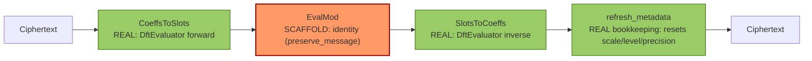
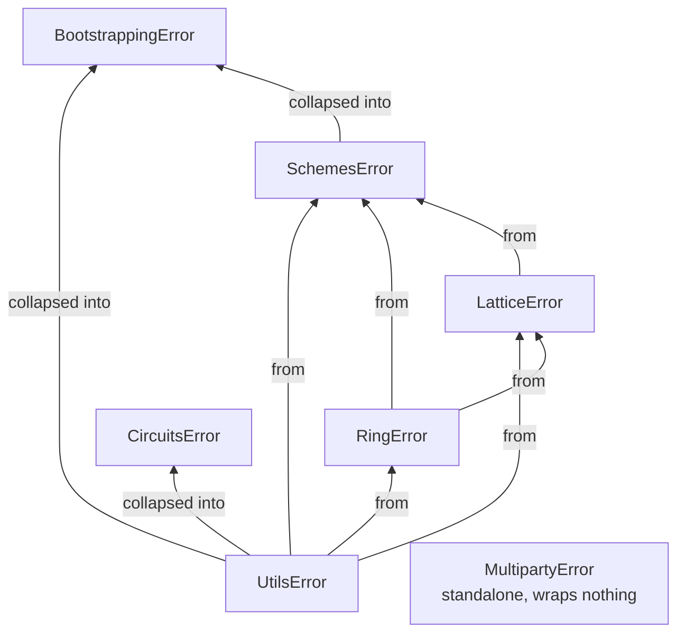

# Technical Manual

This is the precise, code-level reference for Phantom-FHE: exactly what each operation does today, the wire formats, the error taxonomy, and current performance characteristics. Where the current behavior is a correctness scaffold rather than the real cryptographic operation, that's called out explicitly and unambiguously — this document exists so nobody has to read the source to find out. For the conceptual/mathematical background this assumes, see [`concepts.md`](concepts.md); for crate layout, see [`architecture.md`](architecture.md).

> [!WARNING]
> Every "Current status" callout below reflects the alpha scaffold described in [SECURITY.md](../SECURITY.md). Nothing here is a defect report — it's the intended state of an in-progress implementation — but treat any operation marked transparent, placeholder, or identity as providing **no cryptographic protection**.

## Ring internals

### Modular reduction

`phantom_ring::reduce` exposes three reducer shapes plus free functions (`add_mod`, `sub_mod`, `neg_mod`, `mul_mod`, `pow_mod`, `inv_mod`, all operating via widened `u128` arithmetic and correct for any odd modulus).

**Current status:** `BarrettReducer::reduce` and `MontgomeryReducer::mul` are *placeholder* — both just call the same widened-arithmetic `mul_mod`/`% modulus` rather than implementing the actual Barrett/Montgomery algorithms. The types and method signatures are the intended integration points; `reduce_once` (lazy reduction: subtract `modulus` once if `value >= modulus`) is the one reducer that's already a real (if trivial) lazy-reduction primitive. Correctness is unaffected — everything reduces correctly — only performance is left on the table until these are implemented properly.

### NTT

`phantom_ring::ntt::CpuNttBackend` computes a negacyclic transform: twist by powers of `ψ` (the `2N`-th root), apply the transform, and for the inverse, untwist by powers of `ψ⁻¹` and scale by `N⁻¹`.

**Current status:** the forward/inverse transform itself (`forward_component`/`inverse_component` in `ntt/cpu.rs`) is a **direct O(N²) evaluation** — for each output index `k`, it sums `input[j] * ω^(jk)` over all `j` — not a Cooley-Tukey-style O(N log N) butterfly network. It is correct (the round-trip and multiplication-vs-schoolbook tests pass) but has none of the NTT's asymptotic performance advantage yet; at toy sizes (`N=8`) this doesn't matter, but it will not scale to production ring degrees (`N` in the thousands to tens of thousands) without a real butterfly implementation. `Ring::schoolbook_mul` — used throughout `phantom-lattice` for ciphertext multiplication — is explicitly documented as "for correctness tests and small rings," i.e. it's the O(N²) path used in place of NTT-accelerated multiplication everywhere above `phantom-ring` today.

### RNS basis extension

`phantom_ring::rns::extension::extend_basis` reconstructs a polynomial's true value via CRT (`u128`-widened) and re-decomposes it into the target basis.

**Current status:** documented in its own doc comment as intended for "small/debug parameter sets" — it round-trips through a `u128` integer per coefficient, which overflows for realistic RNS bases (more than a couple of 60-bit moduli) and is far from the RNS-native basis-extension algorithms (e.g. Bajard-Eynard-Hasan-Zucca / Halevi-Polyakov-Shoup style) production implementations use. `rns::rescale::drop_last_modulus` (simple truncation of the last RNS component) is the one RNS operation that's already close to its production shape.

### Sampling

`sample_uniform` and `sample_ternary` are the real target algorithms (rejection-sampled uniform bytes, ternary via `sample_bounded(rng, 3)`). `sample_discrete_gaussian`, by contrast, is explicitly documented as "a correctness-oriented placeholder": it samples uniformly in `[-bound, bound]` rather than from an actual discrete Gaussian distribution, and is not constant-time. Anywhere a scheme needs Gaussian error (RLWE encryption error, in the reference math), this is the sampler that would supply it — see [`concepts.md#sampling`](concepts.md#sampling) for why the *shape* of that distribution matters for security.

## RLWE / RGSW internals

### Key generation

`KeyGenerator::generate_secret_key` is real (ternary or the placeholder-Gaussian sampler above, per `SecretDistribution`). `generate_public_key` computes `(b, a) = (-a*s, a)` via `schoolbook_mul` — **with zero encryption error**: no error term is added to `b`. This is a correctness scaffold ("This is a correctness scaffold, not a production key generation routine," per its own doc comment) — the public key is a noiseless RLWE-of-zero rather than a properly-noised one.

### Encryption

`Encryptor::encrypt` (secret-key and public-key variants) *does* perform real RLWE arithmetic — `c_0 = pt - a*s` (secret-key) or `c_0 = pt + b*u`, `c_1 = a*u` (public-key), using real uniform/ternary sampling — but **without any error term** in either path. So `phantom_lattice::rlwe::Encryptor` is exact RLWE-shaped arithmetic, not noised RLWE encryption; a passive adversary who can solve the resulting noiseless linear system recovers the secret directly. This is the primitive layer everything above inherits from.

### Evaluator operations

`add`/`sub`/`neg`/`add_plain`/`mul` are real polynomial arithmetic (the multiplication grows ciphertext degree correctly, as described in [`concepts.md`](concepts.md#rlwe-the-shared-foundation)). `relinearize` is a **no-op that returns the input unchanged** (`Ok(ct.clone())`) — it does not actually bring a degree-2+ ciphertext back to degree 1; decrypting a "relinearized" product still needs the higher-degree accumulation `Decryptor::decrypt` already handles, so correctness holds by accident of the decryptor tolerating any degree, not because relinearization did anything. `rotate_coefficients` performs a literal `Vec::rotate_left` on each RNS component — a real coefficient permutation, but not the Galois-automorphism-based slot rotation a batched scheme needs (it rotates raw coefficients, not encoded slots under the automorphism that makes rotation compatible with encryption).

`keyswitch::key_switch_identity` and `repacking::repack_identity` are exactly what their names say: identity functions returning a clone of the input. They exist as the integration point for real key-switching/repacking, not as working implementations.

### RGSW

`RgswCiphertext` is **plaintext-backed**: it stores the message polynomial directly (`message: Poly`) rather than an encrypted gadget matrix, plus an unused `rows: Vec<Vec<Ciphertext>>` field reserved for the real representation. `external_product` correspondingly just multiplies every RLWE component by the plaintext `message` polynomial (`schoolbook_mul`) — a real polynomial multiplication, but not an RGSW external product in any cryptographic sense, since there's no encrypted RGSW ciphertext to consume. `GadgetDecomposition::decompose`/`recompose`, by contrast, **are** the real base-`2^base_log` coefficient decomposition/recomposition algorithm — this piece is ready to support a real RGSW representation once one exists.

## Scheme internals

### BGV / BFV

`bgv::Encryptor::encrypt` is **fully transparent**: it ignores its `rng` parameter and the encryptor's key entirely, and returns `Ciphertext::new(vec![plaintext.value().clone()])` — the "ciphertext" is literally the plaintext polynomial wrapped in a length-1 vector. `bfv::Encryptor::encrypt` delegates to this same function. Decryption is correspondingly the identity (there's no encryption to undo). This is why the round-trip and homomorphic-operation tests all pass at the BGV/BFV layer regardless of what `phantom_lattice::rlwe`'s own (non-transparent, but noiseless) encryption does underneath — the scheme layer doesn't call into RLWE encryption at all for ciphertext creation.

`ModulusSwitcher::switch_next` (BGV) is documented as a scaffold that "preserves the ciphertext unchanged" — it validates the ciphertext against the ring and returns a clone, not an actual RNS modulus-drop-and-rescale.

`Evaluator::add`/`sub`/`neg`/`add_plain`/`mul`/`mul_plain`/`rotate_slots`/`sum_slots` operate correctly on the transparent representation — because the "ciphertext" is the plaintext, these are just the corresponding plaintext-space operations (mod `t`, or mod the ring's `q` before the encoder's mod-`t` decode), which is why they produce mathematically correct results end-to-end despite the underlying encryption doing nothing.

### CKKS

CKKS's ciphertext (`ckks::Ciphertext`) stores `slots: Vec<Complex64>` **directly**, plus `scale`/`level`/`precision`/`degree` metadata — it never touches `phantom_ring`/`phantom_lattice` types at all for its actual data. `Encryptor::encrypt` and `Decryptor::decrypt` are both identity functions over this representation (ignoring the RNG, secret key, and public key passed to them beyond validating that RLWE parameters *could* be constructed). Every `Evaluator` operation (`add`, `sub`, `mul`, `rescale_next`, `rotate_slots`, `conjugate`, `align_levels`) is real floating-point arithmetic over `Vec<Complex64>`, with real scale/level/precision bookkeeping (scale multiplies on `mul`, level decrements on `rescale_next`, precision degrades by op-specific amounts — see the `degrade(...)` calls in `ckks/evaluator.rs`). So: the metadata model (scale, level, precision, rescale, level alignment) is a faithful simulation of how a real CKKS ciphertext's noise/precision would evolve, but the "ciphertext" carries the plaintext values in the clear the entire time.

### Serialization

`phantom-schemes::serialization` encodes params/plaintexts/ciphertexts for all three schemes — real, working, and format-stable, independent of the encryption gaps above (encoding a transparent CKKS ciphertext still round-trips its `Complex64` slots correctly).

## Circuit internals

`phantom-circuits::common` (linear-transform diagonalization, BSGS planning, polynomial evaluation strategy selection) is real, general-purpose planning logic with no dependency on scheme encryption status — it operates on plain matrices/coefficient vectors, and its output (a `DiagonalMatrix`, a `BabyStepGiantStepPlan`, a `PolynomialEvalPlan`) is meaningful regardless of what's underneath.

`bgv`/`bfv` circuit evaluators (`LinearTransformEvaluator::apply`, `PolynomialEvaluator::evaluate`) require **degree-zero ciphertexts** (checked explicitly, erroring otherwise) and operate directly on the transparent coefficient representation described above — real matrix-vector and polynomial arithmetic mod `t`, on plaintext-equivalent data.

`ckks` circuit evaluators (`DftEvaluator`, `ComparisonEvaluator`, `InverseEvaluator`, `Mod1Evaluator`, `MinimaxEvaluator`, `LinearTransformEvaluator`) are real floating-point implementations of their named operations (DFT is literal O(n²) evaluation, not FFT-accelerated; comparison/inverse/mod1 are the real closed-form approximations described in [`concepts.md`](concepts.md#ckks-specific-circuits)) — operating on CKKS's transparent `Complex64` slots. Every one of these evaluators also degrades the output's `Precision` estimate by an amount reflecting what the real homomorphic operation would cost, even though no actual noise was introduced.

## Bootstrapping internals

The pipeline shape (see [`concepts.md#bootstrapping`](concepts.md#bootstrapping)) is faithfully implemented; only the middle stage is a stand-in:



The CKKS bootstrapping pipeline (`Bootstrapper::bootstrap`) really does run coefficients→slots (`CoeffsToSlots`, via `DftEvaluator::transform(..., Forward)`) then eval-mod then slots→coefficients (`SlotsToCoeffs`, via `DftEvaluator::transform(..., Inverse)`) — the pipeline *shape* is faithful. But `EvalMod::preserve_message`, the function the bootstrapper actually calls for the middle stage, is an **identity function** (`Ok(input.clone())`) — not the real modular-reduction polynomial approximation described in [`concepts.md#bootstrapping`](concepts.md#bootstrapping). (`EvalMod::centered_fractional_part`, which *does* call the real `Mod1Evaluator`, exists on the type but is not what the bootstrapper's `bootstrap()` method calls.) After the pipeline, `refresh_metadata` resets scale to the CKKS context's default, level to `BootstrapParams::target_level`, and precision to `BootstrapParams::target_precision_bits` — i.e. the metadata genuinely gets "refreshed" to look like a fresh ciphertext, which is the observable effect a real bootstrap should have, even though no actual noise reduction occurred (because there's no noise to reduce in a transparent ciphertext).

`BootstrapKeyGenerator::generate` produces a `BootstrapKey` that's just `{ params, rotation_elements }` — no actual key material, consistent with the transparent scheme layer beneath it not needing any.

`bgv`/`bfv` bootstrapping (`phantom_bootstrapping::{bgv, bfv}`) are reserved module locations: `BootstrapParams`/`BootstrapKey` are effectively unit structs, and `Evaluator::bootstrap_unimplemented` always returns `Err(BootstrappingError::InvalidParameters("BGV bootstrapping is reserved but not implemented"))`.

## Multiparty internals

`phantom-multiparty::common` (participants, sessions, shares, transcripts) is real, working protocol-scaffolding logic — session/round/participant binding checks, threshold gating, deterministic encoding, are all genuinely enforced, independent of scheme cryptographic status.

**The transcript hash is not a cryptographic hash function.** `stable_hash_256` (in `common/transcript.rs`) is a small hand-rolled 4-lane XOR/multiply/rotate mixer producing a 256-bit output — deterministic and collision-*resistant-looking*, but it has had no cryptanalysis and must not be treated as providing collision resistance, preimage resistance, or any other property a real hash function (SHA-256, BLAKE3, ...) would provide. Anywhere a transcript hash needs actual cryptographic hash security (e.g. a Fiat-Shamir-style protocol built on top of `Transcript`), this needs to be swapped for a vetted primitive first.

Each `mpXXX::{ckg, rkg, gkg}::aggregate_*` is a **placeholder aggregation**: `CollectiveKeyGen::aggregate_public_key` ignores the collected shares' content (`let _shares = aggregator.aggregate()?;`) and returns a public key made of two all-zero polynomials; `RelinearizationKeyGen::aggregate_key` similarly ignores share content and returns the unit `RelinearizationKey`; `GaloisKeyGen::aggregate_keys` returns `GaloisKey` markers for the requested elements, again without using share content cryptographically. The *protocol shape* (collect `threshold` shares bound to a session, then aggregate) is real and enforced; the *cryptographic content* of what gets aggregated is not yet real key material.

`PartialDecryptor`, `ReEncryptor`, and (for `mpbgv`/`mpbfv`) `InteractiveBootstrap::aggregate_*` all follow a different, more substantive pattern: they require every collected share's payload to be byte-identical (`ensure_equal_payloads`) and then decode that shared payload back into a real `Poly`/`Plaintext`/`Ciphertext` — consistent with, but not hiding, the fact that the underlying BGV/BFV ciphertext is transparent (there's no real secret-sharing of a decryption computation happening; every "share" is just the same cleartext-equivalent data). `mpckks::InteractiveBootstrap::aggregate_refreshed` does the same aggregation-of-identical-shares, then hands the result to the real `phantom_bootstrapping::ckks::Bootstrapper::bootstrap` pipeline described above.

## Serialization format

### Header

Every encoded payload starts with an 8-byte **domain tag** (ASCII, identifying the encoded type) followed by a little-endian `u16` **version**:

```text
byte offset   0                                7 8    9
              +--------------------------------+------+
              |          domain tag (8B)        | ver  |
              +--------------------------------+------+
```

`SerializationHeader::write_to` writes this; `SerializationHeader::read_expected` reads it back and returns `UtilsError::InvalidDomain` if the tag doesn't match what the caller expected, or `UtilsError::UnsupportedVersion` if the version doesn't match — decoding a payload against the wrong `decode_*` function, or a payload from a future/past format version, fails immediately rather than misparsing.

After the header, each format writes its fields with `BufferWriter`'s deterministic little-endian primitives: fixed-width integers (`write_u8`/`write_u16_le`/`write_u32_le`/`write_u64_le`), raw bytes (`write_all`), and length-prefixed byte vectors (`write_bytes`, a `u64` length followed by the bytes). All current formats are version `1`.

### Domain tag catalog

| Domain tag | Type | Crate | Encode / decode functions |
| --- | --- | --- | --- |
| `RLWEPK01` | `phantom_lattice::rlwe::PublicKey` | `phantom-lattice` | `encode_public_key` / `decode_public_key` |
| `RLWEEK01` | `phantom_lattice::rlwe::EvaluationKey` | `phantom-lattice` | `encode_evaluation_key` / `decode_evaluation_key` |
| `BGVPRM01` | `phantom_schemes::bgv::BgvParams` | `phantom-schemes` | `encode_bgv_params` / `decode_bgv_params` |
| `BFVPRM01` | `phantom_schemes::bfv::BfvParams` | `phantom-schemes` | `encode_bfv_params` / `decode_bfv_params` |
| `CKKSPR01` | `phantom_schemes::ckks::CkksParams` | `phantom-schemes` | `encode_ckks_params` / `decode_ckks_params` |
| `BGVPLT01` | `phantom_schemes::bgv::Plaintext` | `phantom-schemes` | `encode_bgv_plaintext` / `decode_bgv_plaintext` |
| `BFVPLT01` | `phantom_schemes::bfv::Plaintext` | `phantom-schemes` | `encode_bfv_plaintext` / `decode_bfv_plaintext` |
| `CKKSPL01` | `phantom_schemes::ckks::Plaintext` | `phantom-schemes` | `encode_ckks_plaintext` / `decode_ckks_plaintext` |
| `BGVCTXT1` | `phantom_schemes::bgv::Ciphertext` | `phantom-schemes` | `encode_bgv_ciphertext` / `decode_bgv_ciphertext` |
| `BFVCTXT1` | `phantom_schemes::bfv::Ciphertext` | `phantom-schemes` | `encode_bfv_ciphertext` / `decode_bfv_ciphertext` |
| `CKKSCT01` | `phantom_schemes::ckks::Ciphertext` | `phantom-schemes` | `encode_ckks_ciphertext` / `decode_ckks_ciphertext` |
| `CIRPOLY1` | `phantom_circuits::common::PolynomialEvalPlan` | `phantom-circuits` | `encode_polynomial_eval_plan` / `decode_polynomial_eval_plan` |
| `CIRBSGS1` | `phantom_circuits::common::BabyStepGiantStepPlan` | `phantom-circuits` | `encode_bsgs_plan` / `decode_bsgs_plan` |
| `CKKSBTP1` | `phantom_bootstrapping::ckks::BootstrapParams` | `phantom-bootstrapping` | `encode_ckks_bootstrap_params` / `decode_ckks_bootstrap_params` |

Every crate's test suite includes malformed/truncated/wrong-domain payload rejection tests (see the `phaseNN_serialization.rs` files noted in [`developer-guide.md`](developer-guide.md#testing-conventions)). Secret-bearing types (`SecretKey`, RLWE/RGSW key material) intentionally have **no** encode/decode path — see [`internal/dependency-policy.md`](internal/dependency-policy.md) for the standing policy on this.

## Error reference

Every crate exports one `Result<T>` alias and one `#[derive(thiserror::Error)]` enum from its root. Lower-layer errors are wrapped via `#[from]`/`#[error(transparent)]`, so a `SchemesError` can originate from `phantom-ring`, `phantom-lattice`, or `phantom-utils` as well as from the schemes layer itself:



Every "from" edge above is a `#[from]`/`#[error(transparent)]` conversion that preserves the original error as a variant payload. Every "collapsed into" edge is a `From` impl that discards the structured error and maps it to a generic `&'static str` variant instead — see the note below the table for where. `RingError` does not itself wrap anything (it's the bottom of the stack — `phantom-ring` has no crate dependencies below it that could fail). `MultipartyError` is the one error type that wraps nothing at all: every multiparty failure is a protocol-level condition (duplicate participant, stale share, threshold not met, ...) rather than a propagated lower-layer error.

| Crate | Error type | Variants |
| --- | --- | --- |
| `phantom-utils` | `UtilsError` | `Io`, `InvalidDomainLength { actual }`, `InvalidDomain { expected, found }`, `UnsupportedVersion { expected, found }`, `LengthOverflow { len }` |
| `phantom-ring` | `RingError` | `InvalidDegree(usize)`, `InvalidModulus(u64)`, `InvalidNttModulus { modulus, two_n }`, `DimensionMismatch`, `LevelOutOfBounds { level, moduli }`, `CrtOverflow`, `MissingRoot(u64)` |
| `phantom-lattice` | `LatticeError` | `Ring(RingError)`, `DimensionMismatch`, `InvalidParameters(&str)`, `MissingKey(&str)`, `Utils(UtilsError)` |
| `phantom-schemes` | `SchemesError` | `InvalidParameters(&str)`, `DimensionMismatch`, `InvalidSlotCount`, `Ring(RingError)`, `Lattice(LatticeError)`, `Utils(UtilsError)` |
| `phantom-circuits` | `CircuitsError` | `InvalidParameters(&str)`, `DimensionMismatch`, `EmptyPolynomial`, `SchemeOperation(&str)` (plus a `From<UtilsError>` collapsing serialization failures into `InvalidParameters`) |
| `phantom-bootstrapping` | `BootstrappingError` | `InvalidParameters(&str)`, `DimensionMismatch`, `SchemeOperation(&str)`, `CircuitOperation(&str)` (plus `From<SchemesError>`/`From<UtilsError>` collapsing into `SchemeOperation`/`InvalidParameters`) |
| `phantom-multiparty` | `MultipartyError` | `InvalidParameters(&str)`, `DuplicateParticipant`, `MissingShare`, `UnknownParticipant`, `StaleShare`, `MalformedMessage`, `ThresholdNotMet` |

The `CircuitsError`/`BootstrappingError` collapsing conversions (turning a structured lower-layer error into a generic `&'static str` variant) are one of the "improve error conversions" items tracked under Alpha Hardening Workstream 2 in [`internal/implementation-plan.md`](internal/implementation-plan.md) — expect these to become more granular over time.

## Performance

The current implementation prioritizes small, readable correctness scaffolds over performance — this is deliberate at the current stage, not an oversight, but it means today's numbers are not representative of where the library needs to land.

- `phantom_ring::ntt::CpuNttBackend` is the correctness-first O(N²) transform described [above](#ring-internals) — fine for toy sizes (`N` ≤ ~64 in tests/examples), not representative of NTT-accelerated performance.
- `Ring::schoolbook_mul` (O(N²) negacyclic multiplication) is what `phantom-lattice` actually uses for ciphertext multiplication today, not an NTT-accelerated path.
- `phantom-benches` intentionally has **no external benchmark dependency** — it uses `std::time::Instant`-based smoke timing (`phantom_benches::time_iterations`/`print_result`) rather than Criterion, specifically so `cargo bench -p phantom-benches` runs without network access or extra setup. Its output (iteration count + elapsed wall time, printed per target) is a smoke signal — "did this get dramatically slower" — not a statistically rigorous benchmark report. `docs/internal/dependency-policy.md` pre-approves adopting Criterion as a `phantom-benches`-only dev-dependency once Workstream 9 (Performance and Benchmarking) is picked up.
- Benchmark targets today: `ring_ntt`, `ring_rns`, `rlwe_encrypt`, `rlwe_keyswitch`, `bfv_eval`, `bgv_eval`, `ckks_eval`, `ckks_bootstrapping`, `multiparty` (see `crates/phantom-benches/benches/`).

Planned performance work (see `implementation-plan.md` Workstream 3 and 9): a real Cooley-Tukey-style NTT, allocation-reduction passes over evaluator hot paths (many operations currently clone full ciphertexts rather than mutating in place), and larger parameter presets once the correctness/security work above catches up enough that larger sizes are meaningful to benchmark.

## Where this stands relative to the roadmap

Every gap catalogued in this document has a corresponding hardening track in [`internal/implementation-plan.md`](internal/implementation-plan.md)'s Alpha Hardening workstreams (3 through 7 cover ring, RLWE/RGSW, schemes, bootstrapping/circuits, and multiparty respectively). This document will be updated as each track lands — if you're reading this to decide whether a specific operation is safe to rely on, treat "not mentioned as a gap here" as the thing to verify against the current source, not as an implicit guarantee; this document is a snapshot, not a live contract.
